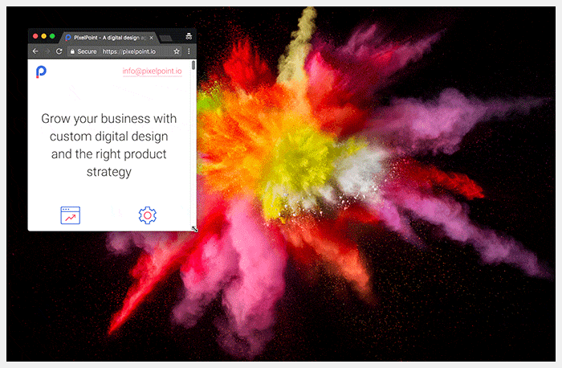
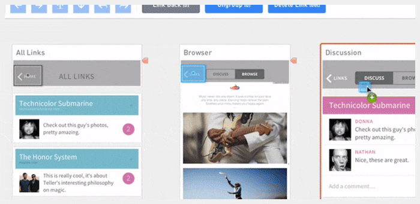

## Grid

Keep in mind the behavior of CSS Grid Systems as you build your design. Take a look at Bootstrap Grid. It’s a very popular CSS framework that will cover all standard cases, and is easy to set up for a developer. The main thing to understand is that columns in CSS Grids have relative width and static inner padding. Bootstrap Grid has 12 columns and 15px inner padding by default, but you can customize it. You could say that you don’t have relative numbers for columns in sketсh, and you’d be right, because you don’t need it.

When you build UI, you always show a static picture, and, of course, you have a static container size. So, for example, if you have a 1920px artboard and a 960px container, you will have one column at 80px, with a 15px inner padding and a 50px inner column size. Read this article to understand how to build the right fluid grid with Sketch.

When you build UI based on a Grid system like Bootstrap, you don’t need to tell the developer the size of each column; you will just need to show him/her the column overlay. The developer will know what classes s/he needs to use in CSS: .col-sm-2 or .col-sm-6, for example.

Many grid generators have their own ideas regarding how to build grids. They’ll have a single gutter size between columns and a margin for the container. To understand this better, use that guide or read the Bootstrap Grid section.

## Responsive design

Your main goal is to show the developer how each element will look at different dimensions, and with different transitions between them. Think in relative, not static values. If you prepare a layout with a few different dimensions, like 320x568, 1024x768, and 1920x1080, it does not mean that your job is done. You will still need to demonstrate and explain your transitions.

- What will be with the columns and inside content on each breakpoint?
- What changes will be with container size at each dimension (and ensure that you have columns with relative values)?
- How will these changes affect images, and did we prepare images for that behavior, too? Take this example: You have a 200x200 image at desktop version, and decide to make it 100% width for a 375x667 device. In this case, you would need to have an image of more than 750px width (high pixel density) to prevent a blurring effect on mobile devices.

Another typical mistake designers make is forgetting about height and only showing the behavior of elements based on width changes of the container. Sometimes, you have elements with relative height, too, and you will need to explain the behavior of those objects to the developer . You must establish the minimum height or maximum height, and the position of the elements inside that element.

Use some basic breakpoints: 320x568, 375x667, 768x1024, 1024x768, 1280x768, 1366x768, and 1920x1080. And, of course, don’t forget to test your design on landscape mobile view.

This is an example of text in columns that looks good on the desktop version, but has responsivity problems. You must define how you will work with that.

## Don’t reinvent the wheel

If you don’t have time, or are not sure that you can build small components (like a dropdown) from scratch, ask your developer what library s/he suggests, and polish a pre-made version. One typical case is reinventing a datepicker. Too many people think they just need to draw a calendar with numbers on it, but you also need to think about:

- Whether you will mark dates from the previous or next month.
- What the hover effect will be for each date.
- How you will mark the current date.
- How you will mark a picked date.
- How you will switch years or months.

We are living in a world where everyone is trying to build their own startup. Sometimes, it is better for clients to reach MVP than waste time and money on a designer who is trying to be creative. Designers should understand that they can use existing libraries of components and polish them for diverse projects. This reduces the often irrational costs of developer work, even when it’s necessary to create custom solutions.

## Animation and clickable prototypes

Instead of writing notes explaining how your animations should look or behave, show it. It’s unlikely that your description of the animation will be as good as it is in your imagination. Use InVision or Axure for prototyping user journeys, and use Principle, Framer, or Adobe After Effects for animations. This will prevent headache-inducing misunderstandings between you, developers, and clients. It will also help you check your assumptions before implementation. Animations and prototypes make cool presentations for clients, and make your designs seem extra special.

[Part 1 — Software, Naming, Image Optimization, Sprites, SVG, Favicon](/blog/handoffs-guide-for-pixel-perfect-design-part-i)

[Part 3 — UI kits,Export, Element states, Line-height, Fonts, Developers and designers](/blog/handoffs-guide-for-pixel-perfect-design-part-iii)
