Welcome to our simple guide for those of you looking for 99.9% uptime and an almost free deployment solution for your static websites, without having to maintain and configure your own server. In this article, we will do it with Cloudflare as a CDN service and AWS S3 as file storage.

Cloudflare has 150+ data centers all over the world and their Basic plan (free) is more than enough for most websites. Though its features are basic, you will still get 99.9% uptime, free SSL certificate, DDoS protection, Brotli compression, auto JS/CSS minification, hiding of your destination server IP, and proper cache settings.

We decided to write this article because most other guides on the internet overwhelm people with superfluous settings that do not make any sense and seem copy/pasted from other sites.

## Starting Requirements

- AWS account
- Cloudflare account with your existing NS already migrated to it

Migration to Cloudflare is a very simple process, because they have a nice UI/UX. They will scan your DNS records and suggest that you add existing ones.

## Pros and Cons

✅ Highly performance CDN for free;

✅ 99.9% uptime;

✅ Free SSL certificate;

✅ Simple configuration and usage;

❌ Not possible to use S3 with Cloudflare if you find that your current site name is in use as a bucket name (explanation below);

❌ Only first level subdomain compatibility for https websites on a free plan.

## 1. Create S3 Bucket

You need navigate to S3 through your AWS console and click “Create bucket”.

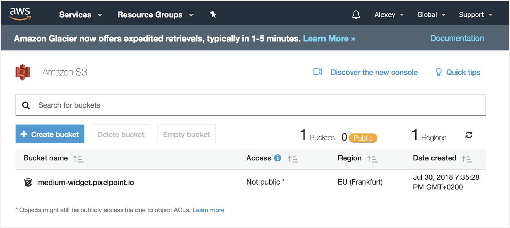

On the next screen, pick your bucket name and define the region. The bucket name should be the same as your website name. It’s an AWS requirement and without it you will not be able to access your website through Cloudflare. The region does not matter, because the site is cached by Cloudflare anyway.

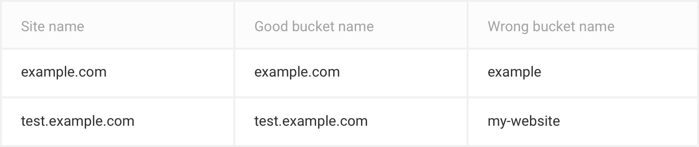

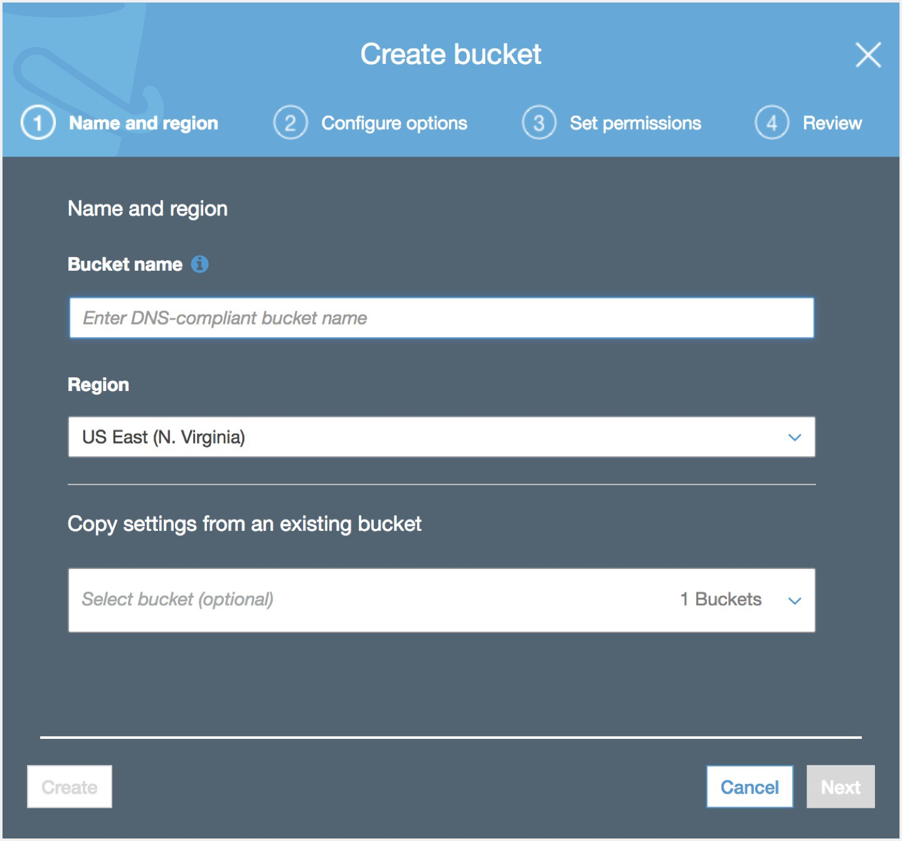

After that screen, click “Next” until you create your bucket. You don’t need to change anything in these settings. Note: If you receive a “Bucket name already exists” message in this step, please see the “Troubleshooting” section at the end of the article for details.

## 2. Create IAM user

First, we need to the install AWS command line tool by following this link. Once it’s ready, go to the IAM tab in AWS, then Users, and Add user. Make sure you check Programmatic access, because we don’t need extra permissions for this user despite publishing website content.

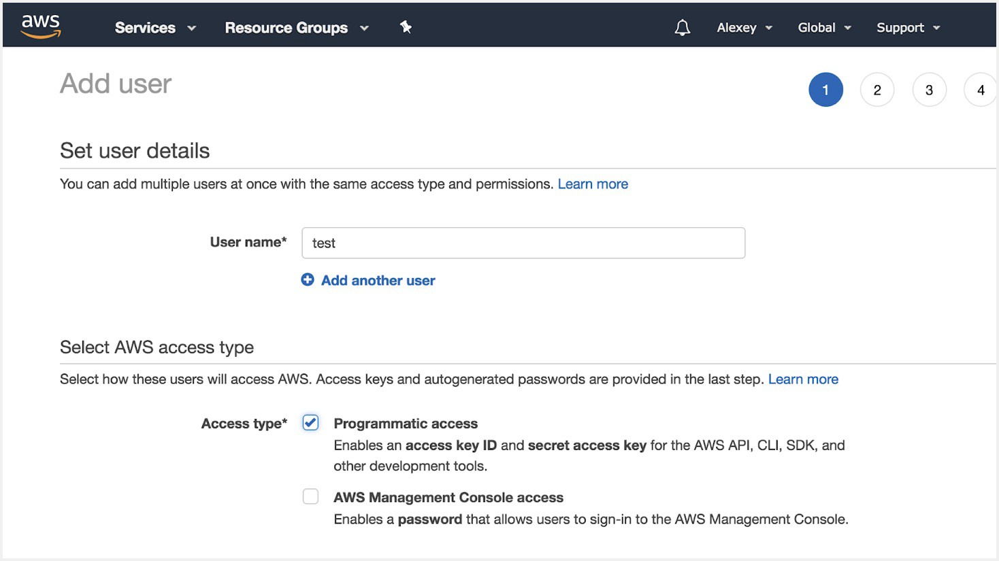

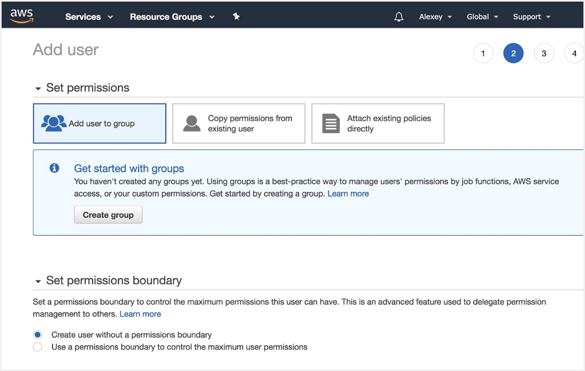

By default, your user is created without extra permissions. Simply click “Next” until you reach the “Success” page with user credentials

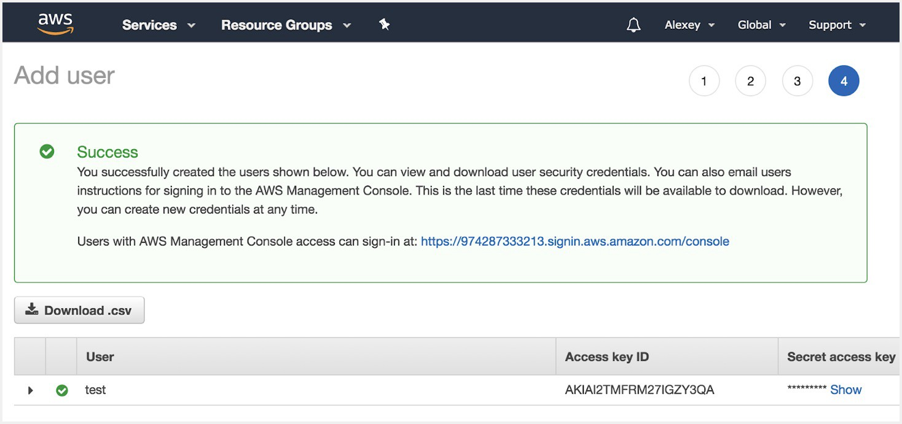

Download you .csv and store it securely. These details are required for AWS CLI.

## 3. Set the right permissions for your user

After you created your user, click on it, then on the permissions tab click “Add inline policy.”

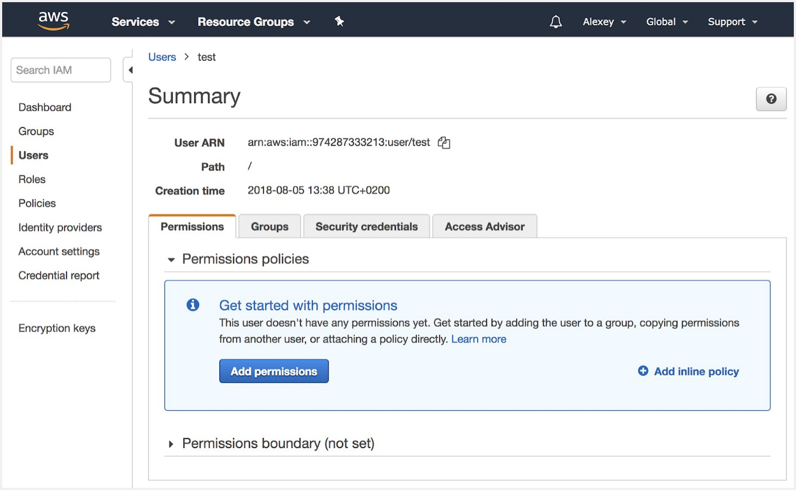

You should see the policies generator page, where you’ll see the following settings:

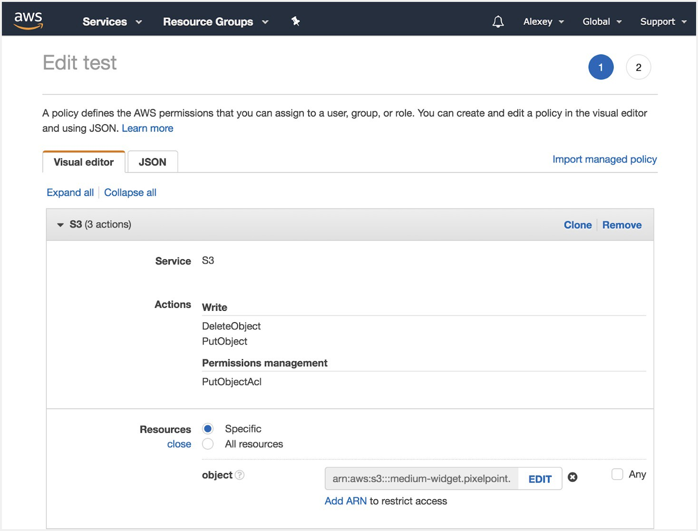

**Actions** — Write section with PutObject and DeleteObject; Permissions section with PutObjectAcl

**Resources:** your ARN bucket name, which looks like this arn:aws:s3:::medium-widget.pixelpoint.io/\*

In JSON view, it should look like this
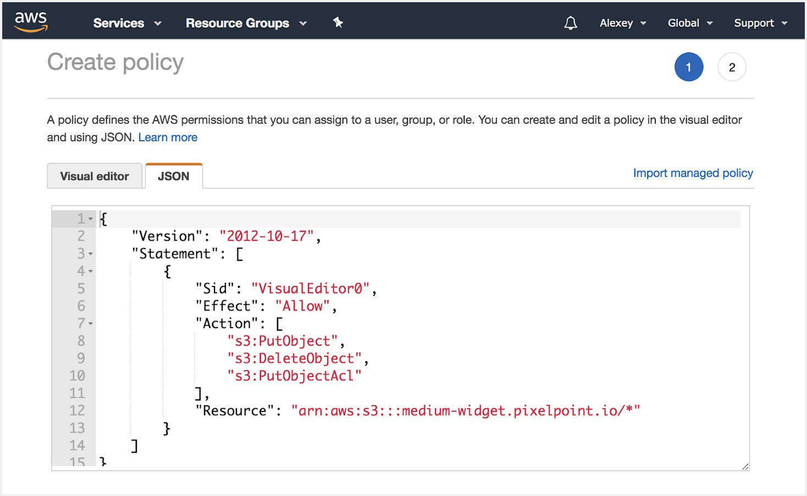

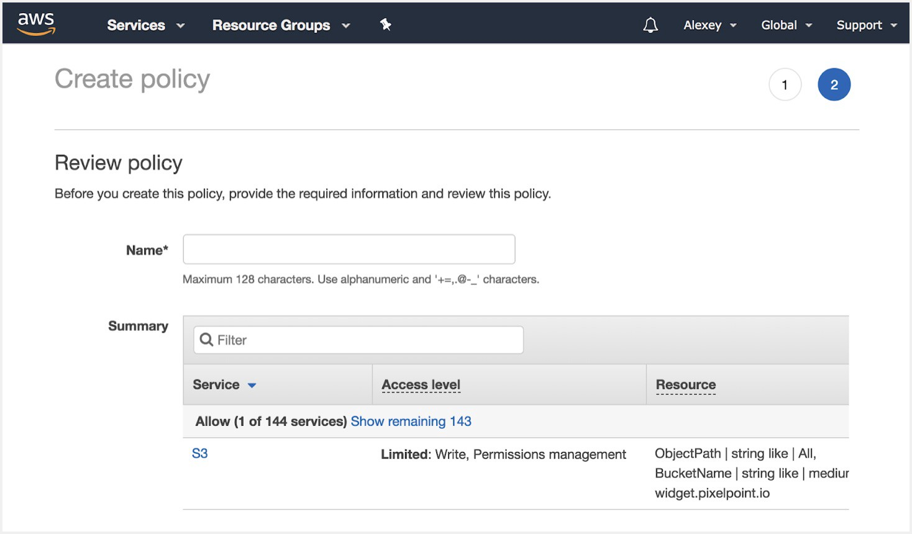

Review the policy and enter the name. We are now done with configuring permissions and we can now set up aws-cli to push your website.

## 4. Deploy with AWS CLI

Go to the terminal and run aws configure. You will be asked to fill in credentials from the .csv file you downloaded during the IAM user creation process. Enter you Access Key ID and Secret Access Key. The other fields are optional and you can simply hit “Enter”.

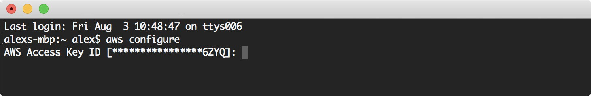

After that, you’re ready to deploy your website with AWS CLI. Go to your website folder; it should contain index.html and other files. Then execute:

```bash
aws s3 cp {folder name} s3://{bucket name} — recursive — acl public-read
```

Real example:

```bash
aws s3 cp dist/ s3://test.pixelpoint.io — recursive — exclude ‘.DS_Store’ — acl public-read
```

In the command, we copy the folder to the remote bucket on S3.

- — recursive copies all nested folders;
- with — exclude you can define lists of files that it is not necessary to copy, such as some temporary, IDE, or OS related files;
- — acl public-read is necessary to make your website accessible.

We use copy instead of sync folder, because sync does not work as expected and some files will not be copied to the bucket even after modification.

## 5. Publishing website

To finally publish your website, go to your S3 bucket list, click to the bucket, then choose the Properties tab. Enable static website hosting and enter index.html as your index file. Copy the url of the website and click “Save.”

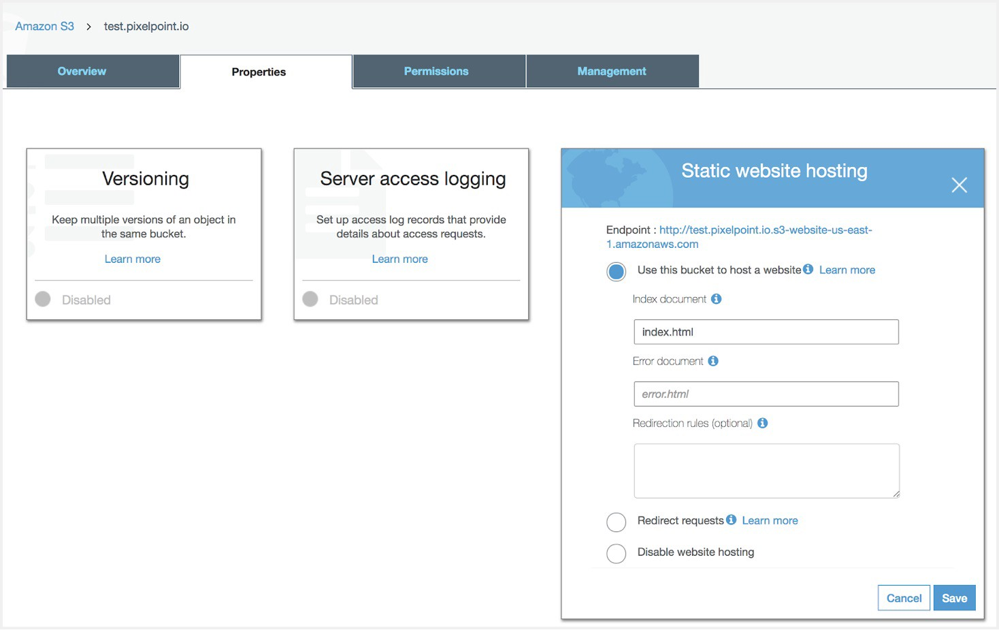

The final step is to go to your Cloudflare DNS settings and add a new CNAME record. As we noted above, your bucket name should be the same with your CNAME. In the domain name field in Cloudflare, you should put a link to your website on S3 without “http” and “/”, like this: test.pixelpoint.io.s3-website-us-east-1.amazonaws.com. In a name field, you should put your website name without domain. For example, for “test.pixelpoint.io”, we would only put “test” as a name.


That’s it. Now your website should be accessible via your chosen domain name.

## Troubleshooting

- Make sure you that you have “Flexible” settings enabled in Cloudflare’s SSL section, otherwise you could face an issue with SSL certificate.
- To redirect from www to non www domains, be sure you do it as a first level subdomain(Cloudflare limitations). You can do this through the Page Rules section on Cloudflare or by creating a new bucket with a Redirect rule at S3.
- If you receive the error “Bucket name already exists” during the bucket creation process, this solution will not work for you, as you will not be able use Cloudflare in this case.
