Alarm and monitoring systems are a key part of mature products and applications. If you worry about your customers, it’s better to be notified when something goes wrong then be in the dark. If you host your infrastructure on AWS, the only one way to get the full metrics of your used services is to use CloudWatch. AWS CloudWatch doesn’t only give you access to metrics, however, it also creates alarms for specific cases. But, if you worked with AWS before you no doubt noticed that the interface and certain functions are a far cry from “user friendly,” which means that sending a notification with alarms to Slack not a trivial task.

This article reveals the secrets you should know to set up the alarms you need in five minutes. For those of you who would like to see all in action, please watch our video tutorial.

There are a few steps we will need to go through to make this happen:

- Create an AWS Access Key and Secret
- Create a Role
- Deploy the Lambda function
- Create an SNS topic and subscription
- Create a Cloudwatch Alarm

## 1. Create AWS Access Key and Secret

If you already have your AWS Access Key and Secret, you can skip this step. Otherwise, follow [this link](https://console.aws.amazon.com/iam/home#/users). Choose your user, then go to the Security Credentials tab and click Create Access Key.

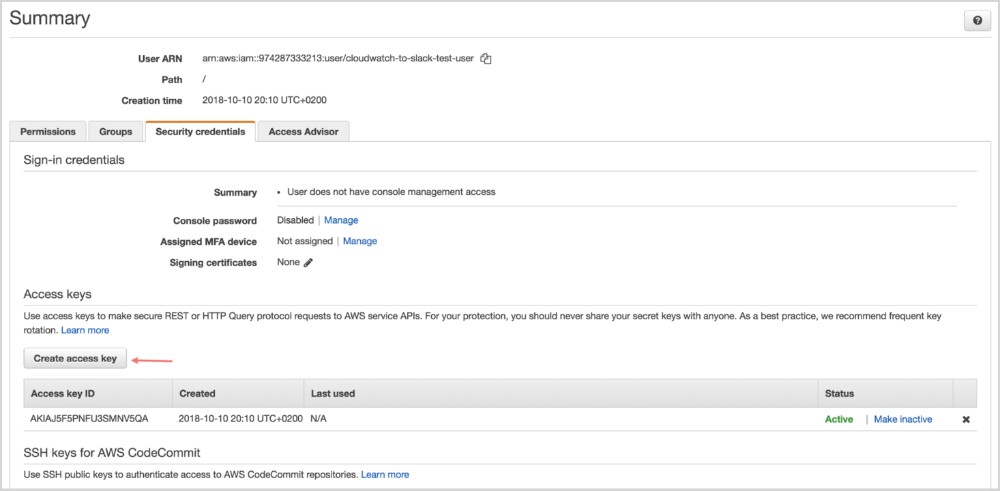

Copy the AWS Access Key and Secret; we will use them during configuring deployment of Lambda Function.

## 2. Create a Role

The Role will be used by your Lambda function and requires permission to do certain things.
Follow [this link](https://console.aws.amazon.com/iam/home?region=eu-west-1#/roles) then click Create Role.

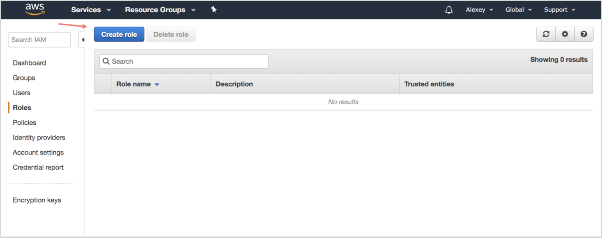

Chose Lambda from the list.

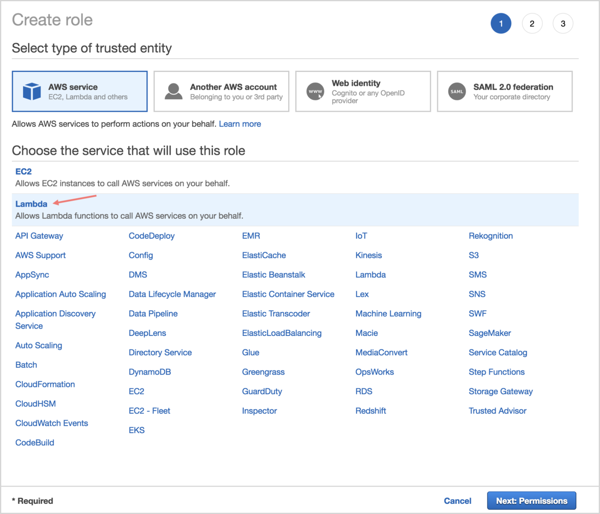

Find AWSLambdaBasicExecutionRole and select it.

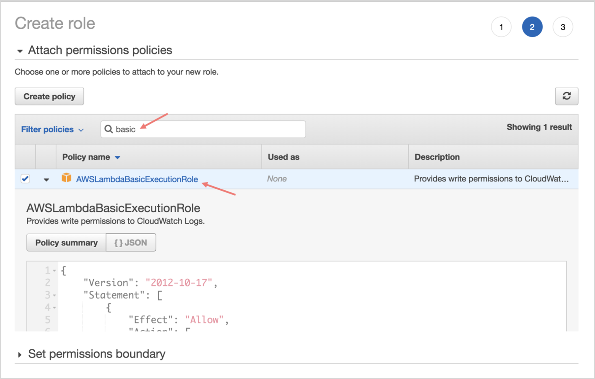

Finally, type a role name, such as “cloudwatch-to-slack-role,” click on the newly created role in the list and copy the ARN name. We will use it in step 3 during deployment of the Lambda function.

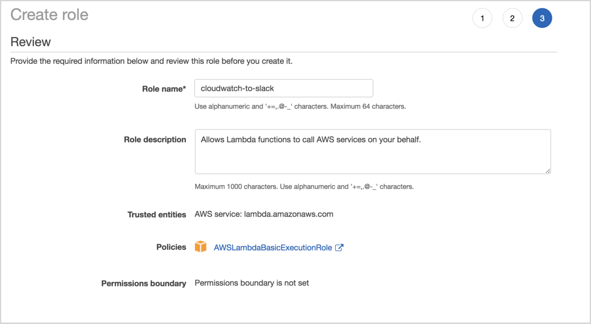

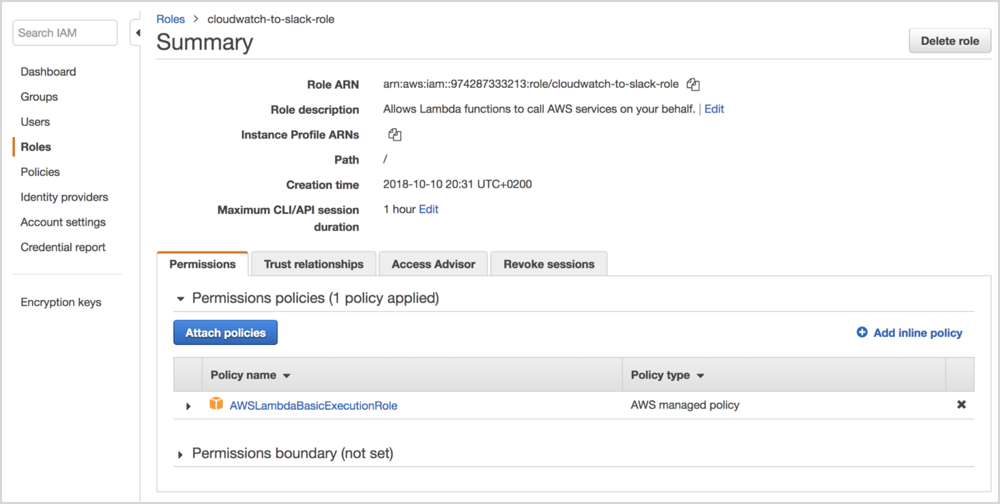

## 3. Deploy the Lambda function

To deploy the AWS Lambda function, you need to clone the repository and have Node.js installed on your local machine. Especially for that guide, we contributed significantly in the repository to get a better configuration process.

```bash
git clone git@github.com:assertible/lambda-cloudwatch-slack.git
cd lambda-cloudwatch-slack
cp .env.example .env
```

Open your .env file and fill in the environment variables.

**UNENCRYPTED_HOOK_URL**
That variable you should fill with the Slack Incoming Webhook; create a new one for CloudWatch on [that page](https://slack.com/apps/A0F7XDUAZ-incoming-webhooks) for your organization

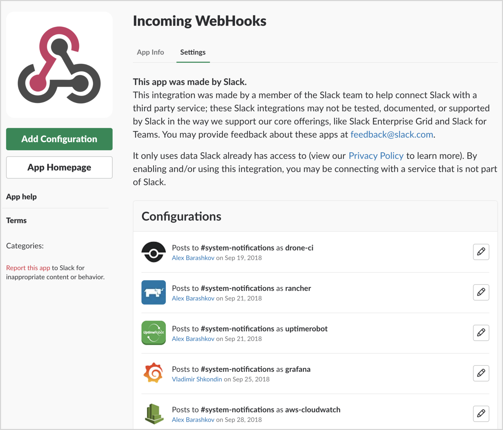

Follow the practice of using one hook for one specific service. Once you create a webhook, choose a channel, then post notifications, create a username(the title for messages) and, of course, add a nice picture. Download the Cloudwatch logo from the link [here](https://user-images.githubusercontent.com/2697570/46758481-30917080-cccd-11e8-966b-9a2813ff1e8a.png)

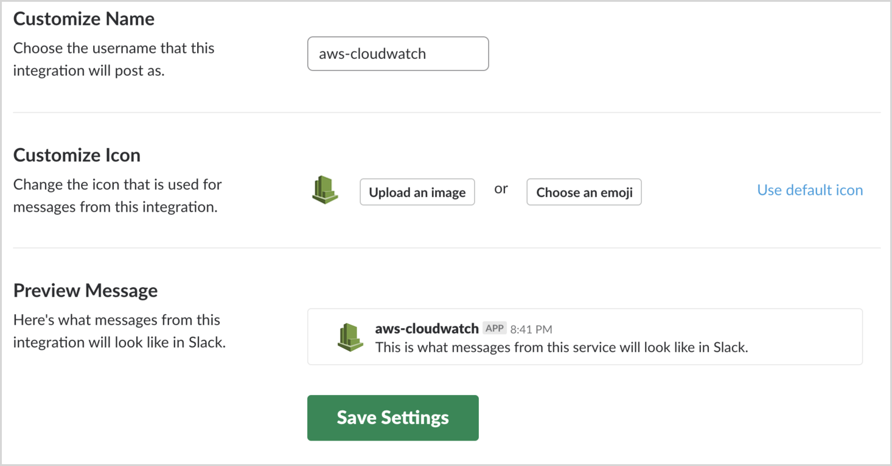

**AWS_FUNCTION_NAME**
The name of your function which will be declared in your AWS Lambda function page. Let’s call it “cloudwatch-to-slack.”

**AWS_REGION=eu-west-1**
Choose the region of the Lambda function.

**AWS_ROLE=”arn:aws:iam::123456789123:role/lambda_exec_role”**
Copy the arn id from the second step here.

**AWS_ACCESS_KEY_ID**
**AWS_SECRET_ACCESS_KEY**
Fill in the AWS Access Key and Secret with your keys from the first step.

Now we’re ready to deploy; simply execute the following command in your terminal from the folder with the repository we cloned:

```bash
npm install
npm run deploy
```

If everything went well, you will be able to find your fresh installed function on the Lambda page in AWS.

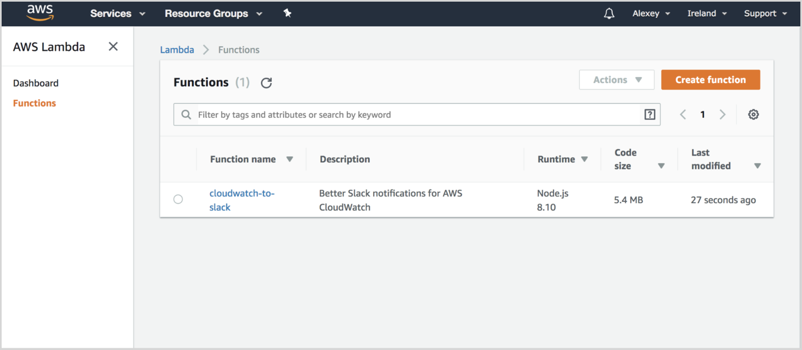

## 4. Create an SNS topic and subscription

Browse in AWS to the Simple Notification Service. Ironically, this service is anything but simple, especially the terminology they use and steps you have to go through.

Go to Topics and click Create New Topic. I chose the name “cloudwatch-alarms” for the notification that will be sent.

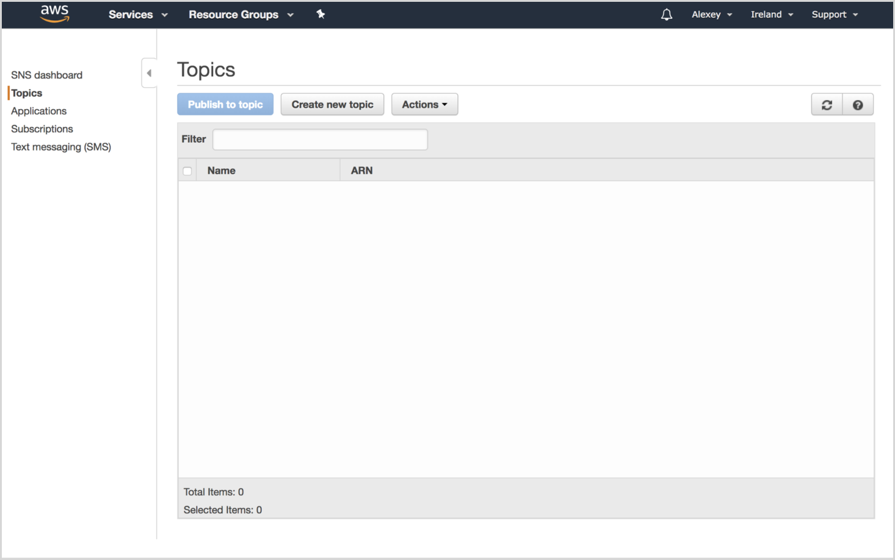

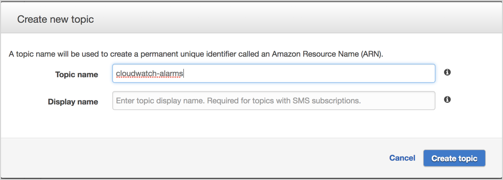

Open the created topic and create a subscription.

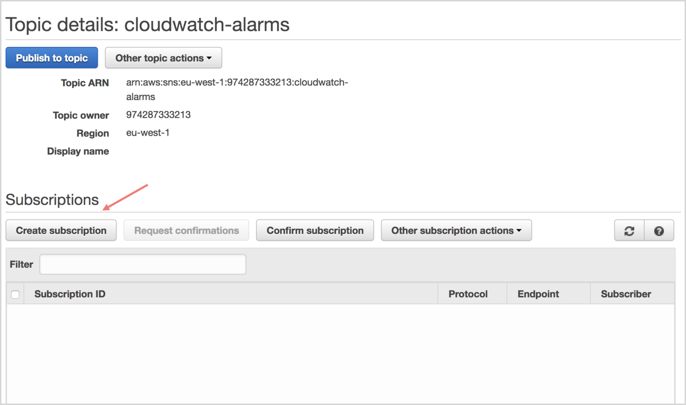

Select AWS Lambda as your Protocol and pick the endpoint with the name of your function.

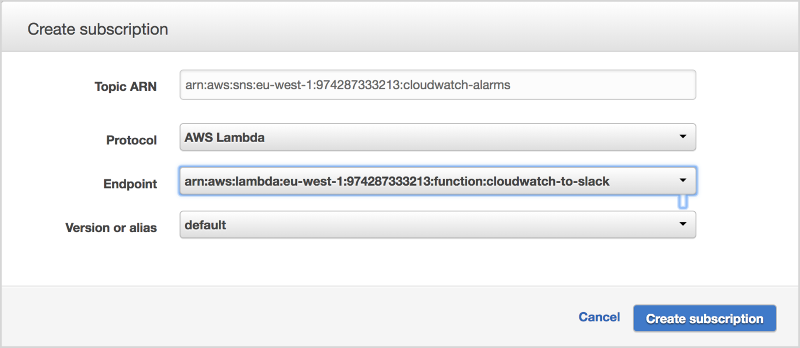

That’s it; now we are ready to create an alarm.

## 5. Create Cloudwatch Alarm

Navigate through Cloudwatch to your AWS account and click Create Alarm.

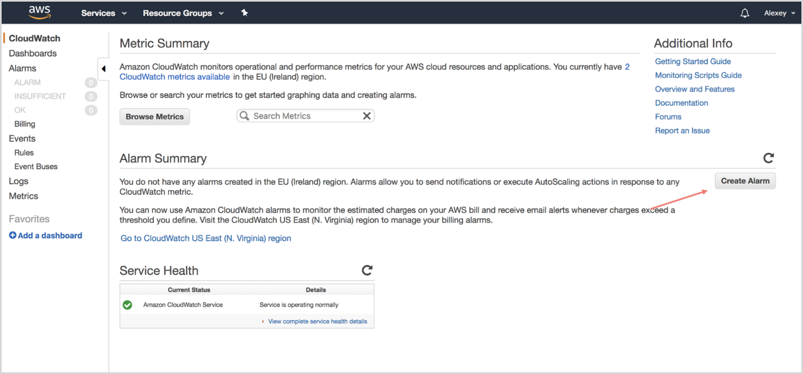

Chose the metric you would like to monitor, define the alarm configuration and select your SNS topic name in the Send Notification To section.

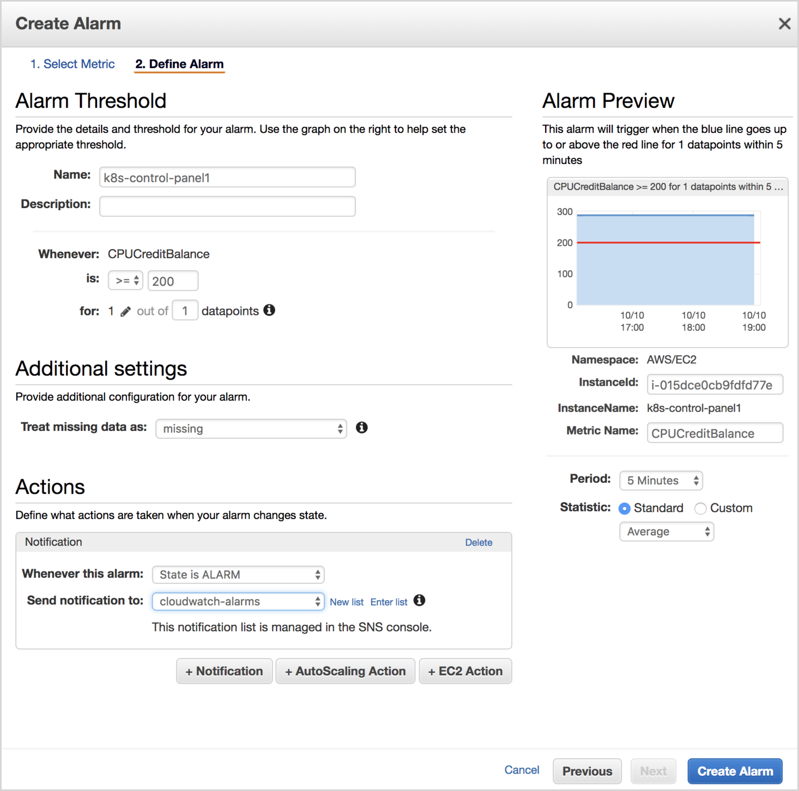

I recommend that you specifically define conditions that will immediately throw alarms for the purposes of testing your function. If everything is configured properly, you will see the message in your Slack channel.

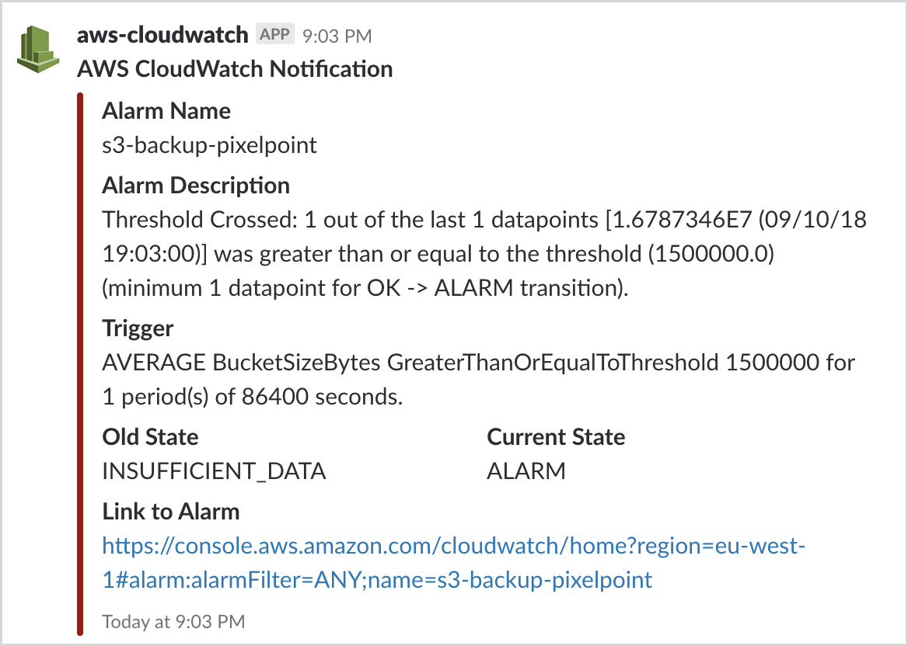

I hope this guide helps you save time and set up alarms for your current or future projects.

**Additional notes:**
By default, AWS Lambda has blueprints that allow you to do different things with a simple configuration and, in those blueprints, you may even find a CloudWatch-to-Slack function. Unfortunately, this send a very poor, unstructured data to the channel.
