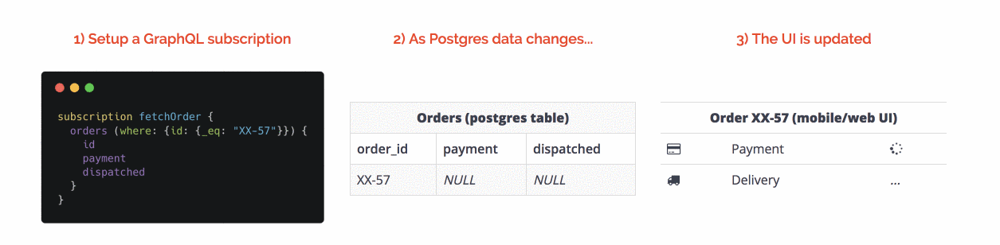
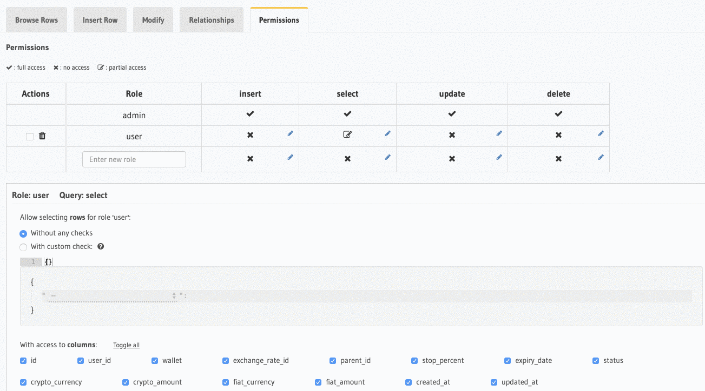

Real time updates are a part of almost every modern web and mobile application, with uses in everything from banking apps to news feeds. There are so many ways of handling real times updates that there will always be discussions about which way is better.

## A bit of history

For the past 10 years, the most common approach was to use a websocket client, such as socket.io, and server and push events to the customers through it by triggering them inside your backend.

There are also more recently developed data driven solutions, such as RethinkDB. I am a fan of this solution because, from my perspective, changes in the data should initiate events, clients should be subscribed for a specific query and data the clients should be changed accordingly. That what RethinkDB provides: good client libraries, their own query syntax, and scalability. Unfortunately, the RethinkDB project was closed and is now maintained only by the community.

[Graphql](https://graphql.org/) is another promising, more recent development, but early versions had no subscriptions at all so it remains to be seen how good it will be. GraphQL follows a similar approach to RethinkDB; it uses an effective, independent, and scalable solution where you can request data directly from the client, which is good for replacement of API calls to the backend.

Currently, GraphQL can provide you realtime subscriptions, but the issue remains that GraphQL is a separate database. It’s ok in many circumstances, but it isn’t clear people can do if they use PostgreSQL. Not every company has the resources to initiate migration to GraphQL and, especially if you have a massive product, the large amount of logic on the DB level.

We faced this issue with one of our own projects when we realised that we needed a simple way of implementing real-time updates without giving up PostgreSQL. This is where Hasura came in! I was so excited to find them at Product Hunt because I’d wanted a solution for this problem for around three years.

## What is Hasura?

Hasura is a proxy layer between your PostgreSQL database and Graphql server that allows you to set up real time updates very quickly from your PostgreSQL and it’s open-source. You get all the benefits of GraphQL without compromising access to your origin database, including client libraries for web and mobile, query syntax, and subscriptions.

### Key features of Hasura

Real-time updates from your PostgreSQL database
When I realized how easily this could be set up, it blew my mind.

### Dynamic access control & auth

We use Auth0 with our projects; using Hasura, we were able to restrict access to the data while using JWT. Hasura also has a great, simple to use UX for configuring access rules through the UI. Check out this video to see it in action.

As an example, it is possible to have multiple tables that you use from the client part. You can configure it so that a user can only access the data if he is the owner of said data, and define whether that have read, write or delete permissions.

### Event triggers on database events

You could subscribe to each create, update, and delete action in your database and call another service by passing that data. A possible use case for that is as a communication channel between your microservices or to call serverless functions.

The release of this feature was great; previously, we had used native PostgreSQL subscription to do this, but it required a lot of code to actually maintain it and there were no central point with a bulletproof solution.

The really exciting thing is that it’s a highly reliable solution. No matter what happens with your Hasura or network connection, the event will be delivered once you bring it back. The same is true if, due to some unforeseen problem, the events changes came to PostgreSQL through API calls to the backend but another part of your application was down.

### WS to HTTP fallback

It’s not exactly related to Hasura, but when you use Graphql subscription when your client does not support WebSockets, it automatically uses HTTP as an alternative without any further actions from you.

There are, of course, other features that you might find useful, such as mutation of your data and customer resolvers.

## Personal experience

Hasura is a really great product. It’s been a huge time saver for us. It still doesn’t have a stable release and is currently in development, but we already use it in production because all the features we use in our work operate without any problems. Almost every week, there is a new update the developers get closer to v1.0.0.

Migration to a Hasura solution took just two weeks; one week of development by a single developer, and another week for bug fixes and QA. As a result, we got a good, sustainable solution we use for both the web and mobile apps. Our future plans with Hasura include using more event triggers and migration to serverless.

You can immediately play around with Hasura for free through one click deployment to Heroku by following the link on their website If you would like to know more about that solution, I’m happy to write another article explaining how to set it up on existing PostgreSQL and use it with your React/Redux application.
