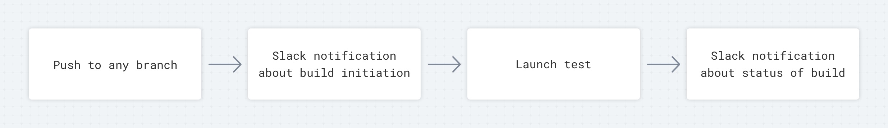
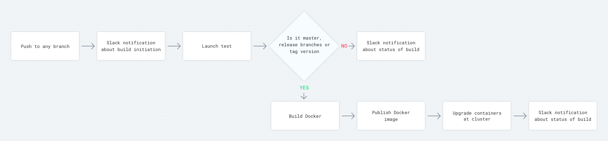

When you plan a project, you don’t always know how big it will be by the end. It’s crucial, therefore, to follow guidelines that make the development process as smooth as possible. One especially useful tool for this is a Continuous Integration/Delivery flow, or CI/CD flow.

At the beginning of a typical development process, before the project is ready for publication, your CI flow looks something like this:



During the development phase, more steps are added to the process until it looks something like the image below. However, you may see many more steps than this in some projects. [Original image](https://user-images.githubusercontent.com/2697570/48337431-33340c80-e663-11e8-87b0-cdc4e24aa776.jpg).



In this article, I will demonstrate a typical CI/CD flow and provide tips to help you scale this up for bigger projects. Note that these recommendations are made on the assumption that you have developed your infrastructure setup using Docker and orchestration tools, such as Kubernetes.

## Define Your VCS Flow

All modern CI tools rely on version control systems, so to maintain your CI flow at a high level you should have a proper version control flow in place. I recommend [Git Flow](https://danielkummer.github.io/git-flow-cheatsheet/) or [Github Flow](https://guides.github.com/introduction/flow/) if you’re looking for ideas. Pick one and adapt your pipeline according to your needs.

_Recommendations_:

- Run tests on each push in any branch. This helps your developers find bugs faster and speed up the code review process.
- Define branches that you will use to trigger Docker image build processes and deploy them as shown in the image above.
- If your releases have a complicated manual approval process, use tags to trigger production releases.

## Specify Your Environments

Once you have a git flow in place, integrate it with your builds’ logic and adapt it for the number of environments you have. Initially, you will likely deploy everything to production after your local environment testing. Later on, you may decide to do development, UAT, and production.

_Example:_

We often use a master branch to initiate deployment to the development environment. Then we merge the master branch into the release branch. This triggers a deployment to UAT, where we allow a small number of users to test the new version. If everything works correctly and the QA team confirms the release, we create a tag from the release branch, which initiates deployment to production.

## Set Up Notifications

You should keep track of all CI flow processes via the notification channel you prefer. We use Slack for our projects.

- Create a system-notification channel and enable it to send notifications about all CI and infrastructure processes.
- Set up notifications about success or failure statuses and to alert you when the build starts.

## Keep Docker Image Simple

It is best practice not to pass to Docker image env variables. All env variables should be passed through the Docker run command or on your orchestration tool level (for example, Kubernetes). This will also help keep your CI configuration files simple.

## Unify Your Pipeline

Companies today increasingly use microservices architecture; a unified pipeline helps you benefit from this by scaling faster to deployment and configuring your CI in new microservices. In Drone CI or Travis CI, there are plenty of CI environment variables you could use during your pipeline steps (find them at [Travis CI env variables](https://docs.travis-ci.com/user/environment-variables/#default-environment-variables) and [Drone CI env variables](https://docs.drone.io/reference/environ/)). Here are a few examples of CI env variables in action:

- To tag a Docker image, you can use a concatenation of a build branch and build number. As a result, you will have something like “master-6.” Alternatively, you can use your git tag version. `tags: "${DRONE_COMMIT_BRANCH}-${DRONE_BUILD_NUMBER}"`
- Use a repository name for deployments in your orchestration tools. Example of Drone CI deployment to Kubernetes cluster with env variables.

```yaml
deploy:
  image: peloton/drone-k8s-deployment
  deployment_names: '${DRONE_REPO_NAME}'
  container_names: '${DRONE_REPO_NAME}'
  namespaces: microservices
  docker_image: '62673275295.dkr.ecr.eu-west-1.amazonaws.com/${DRONE_REPO_NAME}:${DRONE_COMMIT_BRANCH}-${DRONE_BUILD_NUMBER}'
  date_label: deployment.drone.io/date-deployed
  secrets: [kubernetes_url, kubernetes_token]
```

## Define Docker Image Names Convention

You should define a strategy for naming Docker images based on the specifics and importance of your environment. For example, in development and UAT environments where you don’t need to have a rollback functionality, you can use branch names as a tag so that all new builds override the previous image. For production, it’s better to tag images with the version number of the release (v1.0.0), which makes your registry more structured and readable by reducing its size.

## Use Builder Pattern

If you can compile and build something on the CI level, it can be helpful to do this as an extra step before putting it in the final image. Take a look at this video to get a better understanding.

## DB Migrations as a Separate Step

Do not do your migration as a part of your Dockerfile; instead, do it in a separate step. Extra commands, such as compilation of assets or migrations, should be run as separate steps, not executed at Docker start. You should also try to get your Docker images up and running in the shortest amount of time possible.

## Avoid Private Libraries and Submodules

Any extra dependencies, such as private npm modules or submodules, can cause problems for you during the setup process of your CI configuration. For example, if you have a submodule and by default your CI only has access to your repositories through http and an authorization token, your configuration for the local machine through git will not work. You will need to override your submodule and not all CI tools provide that feature.

[Drone CI Submodule Override Example](https://docs.drone.io/cloning/)

You will face similar issues if you use private npm modules, because you will need passkeys or already downloaded modules inside the Docker Image.

## Summary

When you configure a CI for a new project, spend some time thinking about and defining name conventions, potential methods of growing and unification of your build steps. This helps you to deploy new services faster, use those practices as a groundwork for new projects and onboard employees in the pipeline process faster.
