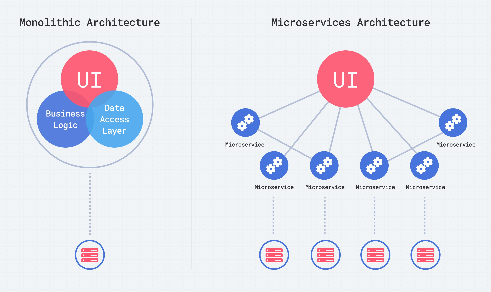

The evolution of technologies has changed the way we build the architecture of applications. Docker, Cloud services, and Container Orchestration services brought us ability to develop distributed, more scalable, and reliable solutions. In this article, we will compare microservices and monolith architecture, discuss what teams and projects should use what type of architecture, and explore their advantages and disadvantages.

At a glance, the difference between those types can be illustrated like this

It is not strictly true that monolith apps are always simple, but microservices are often 10 times larger and almost always requires more resources.

Let’s discuss the pros and cons of each, point by point.

## Deployment

Monolith apps allow you to set your deployment once and then simply adjust it based on ongoing changes. At the same time, however, there is also only a single point of failure during deployment and, if everything goes wrong, you could break your entire project.

Microservices require much more work; you will need to deploy each microservice independently, worry about orchestration tools, and try to unify the format of your ci/cd pipelines to reduce the a amount of time required for doing it for each new microservice. There is a bright side, however; if something goes wrong, you will only break one small microservice, which is less problematic than the entire project. It’s also much easier to rollback one small microservices than and entire monolith app.

## Maintenance

If you plan to use a microservices architecture, get a DevOps for your team and prepare yourself. Not every developer will be familiar with Docker or orchestration tools, such as Kubernetes, Docker Swarm, Mesosphere, or any similar tool that could help you to manage infrastructure with a lot of moving parts. Someone has to monitor and maintain the functioning state of your CI configuration for each microservice and the whole infrastructure.

## Reliability

Microservices architecture is the obvious winner here. Breaking one microservice affects only one part and causes issues for the clients that use it, but no one else. If, for example, you’re building a banking app and the microservice responsible for money withdrawal is down, this is definitely less serious than the whole app being forced to stop.

## Scalability

For scalability, microservices are again better suited. Monolith apps are hard to scale because, even if you run more workers, every worker will be on the single, whole project, an inefficient way of using resources. Worse, you may write your code in the way that would render it impossible to scale it horizontally, leaving only vertical scaling possible for your monolith app. With microservices, this is much easier. Resources can be used more carefully and allow you to scale only that parts that require more resources.

## Cost

Cost is tricky to calculate because monolith architecture is cheaper in some scenarios, but not in others. For example, with the better scalability of microservices, you could set up an auto-scale and only pay for that when the volume of users really requires more resources. At the same time, to keep that infrastructure up and running you need a devops that needs to be paid. With a small monolith app, you could run on a $5-$20 host and turn on the snapshot. With a larger monolith app, you may host a very expensive instance because you can’t share it over multiple small, cheap hosts.

## Development

In one of our projects, we have 16 microservices and I could tell you from experience that this can be tricky to deal with it. The best way to deal with microservices is to build your docker-compose file from the beginning and develop through Docker. This helps you reduce the time spent onboarding new people; simply run the system from scratch and launch all microservices as needed. Opening 10+ terminal windows and executing commands to start each individual service is a pain.

On the other hand. when you develop one microservice, you may have a case in which you don’t need to run other parts of the application at all. This results in fewer problems with git conflicts due to the better process of breaking down tasks and the ability to isolate developers across microservices.

Doing code review and QA is simpler with microservices; you may even be able to write microservices in different languages.

## Releasing

Microservices that are smaller and with a proper architecture of microservices communication allow you to release new features faster by reducing QA time, build time, and tests execution time. Monolith apps have a lot of internal dependencies that could not be broken up. There is also a higher risk that something you are committed to could depend on unfinished changes from your team members, which could potentially postpone releases.

## What architecture is better for you?

Use monolith architecture if you:

- have a small team.
- build the MVP version of a new product.
- did not get millions in investments to hire DevOps or spend extra time on complex architecture.
- have experience of development on solid frameworks, such as Ruby on Rails, Laravel, etc.
- don’t see performance bottlenecks for some key functionality.
- think that microservices are cool and it’s a trend.

Keep in mind that if you find out that there is need of microservices in your project, monolith architecture always carries the risk of break down as a result of these small microservices.

Use microservices architecture if you:

- don’t have a tight deadline; microservices require you to research and architecture planning to ensure it works.
- have a team with knowledge of different languages.
- worry a lot about the scalability and reliability of your product.
- potentially have a few development departments(maybe even in different countries/time zones).
- have an existing monolith app and see problems with parts of your application that could be split across multiple microservices.
