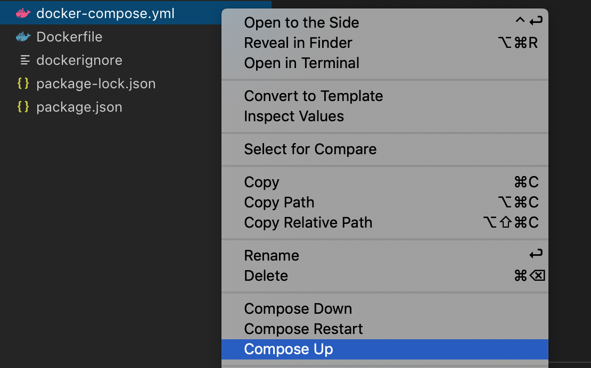

My current primary tech stack is Node.js/Javascript and, like many teams, I moved our development and production environments in to Docker containers. However, when I started to learn Docker, I realized that most articles focused on development or production environments and could find nothing about how should you organize your Docker configuration to be flexible for both cases.

In this article, I demonstrate different use cases and examples of Node.js Dockerfiles, explain the decision making process, and help envision how your flow should be using Docker. Starting with a simple example, we then review more complicated scenarios and workarounds to keep your development experience consistent with or without Docker.

_Disclaimer: This guide is large and focused on different audiences with varying levels of Docker skills; at some points, the instructions stated will be obvious for you, but I will try to make certain relevant points alongside them in order to provide a complete vision of the final set up._

## Prerequisites

- [VS Code](https://code.visualstudio.com/)
- [Docker](https://www.docker.com/products/docker-desktop)
- [Docker extension for VS Code](https://code.visualstudio.com/docs/azure/docker)

## Described cases

- Basic Node.js Dockerfile and docker-compose
- Nodemon in development, Node in production
- Keeping production Docker image away from devDependecies
- Using multi-stage build for images required node-gyp support

## Add .dockerignore file

Before we start to configure our Dockerfile, let’s add a .dockerignore file to your app folder. The .dockerignore file excludes during the COPY/ADD command files described in the file. [Read more here](https://docs.docker.com/engine/reference/builder/#dockerignore-file)

```text
node_modules
npm-debug.log
Dockerfile*
docker-compose*
.dockerignore
.git
.gitignore
README.md
LICENSE
.vscode
```

## Basic Node.js Dockerfile

To ensure clear understanding, we will start from basic Dockerfile you could use for simple Node.js projects. By simple, I mean that your code does not have any extra native dependencies or build logic.

```Dockerfile
FROM node:10-alpine

WORKDIR /usr/src/app

COPY package*.json ./
RUN npm install

COPY . .

CMD [ "npm", "start" ]
```

You will find something like this in every Node.js Docker article. Let’s briefly go through it.

```Dockerfile
WORKDIR / usr / src / app;
```

The workdir is sort of default directory that is used for any RUN, CMD, ENTRYPOINT, COPY and ADD instructions. In some articles you will see that people do mkdir /app and then set it as workdir, but this is not best practice. Use a pre-existing folder/usr/src/app that is better suited for this.

```Dockerfile
COPY package*.json ./
RUN npm install
```

Here’s another best practice adjustment: Copy your package.json and package-lock.json before you copy your code into the container. Docker will cache installed node_modules as a separate layer, then, if you change your app code and execute the build command, the node_modules will not be installed again if you did not change package.json. Generally speaking, even if you forget to add those line, you will not encounter a lot of problems. Usually, you will need to run a docker build only when your package.json was changed, which leads you to install from scratch anyway. In other cases, you don’t run docker build too often after your initial build in the development environment.

## The moment when the docker-compose comes in

Before we start to run our app in production, we have to develop it. The best way of orchestrating and running your docker environment is using [docker-compose](https://docs.docker.com/compose/). Define a list of containers/services you want to run and instructions for them in an easy to use syntax for further running in a YAML file.

```yaml
version: '3'

services:
  example-service:
- build: .
- volumes:
-   - .:/usr/src/app
-   - /usr/src/app/node_modules
- ports:
-   - 3000:3000
-   - 9229:9229
- command: npm start
```

In the example of a basic docker-compose.yaml configuration above, the build done by using Dockerfile inside your app folder then your app folder is mounted to the container and node_modules that are installed inside the container during the build will not be overridden by your current folder. The 3000 port is exposed to your localhost, assuming that you have a web server running. 9229 is used for exposing the debug port. Read more here.

Now run your app with:

```bash
docker-compose up
```

Or use VS code extension for the same purpose.



With this command, we expose 3000 and 9229 ports of the Dockerized app to localhost, then we mount the current folder with the app to /usr/src/app and use a hack to prevent overriding of node modules from the local machine through Docker.

### So can you use that Dockerfile in development and production?

Yes and no.

### Differences in CMD

First of all, usually you want your development environment app reloading on a file change. For that purpose, you can use nodemon. But in production, you want to run without it. That means your CMD(command) for development and production environments have to be different.

There are few different options for this:

1. Replace CMD with the command for running your app without nodemon, which can be a separate defined command in your package.json file, such as:

   ```json
   "scripts": {
     "start": "nodemon --inspect=0.0.0.0 src/index.js",
     "start:prod": "node src/index.js"
   }
   ```

   In that case your Dockerfile could be like this:

   ```Dockerfile
   FROM node:10-alpine

   WORKDIR /usr/src/app

   COPY package*.json ./
   RUN npm install

   COPY . .

   CMD [ "npm", “run”, "start:prod" ]
   ```

   However, because you use docker-compose file for your development environment, we can have a different command inside, exactly as in the previous example:

   ```yaml
   version: '3'

   services:
     ### ... previous instructions
     - command: npm start
   ```

2. If there is a bigger difference or you use docker-compose for development and production, you can create multiple docker-compose files or Dockerfile depending on your differences. Such as docker-compose.dev.yml or Dockerfile.dev.

### Managing packages installation

It’s generally preferable to keep your production image size as small as possible and you don’t want to install node modules dependencies that are unnecessary for production. Solving this issue is still possible by keeping one unified Dockerfile.

Revisit your package.json file and split devDependencies apart from dependencies. [Read more here](https://stackoverflow.com/questions/18875674/whats-the-difference-between-dependencies-devdependencies-and-peerdependencies). In brief, if you run your npm install with --production flag or set your NODE_ENV as production, all devDependencies will not be installed. We will add extra lines to our docker file to handle that:

```Dockerfile
FROM node:10-alpine

ARG NODE_ENV=development
ENV NODE_ENV=${NODE_ENV}

WORKDIR /usr/src/app

COPY package*.json ./
RUN npm install

COPY . .

CMD [ "npm", “run”, "start:prod" ]
```

To customize the behaviour we use

```Dockerfile
ARG NODE_ENV=development
ENV NODE_ENV=${NODE_ENV}
```

Docker supports passing build arguments through the docker command or docker-compose. NODE_ENV=development will be used by default until we override it with different value. The good explanation you could find here.

Now when you build your containers with a docker-compose file, all dependencies will be installed, and when you are building it for production, you can pass build argument as production and devDependencies will be ignored. Because I use CI services for building containers, I simply add that option for their configuration. Read more here

### Using multi-stage build for images requiring node-gyp support

Not every app you will try to run in Docker will exclusively use JS dependencies, some of them require node-gyp and extra native installed os libraries to use.

To help solve that problem we can use multi-stage builds, which help us to install and build all dependencies in a separate container and move only the result of the installation without any garbage to the final container. The Dockerfile could look like this:

```Dockerfile
// The instructions for the first stage
FROM node:10-alpine as builder

ARG NODE_ENV=development
ENV NODE_ENV=${NODE_ENV}

RUN apk --no-cache add python make g++

COPY package*.json ./
RUN npm install

// The instructions for second stage
FROM node:10-alpine

WORKDIR /usr/src/app
COPY --from=builder node_modules node_modules

COPY . .

CMD [ "npm", “run”, "start:prod" ]
```

In that example, we installed and compiled all dependencies based on the environment at the first stage,then copied the node_modules in a second stage we will use in the development and production environment.

The line `RUN apk --no-cache add python make g++` may be different from project to project, likely because you will need extra dependencies.

```Dockerfile
COPY --from=builder node_modules node_modules
```

In that line, we copy a node_modules folder from first stage to a node_modules folder in second stage. Because of this, in the second stage, we set WORKDIR as /usr/src/app the node_modules will be copied to that folder.
Summary

I hope this guide helped you understand how to organize your Dockerfile and have it serve your needs for both development and production environments. We can sum up our advice as follows:

- Try to unify your Dockerfile for dev and production environments; if it does not work, split them.
- Don’t install dev node_modules for production builds.
- Don’t leave native extension dependencies required for node-gyp and node modules installation in the final image.
- Use docker-compose to orchestrate your development setup.
- It's up to you what to choose for orchestration your Docker containers in production, it could be docker-compose, Docker Swarm or Kubernetes.
