Technology is most effective when you know how to work with it; bear this in mind when you work with Docker. Teams adopting Docker for the first time typically do so on the recommendation of Devops. Devops cannot always explain, however, how the new team should use it without risking the benefits of their existing system.

Here, you will find developers use cases for specific commands, explanations of what they do, and demos. Give it to your dev team to preempt their questions when you go through the process of adopting Docker at your company.

## docker build

```bash
docker build --rm -t docker-examples:latest .
```

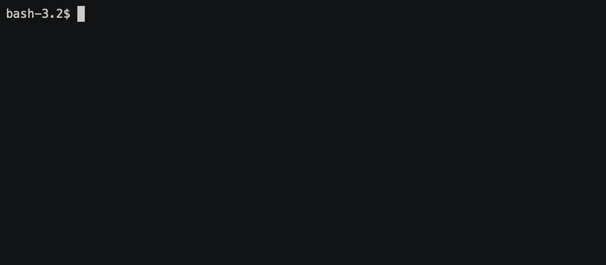

**Use case:** You don’t have a docker-compose file, only a dockerfile. You want to run your service, but first you have to build it.

**Details:** Build an image from a dockerfile.
`--rm` is used in order to remove an intermediate container after the successful build. Without that option in your container list, you will have something like this after the build:


`-t` tag images you build, otherwise it becomes difficult to know at a glance what it contains.

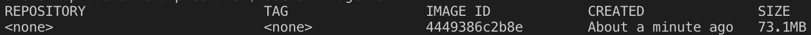

**Shortcut with VS Code**


```bash
docker build --rm -t --no-cache docker-examples:latest .
```

**Use case:** You didn’t specify a dependency package version and want to update to the latest version, but you did not change your dockerfile and Docker uses cached layers constantly.

**Details:** Force Docker to rebuild the image from scratch.

## docker run

```bash
docker run -d -p 4000:3000 docker-examples:latest
```


**Use case:** You’ve built a Docker image and want to run it. The app inside the container uses the 3000 port, but you want to use it on 4000 on your local machine.

**Details:**
`-d` runs the container in the background and prints the container ID.
`-p` publishes the container port to the local machine port **host_port:docker_port.**

**Shortcut with VS Code**
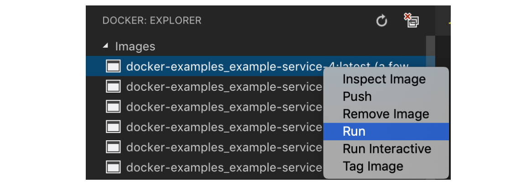

```bash
docker run docker-examples:latest
```

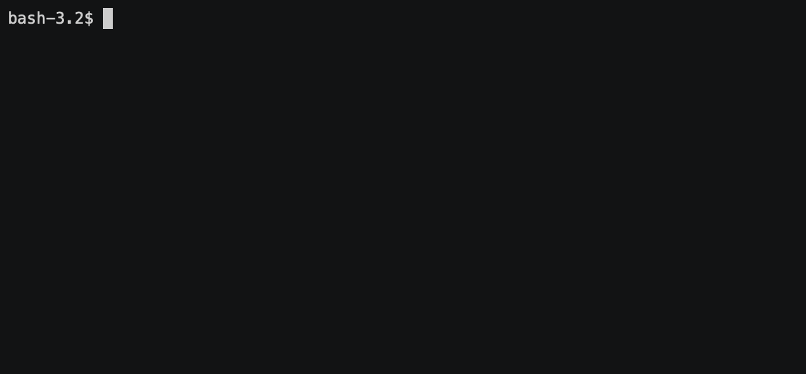

**Use case:** You want to run a Docker image and see/control the launched process in your terminal. Press Ctrl+C to to exit your container as well.

```bash
docker run -t -i docker-examples:latest node
```


**Use case:** You want to run a specific command/tool inside your container, use it, and then run a new instance of the container. For example, if you want get access to the node.js console and execute something. See also the docker exec for already launched containers.

## docker stop

```bash
docker stop container_name
```

**Use case:** You need to stop an already launched container.

**Details:** You can find the container name by using the “docker ps -a” command.

**Shortcut with VS Code**
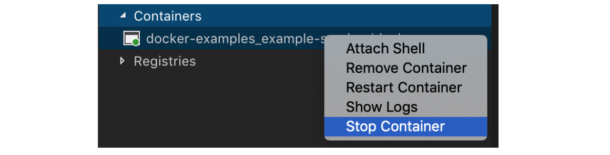

```bash
docker stop $(docker ps -a -q)
```

**Example:** Stop all containers

## docker ps

```bash
docker ps -a
```

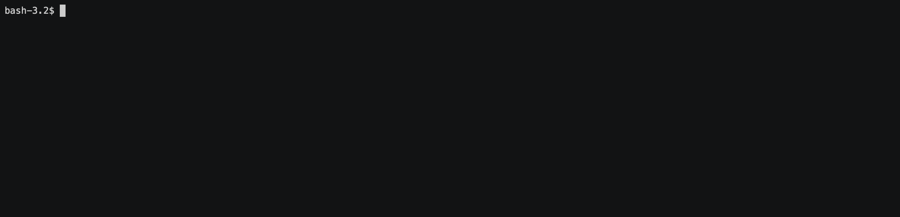

**Use case:** You look at the list of containers and find the name of the container you need in order to stop it. You can also use this to see the status and exposed ports of the container.

**Shortcut with VS Code**
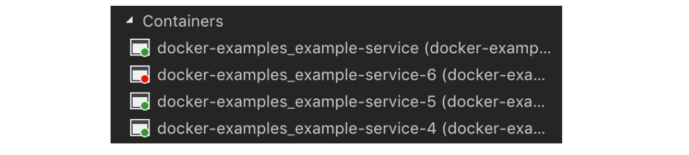

## docker logs

```bash
docker logs -f container_name
```

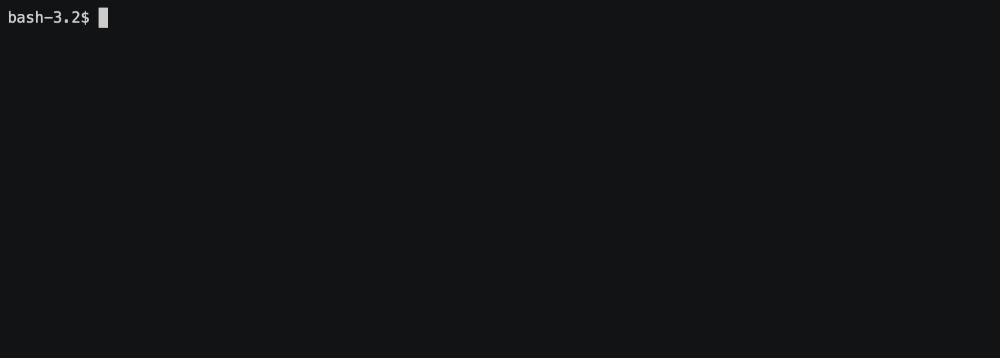

**Use case:** Your service crashed on launch and you want to know the reason. You may also want to watch for the logs for a service on an ongoing basis.

**Details:** Watch for logs of the specific container; thisworks for running and stopped containers.
`-f` turns on following for the log output.

**Shortcut with VS Code**


## docker kill

```bash
docker kill $(docker ps -q)
```

**Use case:** You are disappointed with Docker and want to read everything related to it.

**Details:** Kills all running containers.

## docker rm

```bash
docker rm $(docker ps -a -q)
```

**Use case:** Your container list is messy and you want to tidy it up.

**Details:** Deletes all stopped container

## docker system

```bash
docker system prune
```


**Use case:** You want to rid of unused stuff.

**Details:** Remove all unused containers, networks, images (both dangling and unreferenced), and optionally, volumes.

**Shortcut with VS Code**
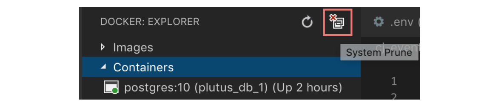

## docker rmi

```bash
docker rmi $(docker images -q)
```

**Use case:** You need more space on your disk.

**Details:** Deletes all images

## docker exec

```bash
docker exec -it container_name /bin/sh
```


**Use case:** A container is throwing out a connection timeout error of “get” request to example.com during execution. You can connect to the container and run curl/ping.

**Details:** Runs a specific command/tool inside your container and allows you to use it inside a container. Very useful for a debugging and understanding what’s happening inside the Docker container.

## docker-compose up

```bash
docker-compose up
```


**Use case:** You have a docker-compose file with some services, and you want to build and run them all and see their output.

```bash
docker-compose up -d
```

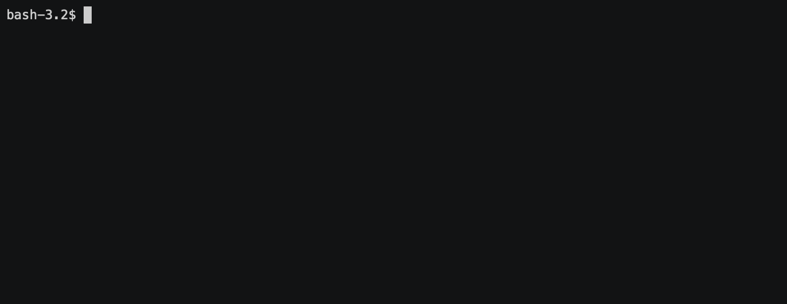

**Use case:** You want to build and run all services in the background and see their statuses later.

**Shortcut with VS Code**
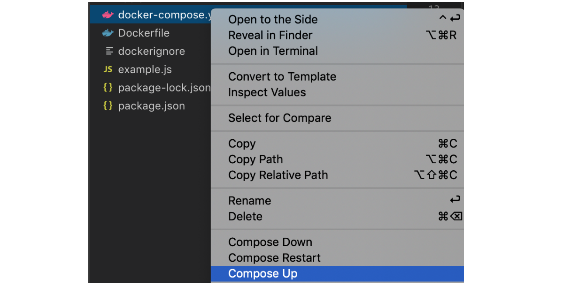

```bash
docker-compose up -d example-service-1
```

**Use case:** You want to run a specific service (name as in docker-compose file) so that all ports and volumes will be used as declared in your docker-compose file for that service.

## docker-compose down

```bash
docker-compose down
```

**Use case:** You need to stop all services declared in a docker-compose file. This stops containers and removes each container’s networks, volumes, and images created by ip. This is helpful when you want to start from a clean slate.

## docker-compose run

```bash
docker-compose run example_app rails db:migrate
```

**Use case:** You need to run a specific task that your service provides, such as migrations or tests. You can do this in a similar way as docker run, but you can run the task by service name from your docker-compose file. Keep in mind that when you use “run” ports, you declarations in docker-compose will not be published without using — service-ports.

## docker-compose exec

```bash
docker-compose exec example_app node
```


**Use case:** You want to access inside the launched container and execute something, similar with docker exec. The difference is that you could get access by the service name. Useful for the debug purpose, test network, check that all data exist inside the Docker container.

## docker-compose logs

```bash
docker-compose logs -f container_name
```

**Use case:** Your service crashed on launch and you want to know why.

**Details:** Watches for logs of the specific container, for both running and stopped containers. Instead of using a docker logs command here, use the service name instead of the container name.
`-f` turns on following for the log output.

## docker-compose stop

```bash
docker-compose stop example_app
```

**Use case:** You want to stop your container by service name or container name.

## docker-compose restart

```bash
docker-compose restart example_app
```

**Use case:** You want to restart a container with the service name or container name.

## Want to read more about Docker?

My previous articles will help you understand Docker even better:

- [How to debug Node.js in a Docker container](/blog/how-to-debug-node-js-in-a-docker-container)
- [Using Docker for Node.js in Development and Production](/blog/using-docker-for-nodejs-in-development-and-production)
