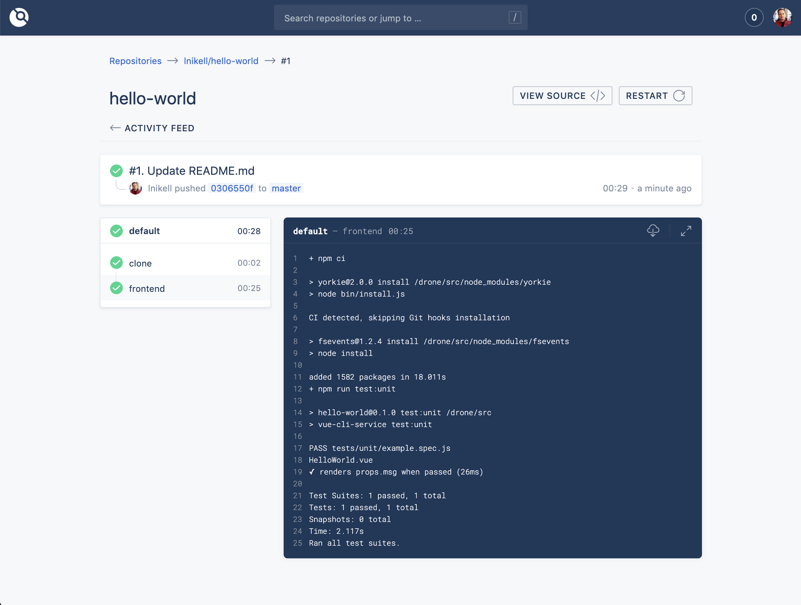
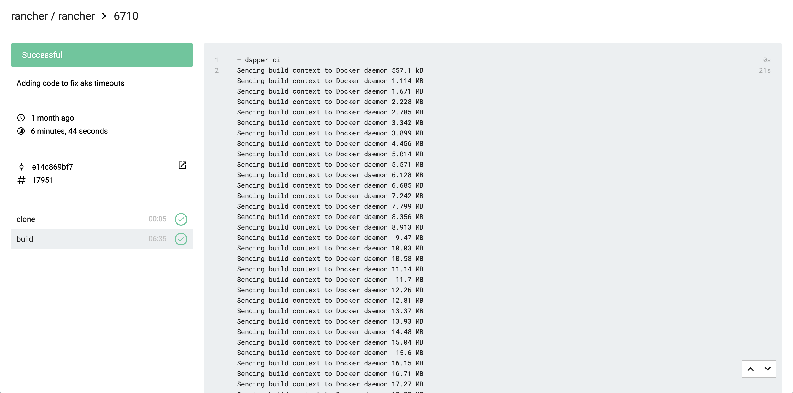
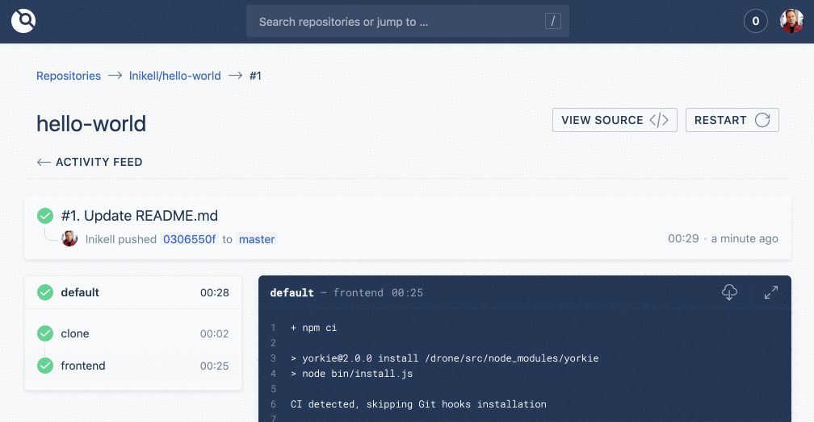
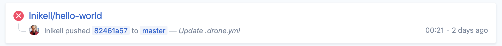
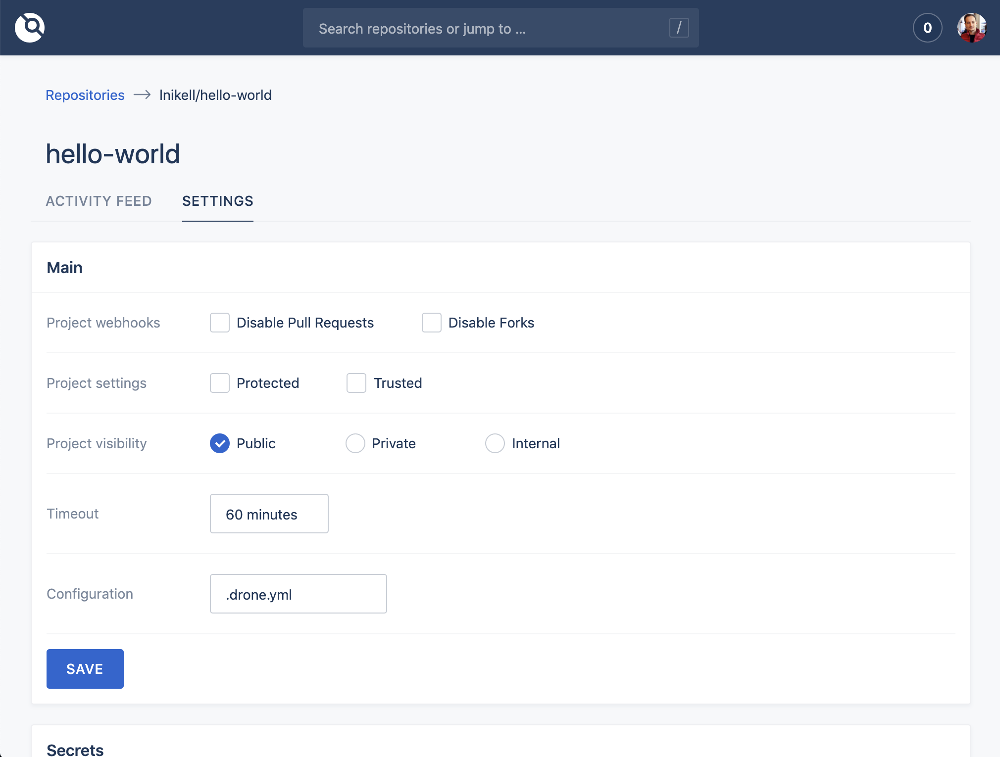
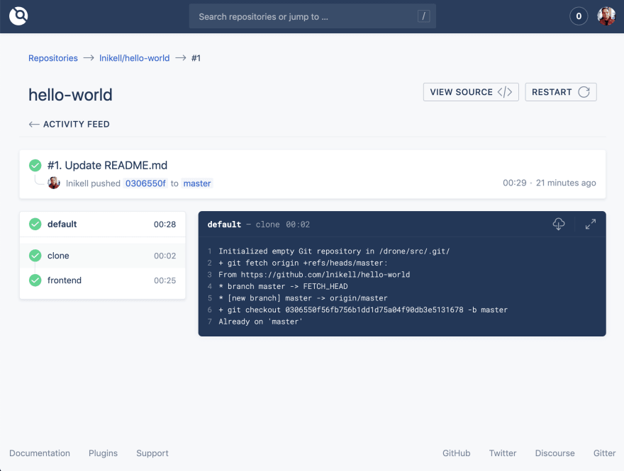
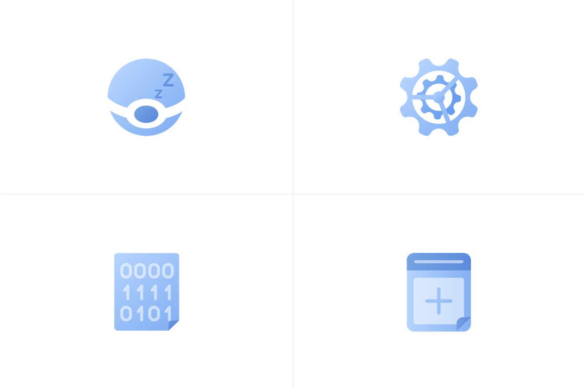

In this article, we talk about Drone CI, a very powerful, lightweight, docker-based, multi-pipeline, multi-platform, open-source CI/CD tool. Drone launched in 2012 and, like many other open source tools, was made by and for developers, so lacked a user-friendly interface.

## I hope we finally changed it…

We at [Pixel Point](https://pixelpoint.io/) use Drone on a lot of different projects, on a day-to-day basis, so we decided to improve it. After months of work, we’re happy to announce new Drone v1.0.0, which is ready to use now.

### New version

### Old version

## Research Previous Solution

The main purpose of the changes was to improve the UX, then the UI. We reviewed existing issues with Drone found on Github, then gathered feedback from our developers and the founder of Drone, Brad Rydzewski.

Based on this, we compiled a list of main issues:

- Complicated and obscure navigation
- A confusing cancel build action
- A lack of user interaction during repository activation
- A lack of responsive design support for mobile and tablet devices
- No clearly defined home page
- Interface scalability problems and no space for new features
- Obscure settings saving

We also created a list of new, upcoming features that include multi-pipeline builds, support for cron jobs, and new repository settings.

## New Ideas and Realization

### Key navigation — Search

To start, we decided to make the “Search” function a key component for navigation across repositories and for their activation. It’s featured at the top of every page and is accessible by shortcut “/”. When using search, you can see a summary of the repository and the status of the latest build.

### Cards

We designed cards for repositories, using the information that was the most useful and trying to create as flexible a solution as possible. For example, the title of the card on the home page is the name of the repository, while the second line is a human-readable phrase with important information.

We built it based on the author of the commit, event, branch and commit message. That solution scales better than the table view, where each column is dedicated to a specific field. Using our solution, you can easy collapse it and break by-lines for mobile view.

### Tabs

We altered the repository page so that you can see tabs upon opening it. This provides a good navigation approach for the settings page and allow us to add new tabs in future (we already have a few in the works).

### Single Settings Page

Rather than split certain settings into different pages, now all of them are in one. Once you activate the new repository, you’re immediately redirected to the settings page, because that is typically the first place you go to configure your repository.

### New build page

We strive for unified components, so the main component with a short breakdown of information about the build status is the same as on previous pages. Navigation on the left now supports multiple pipelines. At the top, we added space for buttons, where we plan to add new features in future releases.

### Logs are important

For a better experience reading and navigating logs, we added a fullscreen mode and the ability to download logs, which is particularly useful if your logs are massive and you want to review them in your personal favourite editor.

### Synchronization does not block your work

Some Drone clients have a massive list of repositories and synchronizing them all with Drone takes some time. Previously, synchronizing was a fullscreen task and did not allow you to close the screen or continue working with existing lists of repositories. Now, it’s simply a small button with animations that play during synchronization.

### Clever loading

In the new version, when you load the data on the first app then jump to another page, Drone draws on the existing list and shows a clear indication that data is loading. No more waiting or watching for spinners; if there’s data, it renders immediately.

### Nice Icons for empty states

We put a lot of effort to make fancy even empty states and made a lot of different icons you would be able to enjoy on various pages.

## What else can you expect from Drone?

There are already plans for a Drone 1.1 release, with key features including:

- A “Deploy” button for a specific environment from the build page
- The ability to filter builds by branches and environments
- User friendly tooltips for users who have just installed Drone
- A new approach to real-time updates
- Improved user management
