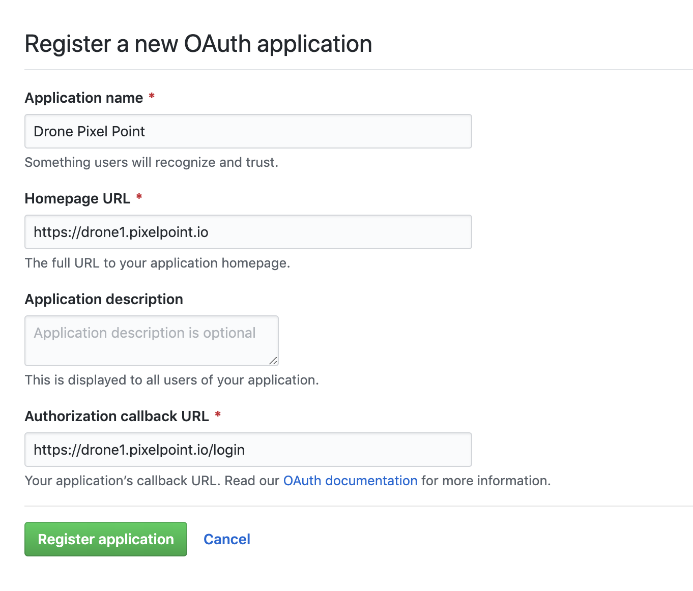
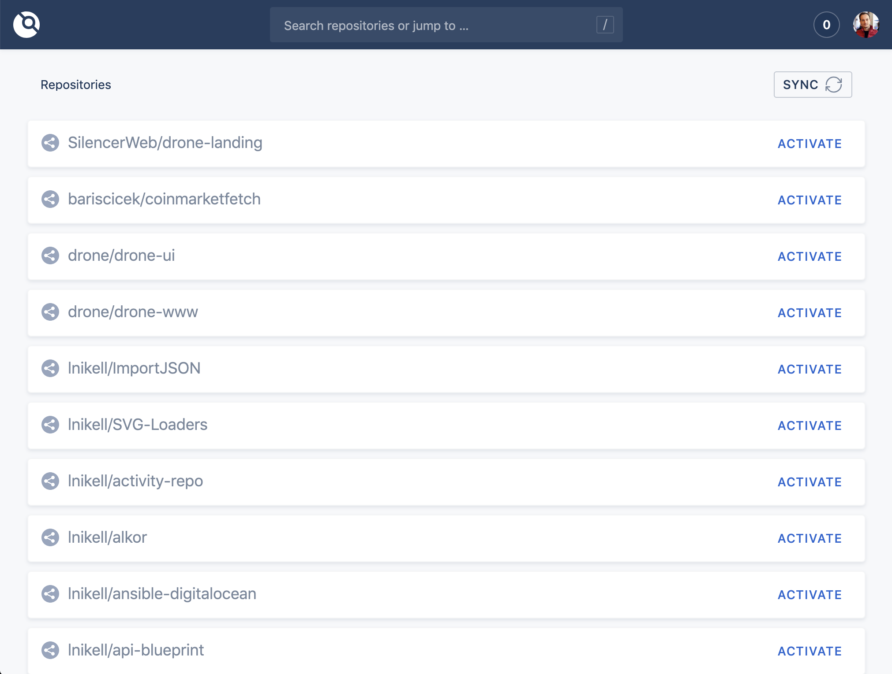
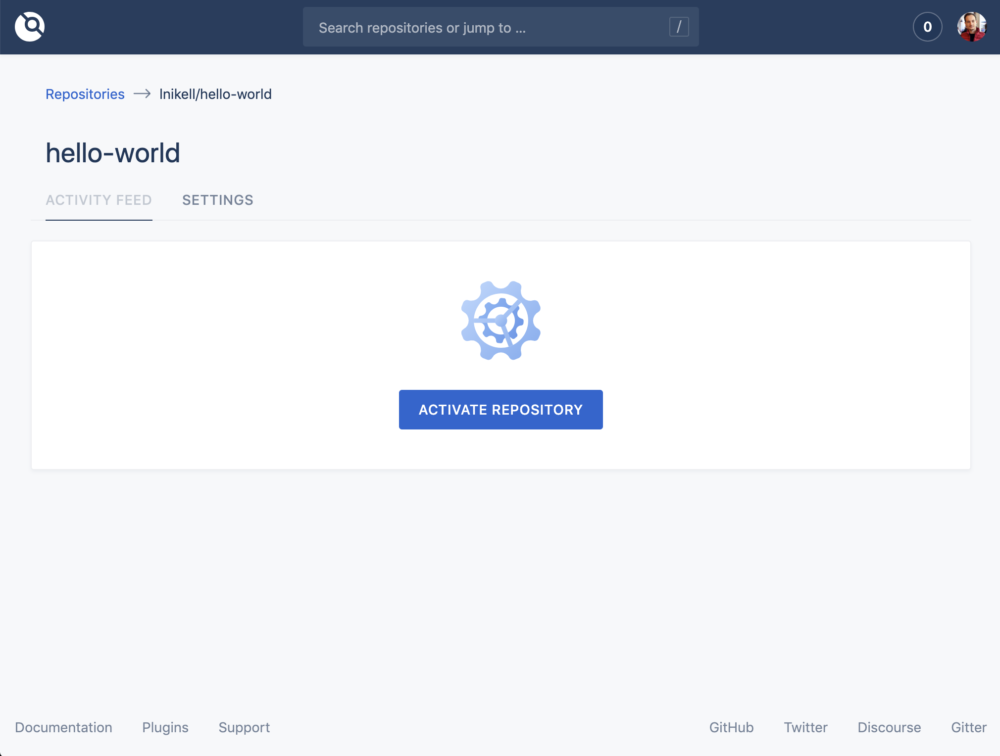
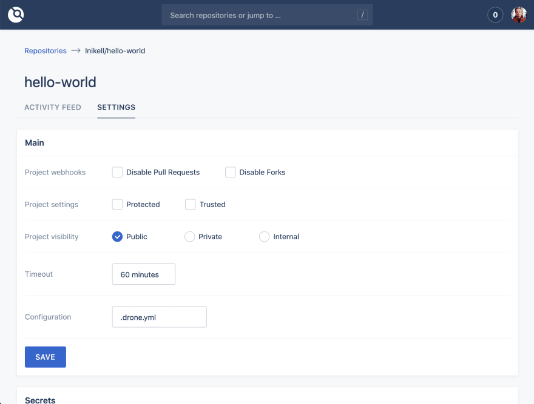
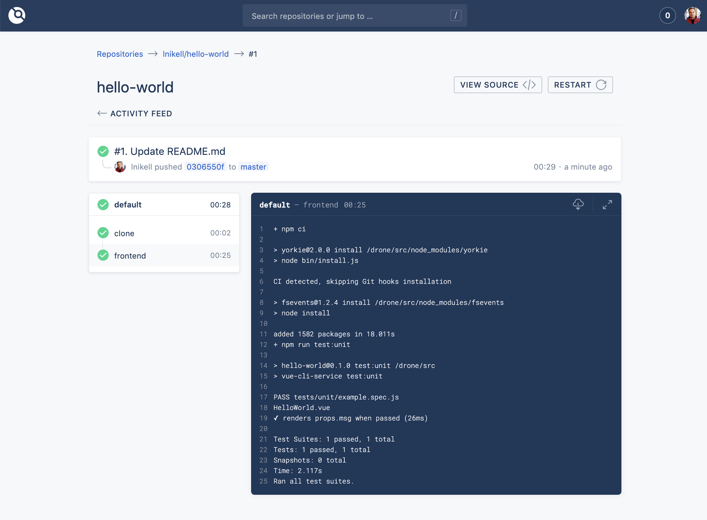

If you are building your side project or startup and want to avoid spending too much money on popular commercial solutions like Travic CI (which costs $69/month), you can use your own self-hosted Drone CI on your laptop, AWS free tier, or any other servers.

Drone CI features:

- Multi-platform support
- Yaml-based configuration
- Multi pipelines and complex build step logic support
- Docker based
- Free
- Github, Gitlab, Bitbucket support

We will run Drone CI on a single host and using Github, but you could use a multimachine configuration or Kubernetes, and different VCS providers. Find more information here.

## Get the Host

For the purposes of this test, we use an AWS EC2 free tier instance, but you can use whatever you want. To use our approach, follow these steps:

- Go to the AWS page;
- Add your SSH pub key to Key Pairs section on the EC2 page (to access your — instance via SSH);
- Create a new Ubuntu 18.04 free tier instance on AWS;
- Allow 80 and 443 ports for the Security Group of your instance; if it’s a fresh account, use launch-wizard-1, or find it in description of your EC2 instance.

## Install Docker

You only need Docker to start using Drone. Just follow the instructions here. Check that you installed everything right by running “docker -v”.

```bash
root@ip-172-31-23-205:~# docker -v
Docker version 18.09.3, build 774a1f4
```

## Create an OAuth Application

We use Github for examples, but you can also run it on Gitlab, Bitbucket, Gitea, and Gogs. More information here.

- Go to [github.com/settings/developers](https://github.com/settings/developers) and sign in to your personal account, if you have one, or set up an account if you don’t.
- Click “new oAuth app”.
- Fill out the form, as per the example below.



You can use the IP of your server or assign a domain to it to correctly fill this form. If you do this, you can use the Client ID and Client Secret in the next steps.

## Install Drone

This is very simple, just use the following:

```bash
docker pull drone/drone:1
```

Followed by:

```bash
--volume=/var/run/docker.sock:/var/run/docker.sock \
  --volume=/var/lib/drone:/data \
  --env=DRONE_GITHUB_SERVER=https://github.com \
  --env=DRONE_GITHUB_CLIENT_ID=652d1he1a62b6336bf0 \
  --env=DRONE_GITHUB_CLIENT_SECRET=c8990176a4bfywe55ekj8c3cf6d0ffccb8e3a213e \
  --env=DRONE_RUNNER_CAPACITY=2 \
  --env=DRONE_SERVER_HOST=drone1.pixelpoint.io \
  --env=DRONE_SERVER_PROTO=https \
  --env=DRONE_TLS_AUTOCERT=true \
  --env=DRONE_USER_FILTER=lnikell \
  --env=DRONE_USER_CREATE=username:lnikell,admin:true \
  --publish=80:80 \
  --publish=443:443 \
  --restart=always \
  --detach=true \
  --name=drone \
  drone/drone:1
```

Using this configuration, Drone generates SSL certificates with Let’s Encrypt, which then lets us use https for accessing the Drone UI. Your user account will have admin privileges (DRONE_USER_CREATE), which you should lose to lock access to the server for anyone else(DRONE_USER_FILTER). You can find explanations of other variables here.

Your instance should now be up and running, simply log in and use it!



## Define Your Pipeline

Once you have your Drone CI instance ready, it’s time to activate the repository and create your pipeline. First, find the repository using the search bar and activate it.



On the settings page, you can change your project visibility settings, add secrets(sensitive information required for build steps) or add a cron job.



Defining build steps and pipelines in Drone is a simple process. Just add to your repository .drone.yml file and use yaml syntax to describe the steps. Here’s a simple example:

```bash
kind: pipeline
name: defaultsteps:
- name: frontend
  image: node
  commands:
  - npm ci
  - npm run test:unit
```

The example above is also available [here](https://github.com/lnikell/hello-world/tree/master)
Now, when you push to the repository, it will trigger a new build on Drone CI.



But you can do much more, depending of the complexity of your project. Here are few typical things that this process can be used for:

- Sending Slack notifications
- Deploying to Kubernetes
- Pushing images to a Docker registry
- Running database or other service instances required for tests
- Running multiple pipelines and using multiplatforms

Drone is an everyday helper which greatly improves the stability, flexibility and ease when our team runs tests and deploys code. For more information about Drone CI, visit [drone.io/](https://drone.io/) and check out our story about how did we make Drone 1.0 better.
