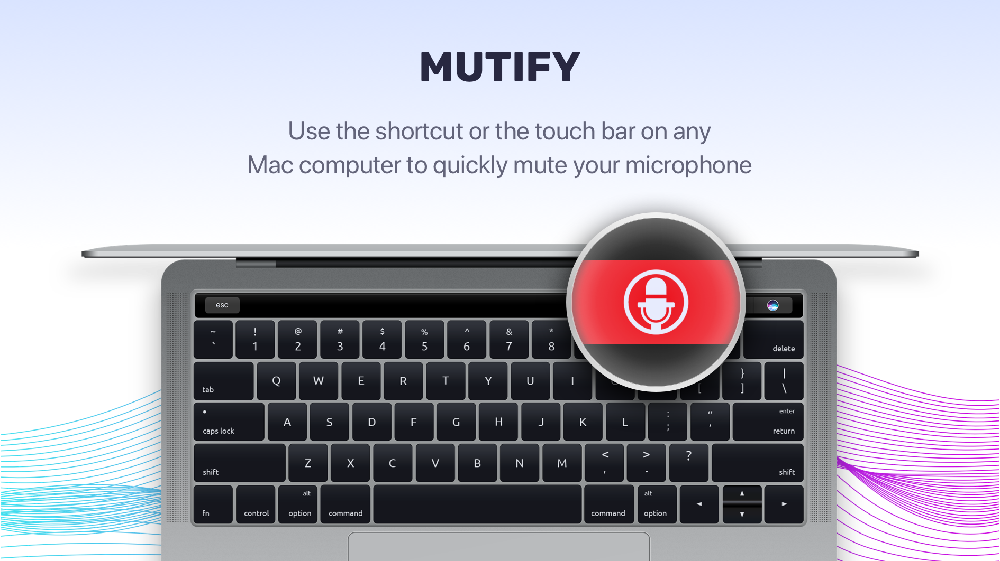
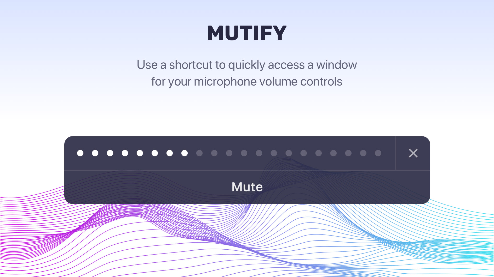

Two years ago, we began the process of building a simple, open-source MacOS app as a side project, but this turned out to be a much more challenging journey than we initially thought. Here, we talk about the various stages of this journey, including:

- how we built the app to mute/unmute microphones using the shortcut or touch bar icon;
- why taking an open-source approach did not meet our expectations;
- what limitations Apple placed on the touchbar that rendered it useless for our needs.

We’ve just released our Mutify app on [Product Hunt](https://www.producthunt.com/posts/mutify), so now we’re waiting for your feedback and support!

## 💡Initial Idea

I often spend a lot of time on calls in the middle of work days discussing tasks, solutions and future plans with tech teams working on various different projects. While on these calls, I prefer to mute my mic anytime I’m not speaking. However, I often switch between browser tabs or look at presentations while in these meetings, which makes it hard to quickly unmute myself as I search for the tab and unmute icon I need. To resolve this, I began using a MacBook 2016 with the touchbar, thinking that adding a mute button to the touchbar could be an effective solution. This is what sparked the journey that eventually led to our new app.

## From Open Source to Paid App

We’re pretty happy with open source in principle, so we initially developed the first version of the app as an open source project, investing in the costs ourselves. We released it and made some promotions, and got positive feedback, but also noticed some bugs. MacOS turned out to be more of a problem than we thought. Particular problems we faced include:

- problems with other apps attempting to control the mic
- compatibility between different versions of MacOS
- limitations put in place by Apple that needed careful investigation

We on the app’s community regularly growing so that we could get some contributors able to help handle issues that arose. Unfortunately, this didn’t happen. From day one, all development was done by ourselves; open-source development on Swift turned out to be quite different than the JS or PHP communities, where you can rely on small bug fixes from outside devs. This lack of helpful community is a major weakness of MacOS development.

We got 159 stars on Github, more than 8000 installations, and zero contributors. The app, however, still needed lot of work to complete, so we decided to rebuild it from scratch and change to a paid model to guarantee at least some support for future development and app improvements. That how Mutify was born.

## Mutify Features

### Mute and unmute microphone

Mute and unmute with a hotkey or touchbar icon available at all times.

### Noise level

Display the current ambient noise level, helping you track when you need to mute yourself.

### Variety app support

Use it with Hangouts, Zoom, GoToMeeting, Skype, Telegram, etc. Different calls apps try to control the mic, but the app allows you to keep control.

## Difficulties of MacOs App Development

We encountered problems at almost every step of development. It was hard to build a fully customized UI, as we didn’t want to use standard components. When we developed a method of low-level muting apps, some apps unmuted without user input or notification. For example, when attempting to mute a microphone and showing it disabled at all in MacOS settings, GoToMeeting or GoToWebinar simply unmuted the mic again when detecting it had been muted. After discussing this with the support team for these apps, they insisted that this is correct behaviour. From our perspective, this is dangerous, since it suggests that meeting apps just want to listen you all of the time. We had to find complicated workarounds to ensure that the mic was always muted when we wanted it to be.

Since the day one, we thought that Apple would extend the functionality of the touchbar API, but there are no changes as yet. Touchbar API has a lot of limitations that prevent developers using it to build potentially useful software.

For example:

- Third party apps can’t be displayed in the list of actions for the touchbar in the “Cutomize Touchbar” settings;
- You only could add one third-party app icon that is always displayed in the touchbar together with Apple developed tools;

Those limitations significantly reduce the possible options for extending touchbar functionality. That’s why we also support mute by hotkey functionality. Even for a simple, one-action app, you need time to build features like the following:

- Onboarding screens
- Update functionality
- Integrated payment functions
- Open at login functions
- Hotkey support
- Website

## Effort = Quality

The main lesson we learned from this project is that doing something well always means a lot of hard work from different people with different skills, including some that don’t always relate to the primary functionality of the app. In the end, however positive feedback from our customers and personal satisfaction of using using our own application made it feel worth the effort.

Support us on [Product Hunt](https://www.producthunt.com/posts/mutify) for a 30% discount! Mutify also has a seven-day free trial, so feel free to test it out and we hope you enjoy!
