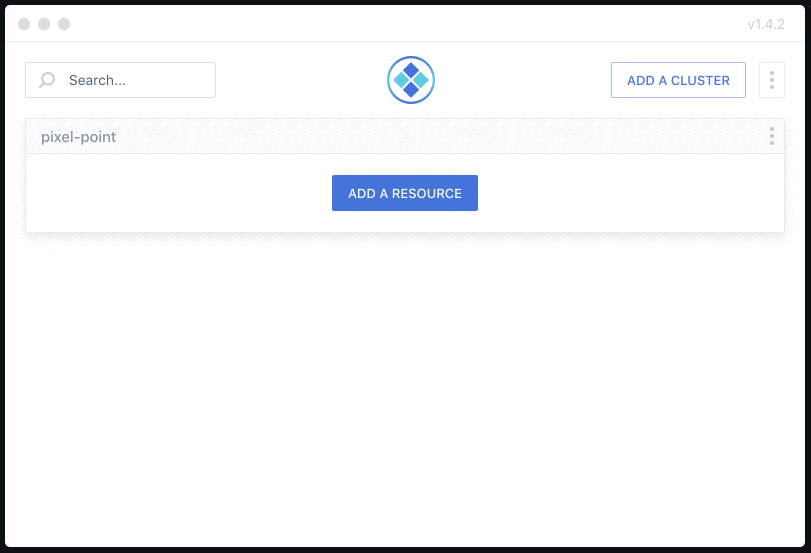

Probably you know that Kubernetes has built-in port forwarding functionality in their CLI. Port forwarding mostly used for the purpose of getting access to internal cluster resources and debugging.

## How does it work?

Generally speaking, using port forwarding you could get on your ‘localhost’ any services launched in your cluster. For example, if you have Redis installed in the cluster on 6379, by using a command like this:

```bash
kubectl port-forward redis-master-765d459796-258hz 7000:6379
```

you could forward Redis from the cluster to localhost:7000, access it locally and do whatever you want to do with it.

Behind the scene, kubectl uses Kubernetes API that tunnel all traffic to destination resource over a single HTTP connection.

## Problems come…

It’s nice to have a built-in functionality in kubectl, but it could be ok if you use it once per month, but if you use it more often you could mention the following problems:

- It does not support auto-reconnect. It’s very annoying to re-run command again and again when your connection is not stable or the destination resource kills a connection
- You have to remember namespaces/pods/deployments exact names to forward something
- Working with Multiple clusters also could be tricky

## Kube Forwarder is the solution

Kube Forwarder is an open-source  built on Electron and available for macOS, Windows, and Linux.



Kube Forwarder has several features that makes it awesome:

### Auto-reconnect

No more issues with failed connection, Kube Forwarder keeps the connection alive while you forward resources.

### Auto-complete

Take a look at how simple it is to add a new resource to your bookmarks by filling the form with autocompleted namespaces/pods/deployments/services names.

### Multiple clusters support

Add a few clusters and bookmark all relevant resources for you.

### Zero native dependencies

You don’t need to have kubectl installed, so even people who not familiar with CLI could use it.

### Import/Export

As a DevOps you could bookmark all necessary resources and then export it in JSON. Give it to your devs and they will be able to import it in their Kube Forwarder app and use it without bothering you.

Kube Forwarder has very simple UX, adding new clusters and forwarding resources take seconds. The app tested with GKE, EKS, AKS and Digital Ocean.

## What do you think?

[Star us on Github if you like the app ⭐](https://github.com/pixel-point/kube-forwarder)

Create an issue if you find some problems or have a question.
