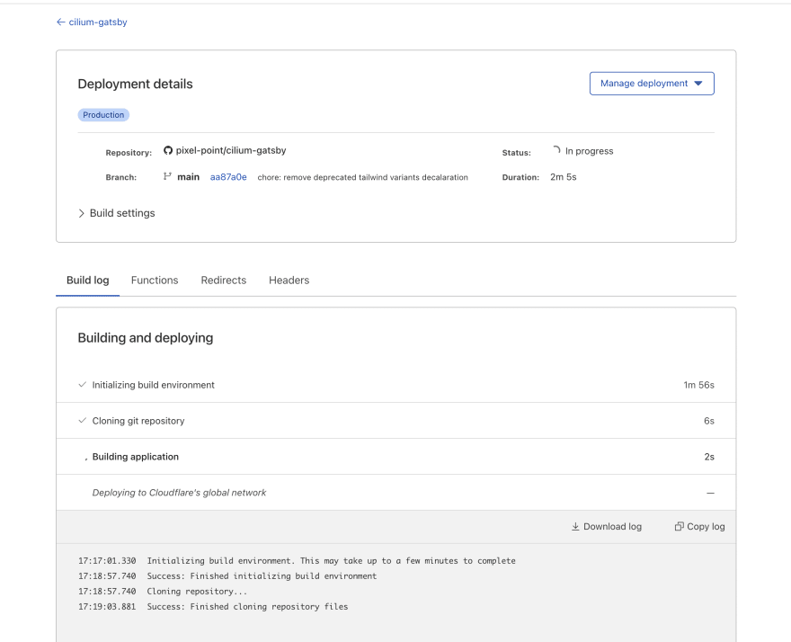
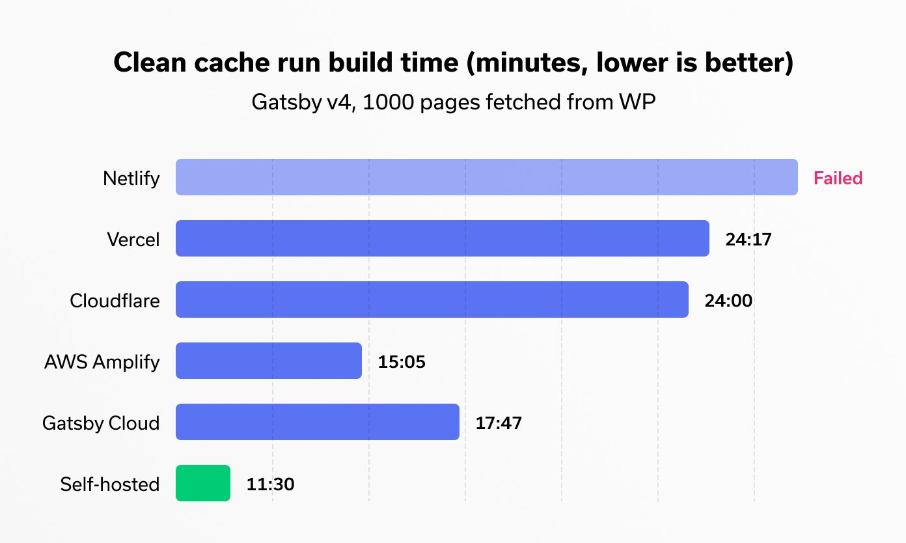
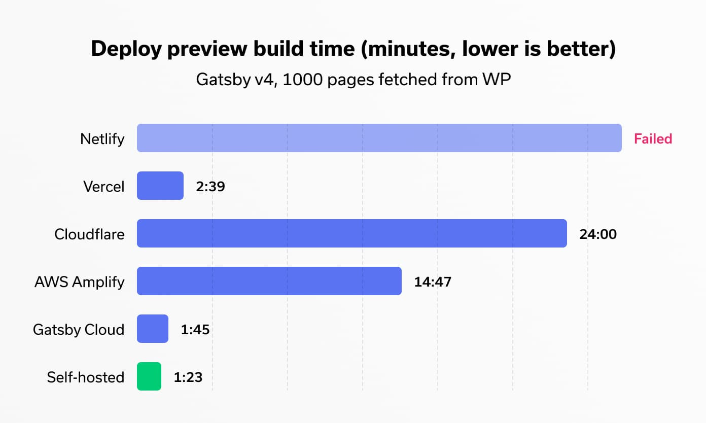
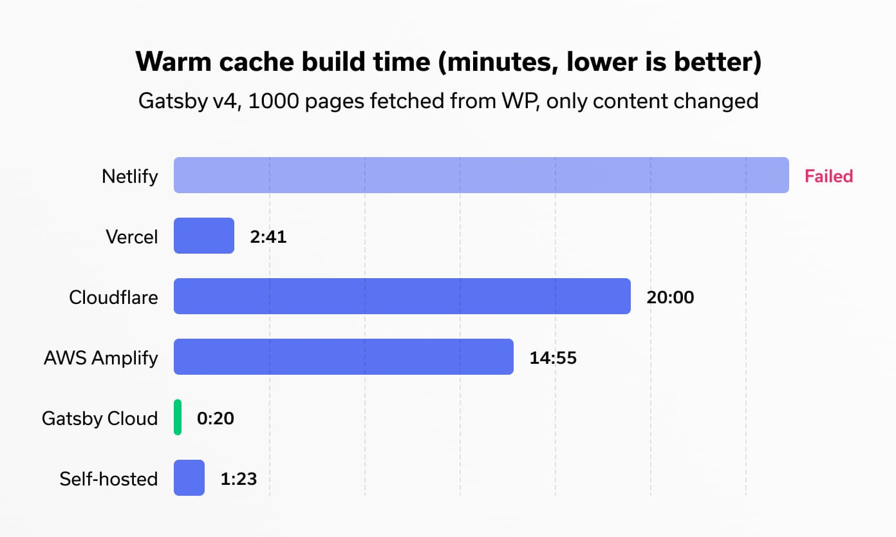

Jamstack is showing rapid growth these days. We get more and more tools and frameworks for it almost every month, bringing a new life for the concept of static sites generation.

Our go-to framework for building websites at [Pixel Point](https://pixelpoint.io/) was always Gatsby. Three years ago, when we’ve just started to use it, there were not too many options where you could deploy the site - [Netlify](https://www.netlify.com/) or [Vercel](https://vercel.com/). Now things have changed, you also have [Gatsby Cloud](https://www.gatsbyjs.com/products/cloud/), [Cloudflare pages](https://pages.cloudflare.com/), [AWS Amplify](https://aws.amazon.com/amplify/), and you can even make similar build tools within your infrastructure using projects like [Waypoint](https://www.waypointproject.io/).

Having a statically generated site comes with one significant drawback - build time. If you have a small blog or single-page website, all hosting or frameworks will give pretty much the same results, and the difference won’t be noticeable, but things get worse when it comes to 100+ pages. On that scale, the platform could make a massive difference in terms of build performance for developers, designers, and marketers, since no one wants to wait hours to see the changes live.

So I decided to run tests across the most popular platforms using paid plans.

## Table Of Contents

- [Platforms](#platforms)
- [Test cases](#test-cases)
- [Markdown-based website](#markdown-based-website)
- [Headless WordPress website](#headless-wordpress-website)
- [Winners](#winners)

## Platforms

### Netlify

Pro plan - $20/month per member.

### Vercel

Pro plan - $20/month per member.

### Gatsby Cloud

Pro plan - $50/month, 2 seats included, $20 per additional member.

### Cloudflare Pages

Pro plan - $20/month, unlimited seats.

### AWS Amplify

First 1000 minutes free, then 0.01$ per build minute.

### Self-hosted

$50/month, a self-hosted server running Drone CI with the following specs: AMD Ryzen 5 3600 Hexa-Core "Matisse" (Zen2), 64 RAM, 512GB Raid NVME SSD. Unlimited seats. Deployment to Netlify using netlify-cli.

## Test cases

I started by testing clean cache build-time performance. Although you usually have a cache that works well and reduces the build time, there are still some cases when you have to clean it up manually, or Gatsby will clean it for you on changes in gatsby-node.js, gatsby-config.js, or package.json files.

I made five runs for each test and then wrote down the average. I also used a stopwatch to ensure that there is no significant difference between the actual notification about completion and the number in UI. The goal of the stopwatch was not to measure it accurately but to figure out whether platforms show us the truth and don’t deduct from a build time some stages such as environment initialization or publication.

## Markdown-based website

### Clean cache build time

First in the test was a markdown-based website. The results were quite surprising. Gatsby Cloud did the job within two min., which is eight times faster than Netlify - 16. The results for Gatsby Cloud are quite similar to what I see running builds locally on Apple M1 chips, which is insane. I’m sure they do some nice magic behind the scenes, at least parallel image optimization.

Vercel was a little faster than Cloudflare pages finishing with 10:30 vs. 11:23. I definitely underestimated AWS Amplify and thought they would run builds on free tier EC2 instances, but they are running builds on a host with 4 vCPU, 7GB memory (appreciate that transparency in UI), so it finished as 9:47.

The self-hosted solution was relatively fast and very close in terms of the build time to Gatsby Cloud, but uploading results to Netlify takes around half of that time, so it finished second place.

The funny thing here is that Gatsby Cloud could complete the whole build in the amount of time it took Cloudflare to initialise the environment.

### Deploy Preview build time

Here I’ve started to feel that it will be a death race since competitors began to reveal their problems and how differently they handle different scenarios. In the Deploy Preview test, I created a separate branch from the master and made two changes in a jsx file and another in md file.

Netlify(16:16), Cloudflare(11:16) and AWS Amplify(9:14) showed the slowest results, and here is why. Netlify has a nice plugin that persists cache between builds, BUT it does not work if your build lasts for more than 15 minutes.

Cloudflare Pages does not have an option to persist cache between builds, so it shows slow results every time.

AWS Amplify has an option to persist the cache, but [all their official docs](https://docs.amplify.aws/guides/hosting/gatsby/q/platform/js/) don’t have information about how to make it work. Simply adding necessary folders to their build yaml file does not work. After spending a reasonable amount of time researching it, I passed on it since I’m pretty sure their users won’t dive into that research either. Without that configuration, the only thing that persists between builds is node_modules.

Vercel did a great job and finished within 3:32. I was impressed with this result because all cache magic is done behind the scene, and there is no need to install additional plugins for gatsby to the platform and inside the code to make it work properly.

Gatsby Cloud was again a winner with 0:49, and the self-hosted version was just 25 seconds behind.

### Warm cache build time

By the warm cache build time, I mean a subsequent build, that runs from the same branch where the build happened before. It’s a case you have every time you redeploy a website on content change or make additional commits to your Pull Request.

Vercel(1:08) and Selfhosted(1:06) finished very close, but Gatsby Cloud was faster with 0:27.

Cloudflare Pages and Netlify, AWS Netlify however, have room for improvement for sure.

## Headless WordPress website

Then I jumped testing Gatsby v4 connected with the WordPress website. The site has two languages, a batch of common WP plugins, and around 1000 pages in total. This is where things get challenging.

### Clean cache build time

Netlify even has not finished the build and stopped after 22 minutes. Vercel and Cloudflare pages completed within 24 minutes. Gatsby Cloud was fast, but it was tough even for it - 17:47. AWS Amplify surprised the most, showing consistent time around 15 min. The self-hosted CI achieved the quickest result - 11:30. The server we host is probably closer to the WP hosting, and it took less time for initial assets to download.

### Deploy Preview build time

I guess we can consider that Cloudflare, Netlify, AWS Amplify failed this round, so let’s go straight to Vercel. It took 2:39 for Deploy Preview, which is a very nice result. Gatsby Cloud did the same job within 1:45, and the Self-hosted version handled it within 1:23.

### Warm cache build time

Vercel did not show any difference from Deploy Preview. For Gatsby Cloud, however, it took 20 seconds less. The self-hosted version had the same excellent results. But I have to mention there was a moment that uploading files over Netlify CLI with a self-hosted version took more than 6 minutes. I decided not to include it because it happened only once.

## Bonus

It won’t be complete without showing you one more thing. All tests above were made, making changes in one jsx file and one blog post. But here is what Gatsby Cloud can do if you make a content change(from CMS like WP/Contentful/Prismic etc), which happens the most.

From an architecture perspective, based on build logs, it feels like Gatsby Cloud keeps the latest instance of your production version in a sleep mode, then they can wake it up quickly and skip some build steps, and knowing a content diff produce a new build very quickly.

It took just 20 seconds from making a change in a CMS to seeing it live in production! That’s very impressive. A few years ago, when [Kyle Mathews](https://twitter.com/kylemathews) (Gatsby creator) said that they were going to make it possible to rebuild the site in a matter of seconds, I was really skeptical about this, but now it seems it could be true. Great job!

**Note**: This result only could be achieved if you change a post or page. If you change shared data such as Menus, it will have to rebuild each page so that it will take around 50 seconds in the end.

## Winners

Gatsby Cloud won the race showing the best in class performance build time. I’m sure it uses the most powerful cars compared to other platforms and does some background magic. Vercel showed up still as a strong competitor. It did not show great results in cold runs, but cache changes everything. Talking with our clients, we mentioned that nobody cares when builds take less than 10 minutes, but after passing that threshold, you start to receive questions about how to make it faster. So considering this, I definitely could recommend both Gatsby and Vercel solutions.

Despite all the love that I have and share about Cloudflare products, Pages feels like the weakest one in their lineup. Development has been very slow, and I did not mention significant changes since the first beta and the current state. In my perspective, Cloudflare has the most affordable and reasonable pricing plan with no seat limits and bandwidth limitations. So let’s keep watching.

AWS Amplify... What can I say? It’s AWS. If you love their services and don’t find their UX the worst, it could still be an option. Build configuration as YAML files, separate settings to enable Deploy previews and builds for other branches. Missing Cache-Control policies out of the box. All of these don’t play well in their favor.

Netlify, I suppose, is still the most popular and very affordable solution on the market. Great UI and amazing features set, but build time could become a severe bottleneck if your site scales faster.

A self-hosted alternative is fast, does not have any limits, and costs just $50/m for a very powerful machine; however, you need to keep in mind that you will probably need to spend hours setting it up at least once in a while.

Want to hear more about Gatsby, Next.js, and tips for building high-performing and visually stunning websites? [Follow me on Twitter.](https://twitter.com/alex_barashkov)

- [Headless WordPress website source code](https://github.com/vshn/website)
- [Markdown based website source code](https://github.com/cilium/cilium.io)
