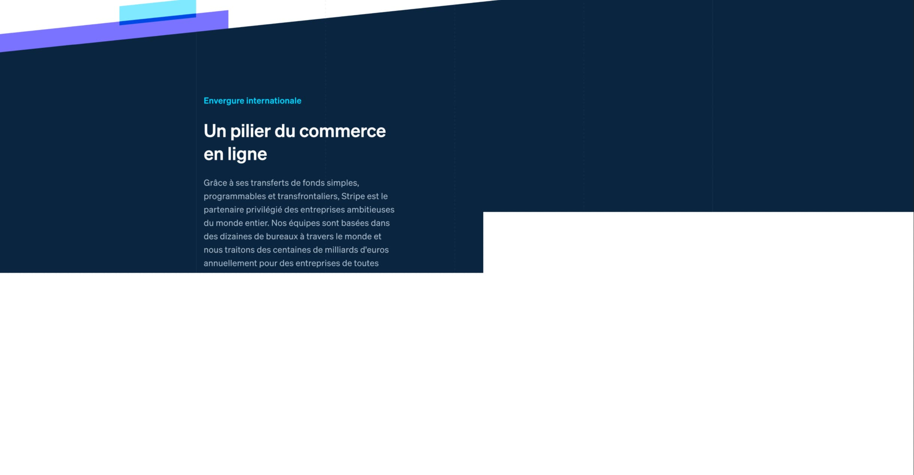

Recently I've been working on an automation task for one of our internal services, trying to make retina quality full-page screenshots of a website. It should've been a trivial problem, but apparently, there are still no web browser testing/automation libraries in 2022 that can help with it.

I've tested Playwright, Puppeteer, and Selenium, but each of them has the same set of issues: full-page screenshots made via standard API are either include blank sections (parts of a website where dynamic content resides), or the whole process fails if the page is long enough - like in my case, with a viewport width of 1920px and height exceeding 10,000px.

Here is the example of my straightforward approach with the following generic Puppeteer API call:

```js
const puppeteer = require('puppeteer');

const url = 'https://stripe.com/';

const screenshot = async () => {
  const browser = await puppeteer.launch();
  const page = await browser.newPage();

  await page.setViewport({
    width: 1920,
    height: 1080,
    deviceScaleFactor: 2,
  });

  await page.goto(url);

  await page.screenshot({
    path: 'screenshot.png',
    fullPage: true,
  });

  await browser.close();
};

screenshot();
```

Which in certain cases results in:



After pondering on this for a few hours, I was able to find a workaround: we need to take multiple screenshots of a page and then merge them together. In this article, I am going to show you how to do it using Puppeteer and Sharp library.

Let's begin with the installation of Puppeteer and Sharp:

```bash
npm install puppeteer sharp
```

Then declare a few constants - we are going to need them later.

```js
const puppeteer = require('puppeteer');
const fs = require('fs');
const sharp = require('sharp');

// URL of the webpage you want to take screenshot of
const URL = 'https://tailwindcss.com/';
// viewport configuration
const VIEWPORT_WIDTH = 1920;
const VIEWPORT_HEIGHT = 1080;
const DEVICE_SCALE_FACTOR = 2;
// Chunk height is a value in px that defines
// maximum height of each screenshot.
// Use a smaller or bigger number based on the tests.
const CHUNK_HEIGHT = 6000;
```

To calculate properly the total amount of screenshots to take, we need to know the exact height of a page, for this purpose let’s use this function

```js
const getHeight = async (page) => {
  const height = await page.evaluate(() => {
    return document.body.scrollHeight;
  });
  return height;
};
```

Yet another helper function that will allow us to automatically scroll down the page, triggering all animations and image loading prior to taking a screenshot.

```js
async function autoScroll(page) {
  try {
    await page.evaluate(async () => {
      // Scroll to the bottom of the page, so that all the content is visible and loaded
      await new Promise((resolve, reject) => {
        var totalHeight = 0;
        var distance = 100;
        var timer = setInterval(() => {
          var scrollHeight = document.body.scrollHeight;
          window.scrollBy(0, distance);
          totalHeight += distance;
          if (totalHeight >= scrollHeight) {
            clearInterval(timer);
            resolve();
          }
        }, 50);
      });
      // Scroll back to the top of the page, so sticky menus will appear at the top
      document.body.scrollTop = document.documentElement.scrollTop = 0;
    });
  } catch (err) {
    console.log(err);
  }
}
```

The last bit is to take a screenshot. Here is a full code snippet with additional comments that might be helpful to achieve the same result.

```js
const puppeteer = require('puppeteer');
const fs = require('fs');
const sharp = require('sharp');

// Puppeteer configuration options
const URL = 'https://tailwindcss.com/';
const VIEWPORT_WIDTH = 1920;
const VIEWPORT_HEIGHT = 1080;
const DEVICE_SCALE_FACTOR = 2;
const CHUNK_HEIGHT = 6000;

// Helper function, needed for calculating number of chunks
const getHeight = async (page) => {
  const height = await page.evaluate(() => {
    return document.body.scrollHeight;
  });
  return height;
};

// Auto scroll the page to trigger all page animations and image loading
async function autoScroll(page) {
  try {
    await page.evaluate(async () => {
      await new Promise((resolve, reject) => {
        var totalHeight = 0;
        var distance = 100;
        var timer = setInterval(() => {
          var scrollHeight = document.body.scrollHeight;
          window.scrollBy(0, distance);
          totalHeight += distance;
          if (totalHeight >= scrollHeight) {
            clearInterval(timer);
            resolve();
          }
        }, 50);
      });
      // Scroll back to the top of the page, so sticky menus appears at the right place.
      document.body.scrollTop = document.documentElement.scrollTop = 0;
    });
  } catch (err) {
    console.log(err);
  }
}

const screenshot = async () => {
  const browser = await puppeteer.launch();
  const page = await browser.newPage();

  await page.setViewport({
    width: VIEWPORT_WIDTH,
    height: VIEWPORT_HEIGHT,
    deviceScaleFactor: DEVICE_SCALE_FACTOR,
  });

  await page.goto(URL);

  await autoScroll(page);
  const pageHeight = await getHeight(page);

  await page.waitForNetworkIdle();

  // If page has height more than 6000px, then split it into the chunks and take screenshots of each chunk
  if (pageHeight > CHUNK_HEIGHT) {
    const chunks = Math.ceil(pageHeight / CHUNK_HEIGHT);
    const chunkCompositeOptions = [];
    for (let i = 0; i < chunks; i++) {
      let height = 0;
      // Calculate chunk offset top for a screenshot
      const offsetTop = i * CHUNK_HEIGHT;
      const filePath = `./screenshot-${i}.png`;

      if (pageHeight - CHUNK_HEIGHT * i < CHUNK_HEIGHT) {
        height = pageHeight - CHUNK_HEIGHT * i;
        // Take a screenshot using clip option passing top offset
        await page.screenshot({
          path: filePath,
          clip: {
            x: 0,
            y: offsetTop,
            width: VIEWPORT_WIDTH,
            height: pageHeight - CHUNK_HEIGHT * i,
          },
        });
      } else {
        height = CHUNK_HEIGHT;
        await page.screenshot({
          path: filePath,
          clip: {
            x: 0,
            y: offsetTop,
            width: VIEWPORT_WIDTH,
            height: CHUNK_HEIGHT,
          },
        });
      }

      // Prepare image merge options for sharp library api
      chunkCompositeOptions.push({
        input: filePath,
        top: offsetTop * DEVICE_SCALE_FACTOR,
        left: 0,
        width: VIEWPORT_WIDTH,
        height: height * DEVICE_SCALE_FACTOR,
      });
    }

    // An example to find batch of files in the folder
    const files = fs.readdirSync('./');
    const images = files.filter((file) => file.includes('screenshot'));

    // Merge images into one
    await sharp({
      create: {
        width: VIEWPORT_WIDTH * DEVICE_SCALE_FACTOR,
        height: pageHeight * DEVICE_SCALE_FACTOR,
        channels: 4,
        background: { r: 255, g: 255, b: 255, alpha: 0 },
      },
    })
      .composite(chunkCompositeOptions)
      .toFile('./merged.png');
    // Delete all the screenshots
    images.forEach((image) => fs.unlinkSync(image));
  } else {
    await page.screenshot({
      path: './screenshot.png',
      fullPage: true,
    });
  }

  await browser.close();
};

screenshot();
```

That's about it! Save and use this trick to automatically create beautiful high-quality screenshots of any web page you like.
