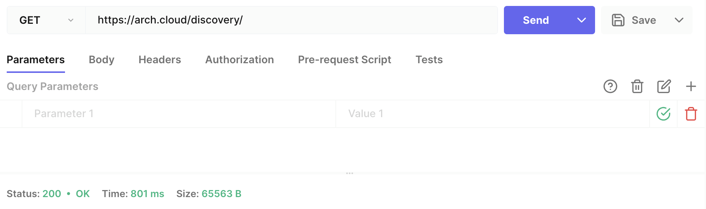
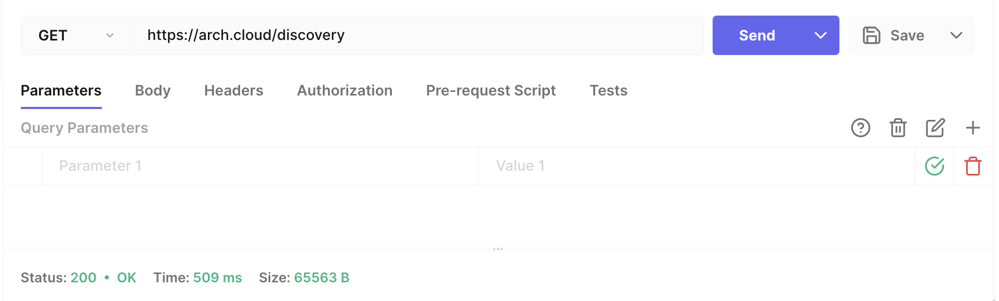
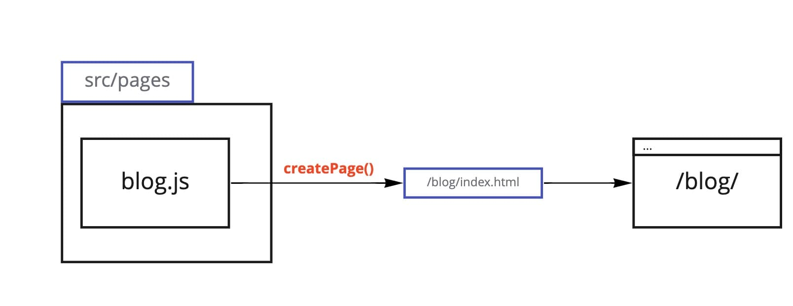
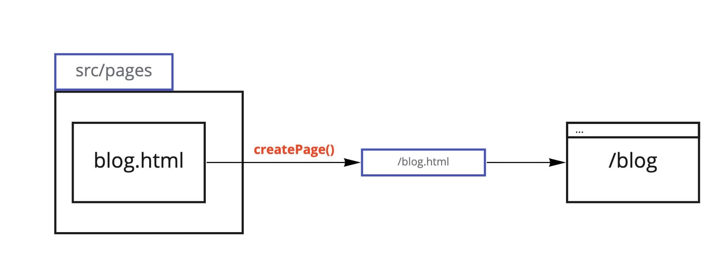

Like most junior web developers out there, I had little to no idea what a trailing slash is. Of course, I was using them in projects, but it was more like following common sense (or even sixth sense) than really understanding the concept.

<Quote>Trailing slash is like an oxford comma: if you hadn't researched the question on purpose, chances are, you're just following your intuition when putting one here and there.</Quote>

A trailing slash is a forward slash character placed at the end of a URL. The general convention (supported by [Web Standards](https://developers.google.com/search/blog/2010/04/to-slash-or-not-to-slash)) is that if an URL ends in a trailing slash, it points to a directory; otherwise, it points to a file.

| File name | Resulting file  | Rendered URL    |
| --------- | --------------- | --------------- |
| blog.html | blog.html       | mysite.io/blog  |
| blog.js   | blog/index.html | mysite.io/blog/ |
| index.js  | /index.html     | mysite.io/      |

Be consistent in using trailing slashes inside your projects and in your team, as, more often than not, you are to decide when and how to use them.

## Do I really need to keep them in mind?

Yeah, you do! There are potential issues related to SEO and performance optimization.

Firstly, you wouldn't want a situation when one of your users is browsing `/thisUrl` , and the host redirects him to `/thisUrl/` with no explanation.

Secondly, if two URLs, with and without trailing slash, coexist on the same website, it makes it difficult to link them properly, and it also lowers the Google link equity score on your website.

Here is an example of the trailing slash misuse that shows you how two pages — one with a TS and one without it — coexist with no redirect between them and no explanation:





Another example: in the video below, you can see a bad UX scenario, when a host adds a trailing slash, and then a front-end router of a SPA removes it, so the user gets an URL that changes and much confusion.

<Video src="https://pixel-point-website.s3.amazonaws.com/posts/2022-06-09-gatsby-to-slash-or-not-to-slash/video.mp4" width="1280" height="168" autoPlay muted loop playsInline></Video>

So in order to be understood properly by a web crawler, you need to specify your intentions either by using canonical URLs or redirects. Then you can have as many identical pages as you want.

## How do trailing slashes work in the site generation process in Gatsby? What happens inside the createPage() function?

Here is a typical example of a Gatsby project file tree with the pages `templates` folder:

```yaml
├── src
│   ├── templates
│   │   ├── 404.jsx
│   │   ├── blog.jsx
│   │   ├── demo.jsx
│   │   ├── index.jsx
│   │   └── product.jsx
│   └── html.jsx
├── gatsby-browser.js
├── gatsby-config.js
└── gatsby-node.js
```

And here is the corresponding `public` folder with all the created pages:

```yaml
├── public
│   ├── blog
│   │   ├── index.html
│   ├── demo
│   │   ├── index.html
│   ├── product
│   │   ├── index.html
├── 404.html
└── index.html
```

Let's see how this process of page creation works and what do we need to know about trailing slashes to grasp the mechanics correctly.

`createPage()` function receives and processes the `path` argument. It can happen either "automatically", when the page is generated from `.js` file in the `src/pages/*` folder, or programmatically, when the desired path is passed explicitly into the `createPage()` call in `gatsby-node.js`. One way or another, the `path` string in the `createPage()` tells Gatsby the exact place where to build the HTML.

```jsx
createPage({
  path: `/my-path/`,
  component: path.resolve(`./src/templates/my-path.js`),
});
```

For example, if your `src/pages/*` folder contains a file called `product.js`, `/product` is the path where the HTML is going to be built. Here comes the reason you should use trailing slashes on Gatsby: the `path` string passed to `createPage()` becomes a directory, and the resulting HTML can be found in `/product/index.html`. The same happens to every passed `path`, whether or not it ends in a trailing slash.


We can say that Gatsby produces folders, not files, making exceptions only for paths explicitly ending in `.html` passed into the `createPage()` in `gatsby-node.js` and the 404 page that is generated at `public/404.html`, and also the site index.

```jsx
createPage({
  path: `/404/`,
  component: path.resolve(`./src/templates/404.js`),
}); // the 404 page is going to be created at public/404.html
```

## What would be the difference between `blog.html` and `blog/index.html` on the client side of the site?

This is not a widespread scenario, as developers rarely use paths like `blog.html` in real projects, but I believe it is crucial to have a full picture of all the possible options.

As we mentioned above, there are different outcomes in page generation when a path that you pass into `createPage()` function ends in `.html` and when it doesn't. This also leads to the differences on the client side. The `path='/blog.html'` results in `blog.html`, and you can find this page at `mysite.io/blog`.

At the same time, `path='/blog'` or `path='/blog/'` results in creating the HTML at `/blog/index.html`, and this page should be available at `mysite.io/blog/`. This can create confusion for the user and also problems with SEO from duplicated content, if used improperly, so, again, it's better to be consistent with your page generation.

Don't forget that since `/blog` and `/blog/` result in the same `/blog/index.html` generation, from the web standards point of view, you have to always use trailing slash (i.e., `'/blog/'`) when creating pages programmatically or adding hardcoded links to the page.

```jsx
createPage({
  path: `/blog`,
  component: path.resolve(`./src/templates/blog.js`),
});
```



```jsx
createPage({
  path: `/blog.html`,
  component: path.resolve(`./src/templates/blog.js`),
});
```



## Gatsby trailing slashes config: what's up now? What will the future bring?

There is no explicit standardisation at the moment, and you can see that Gatsby doesn't specifically imply the use of trailing slashes in your projects in v3 or v4. The solution for the Gatsby version lower than 4.7 was to use plugins (either `gatsby-plugin-force-trailing-slashes` or `gatsby-plugin-remove-trailing-slashes`).

However, [since Gatsby 4.7 there is a `trailingSlash` option](https://www.gatsbyjs.com/docs/reference/config-files/gatsby-config/#trailingslash), you can specify in the `gatsby-config.js` of your project instead of using an additional plugin, and it has three options:

- `always`: Always add trailing slashes to each URL, e.g. `/x` to `/x/`.
- `never`: Remove all trailing slashes on each URL, e.g. `/x/` to `/x`.
- `ignore`: Don't automatically modify the URL.

```jsx
module.exports = {
  trailingSlash: `always`,
};
```

The default option in Gatsby v3/v4 is `legacy` in order not to ruin anything in the existing projects.

In Gatsby v5 the default trailing slash config option will be `always`, meaning that Gatsby will support the explicit use of trailing slashes.

The table below shows how Gatsby Cloud (and also Gatsby itself within `gatsby develop` and `gatsby serve`) handles redirects depending on the `trailingSlash` value:

The example page is at the [https://example.io/blog/index.html](https://example.io/blog/index.html).

| `trailingSlash` value | Requested URL    | Redirect code | Rendered URL |
| --------------------- | ---------------- | ------------- | ------------ |
| ignore                | /blog            | none          | /blog        |
| ignore                | /blog/           | none          | /blog/       |
| ignore                | /blog/index.html | none          | blog/        |
| always                | /blog            | 301           | /blog/       |
| always                | /blog/           | none          | /blog/       |
| always                | /blog/index.html | none          | /blog/       |
| never                 | /blog            | none          | /blog        |
| never                 | /blog/           | 301           | /blog        |
| never                 | /blog/index.html | none          | /blog        |

Please note that this config option only affects the client-side behavior, and the actual server-side behavior still depends on the hosting provider or your web server configuration!

## Bonus: how do different platforms handle redirects with and without trailing slashes?

There is [an awesome page](https://github.com/slorber/trailing-slash-guide#summary) by [@slorber](https://github.com/slorber) summarizing the deployment of a basic static site on different hosting platforms.

The extensive table there shows how different platforms (Vercel, Cloudflare Pages, GitHub pages, Netlify) handle redirects for this simple static site:

```yaml
static
│
├── file.html
│
├── folder
│   └── index.html
│
├── both.html
└── both
└── index.html
```

The main idea is, the confusion and unpredictability happens because we don't have any common convention for host providers and static site generators on how to deal with trailing slashes in a standardized way. So the solution for all the potential problems is to be consistent with your trailing slashes, for example, using Gatsby 4.7+ and a config with `trailingSlash: 'always'`.

## Summary

Trailing slash knowledge is crucial for any web developer; however, we often tend to pay attention only when something goes wrong with our site SEO or redirects. I hope this article has cleared all the basics of working with trailing slashes and URLs and provided an understanding for better everyday development decisions.

## Useful links

[Trailing Slashes on Netlify](https://jonsully.net/blog/trailing-slashes-on-netlify/)

[Trailing Slash Guide: Hosting Providers](https://github.com/slorber/trailing-slash-guide/blob/main/docs/Hosting-Providers.md)

[Trailing Slashes on URLs: Contentious or Settled?](https://www.zachleat.com/web/trailing-slash/)

[RFC on trailingSlash in Gatsby](https://github.com/gatsbyjs/gatsby/discussions/34205)
