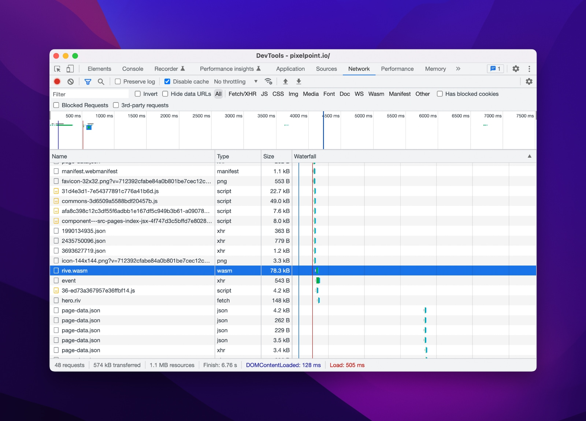

## What is Rive?

Rive is a modern tool for creating well-performing interactive animations that you can run anywhere. It is simple to use, works great with vector graphics, has a nice developer toolkit and many powerful features like state machine and mesh deformation. At [Pixel Point](https://pixelpoint.io/), we often use it for building stunning marketing websites, including our own one.

See a lot of fascinating examples in [Rive community library](https://rive.app/community/).

<iframe style="border: none" width="800" height="500" src="https://rive.app/community/1714-4322-rives-animated-emojis/embed" allowfullscreen></iframe>

## What can we optimize?

Rive tells us that all animations are already performing great, and **it’s true**. Just see this test from Rive team comparing Lottie and Rive.

<Tweet tweetLink="https://twitter.com/guidorosso/status/1580267624050532352?s=20&t=vOgDMFrOJ0AVVlSjVGeksg" align="center"/>

So I won’t be telling you how to draw and animate in Rive. I will tell you how can you optimize the loading of Rive animations to achieve a better user experience.

### Room for improvement

It’s very simple to use Rive in React project. Following the official guide, you can do it this way.

```jsx
import Rive from '@rive-app/react-canvas';

export const Simple = () => <Rive src="https://cdn.rive.app/animations/vehicles.riv" />;
```

Once the component is mounted, Rive loads a separate [WASM](https://webassembly.org/) runtime library during initial initialization. Rive uses this library to control animations and interact with them. I suppose it is also the reason Rive performance is so much better compared to the alternative solutions like Lottie. This WASM module is not small and has a size of **78KB**.



However, in that case WASM module and .riv animation file will start loading only after React is executed, and if you have Rive animation in the Hero section of your page, it may appear only after 4-5 seconds if the page size is rather big.

Considering that you use modern frameworks that give you SSG/SSR, initial HTML will come to you quite fast, but then you will wait for React hydration to initialize Rive animation.

After measuring the time needed for the initial page loading, component mounting and animation playing, I’ve got the following numbers on a sample project:

```jsx
React component mounted: ~2.5s
Rive animation playing: ~3.5s
```

Those are average numbers. They can be different depending on your location and connection. However, it’s obvious that there is room for improvement. My goal was to make the diff between component mounting and animation playing as short as possible, so that’s what can you do.

### Host WASM yourself

If you look at the network tab closer, you can see that Rive does not bundle the WASM module into your project and always loads it from

```jsx
https://unpkg.com/@rive-app/canvas@1.0.64/rive.wasm
```

It creates an additional connection that I would like to avoid and serve all files from the same CDN. In order to fix it, we can [use the following API](https://github.com/rive-app/rive-wasm/blob/master/js/CHANGELOG.md#0714):

```jsx
import riveWasmUrl from '@rive-app/canvas/rive.wasm';
import { RuntimeLoader } from 'rive-react';

RuntimeLoader.setWasmUrl(riveWasmUrl);
```

You can add this code to a page component file where Rive is used. It won’t work unless you add an additional webpack URL loader for wasm files into the webpack configuration.

So, if you use Gatsby, do this:

```jsx
exports.onCreateWebpackConfig = ({ loaders, actions }) => {
  actions.setWebpackConfig({
    module: {
      rules: [
        {
          test: /\.wasm$/,
          use: [loaders.url()],
        },
      ],
    },
  });
};
```

And this, if you use Next.js:

```jsx
module.exports = {
  webpack: (config, options) => {
    config.module.rules.push({
      test: /\.wasm$/,
      use: ['url-loader'],
    });

    return config;
  },
};
```

Now it’s better, but it was not the biggest issue here.

### Preload WASM

The next thing we can do is preload WASM module with `link rel="preload"`

Since we already patched webpack to load WASM, now it’s very simple to preload it. Add it to the main layout if you use Rive everywhere or set it in the React Helmet on pages where you need it.

```jsx
import riveWasmUrl from '@rive-app/canvas/rive.wasm';

<link rel="preload" href={`${riveWasmUrl}`} as="fetch" crossOrigin="anonymous" />;
```

### Preload .riv animation

The same thing you can do for `.riv` file on a page where it is played.

```jsx
<link rel="preload" href="/path-to-rive-file/hero.riv" as="fetch" crossOrigin="anonymous" />
```

### Results

I could achieve almost 0 difference between React component mounting and Rive animation playing with this solution. The remaining difference was about 30ms.

I also have some other tricks that can help you with certain conditions.

## Rive lazy loading

If you use small animations across the page, it is easy to load all of them in advance. However, if you have some complex graphics and animations in Rive, it could take easily 20KB+. For that reason, I recommend using Intersection Observer API to load them only when they are visible.

_See example below how .riv file loads only when we're getting closer to the section with Rive animation_
<video autoplay playsinline muted loop width="800" height="600">

<source type="video/mp4" src="https://pixel-point-website.s3.amazonaws.com/posts/2022-10-27-rive-react-optimizations/video-1-compressed.mp4" />
<source type="video/webm" src="https://pixel-point-website.s3.amazonaws.com/posts/2022-10-27-rive-react-optimizations/video-1-compressed.webm" />
</video>

In order to achieve it, we need to understand how the Rive react component works. Based on Rive source code, it loads `.riv` file on component mount, meaning that in order to prevent additional files from loading, we need to prevent rendering of the `<RiveComponent>`.

Then, using `react-intersection-observer`, we can subscribe to the visibility of the section with animation.

And the last bit is to wrap RiveComponent with `<ImagePlaceholder>` to prevent layout shifts on the page.

> ImagePlaceholder is a simple solution that uses a svg placeholder to maintain the needed aspect ratio of the image. As an alternative, you can use a modern `aspect-ratio` CSS property (that still does not work in Safari, unfortunately) or an old school `padding-bottom` solution. You can find the source code in the demo or in our [website](https://github.com/pixel-point/pixelpoint-website/blob/main/src/components/shared/image-placeholder/image-placeholder.jsx) repo.

Below is an example app that illustrates how it works ([See demo](https://codesandbox.io/s/confident-hill-cfwi8z?file=/src/App.js))

```jsx
import './styles.css';
import { useRive } from '@rive-app/react-canvas';
import { useInView } from 'react-intersection-observer';
import riveBotAnimationUrl from './bot.riv';
import ImagePlaceholder from './ImagePlaceholder';

const ART_BOARD = 'HeroBot';
const STATE_MACHINE_NAME = 'State Machine 1';

export default function App() {
  const { RiveComponent, rive } = useRive({
    src: riveBotAnimationUrl,
    autoplay: true,
    stateMachines: STATE_MACHINE_NAME,
    artboard: ART_BOARD,
  });

  const [ref, isInView] = useInView({
    triggerOnce: true,
    // rootMargin: "200px"
    threshold: 0.2,
  });

  return (
    <div className="App">
      <section className="hero">
        <div>
          <h1>Rive Lazy Loading Example</h1>
          <p>Scroll down the page and look at network tab</p>
        </div>
      </section>
      <section ref={ref} className="animation-container">
        <ImagePlaceholder height={400} width={400}>
          {isInView && <RiveComponent />}
        </ImagePlaceholder>
      </section>
    </div>
  );
}
```

<CodeSandbox codeSandboxId="confident-hill-cfwi8z" />

Note: Rive WASM module also loads automatically on a first RiveComponent initialisation, so when postponing the rendering, you also postpone the loading of quite a large runtime.

## Rive, React.lazy and Suspense

Last bit of optimisation that is very useful in case you don’t want to show Rive animations at all on certain devices is using React 18 Suspense and lazy component loading. The architecture behind that solution is:

1. Move the component that loads, controls and plays Rive animation into a separate React component.
2. Import it, using React.lazy. This will cause a creation of a separate JS bundle.
3. Wrap lazy loaded component with Suspense.

```jsx
const RiveAnimation = lazy(() => import('components/rive-animation'))

const Section = () => {
return (
    {isMobile ? (
      
    ) : (
      <Suspense fallback={<Loading />}>
        <RiveAnimation />
      </Suspense>
    )}
  )
}
export default Section
```

You can find a full example of this solution in a great demo by **[Paul Scanlon](https://twitter.com/PaulieScanlon).**

[Rive animation component](https://www.notion.so/d7935306ee974c0cb44aa73ebeaa22c9)

[Section component](https://github.com/PaulieScanlon/rise-of-the-robots/blob/main/src/sections/gatsby-section.js#L9)

[Demo site](https://www.gatsbyjs.com/demos/rise-of-the-robots/)

## That’s it!

Let’s sum up everything on the optimal usage of Rive with React:

- Host WASM runtime library yourself. It will prevent an additional http connection with an external unpkg server where this library hosted by default.
- Preload .riv and WASM files in case you have Rive animation in the Hero section of the page. It will drastically decrease loading and execution times.
- Create a separate bundle for Rive using React lazy and Suspense to avoid loading the library when the network is slow or on mobile devices.

If you enjoyed the article and want to see more tips on web performance, [follow me on Twitter](https://twitter.com/alex_barashkov).
