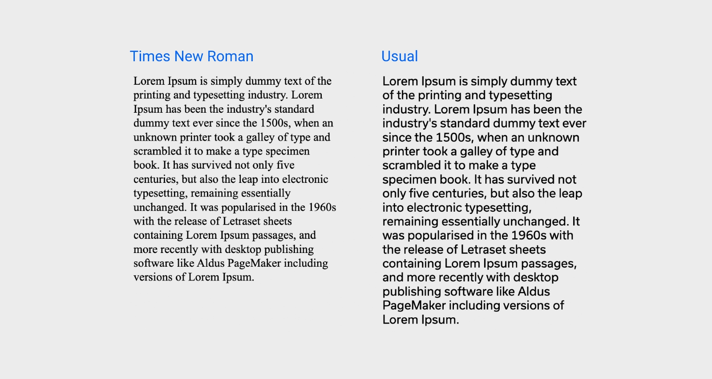
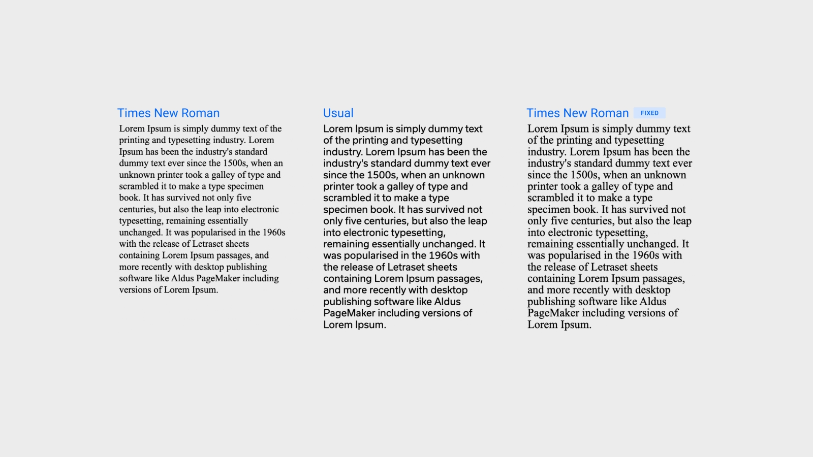
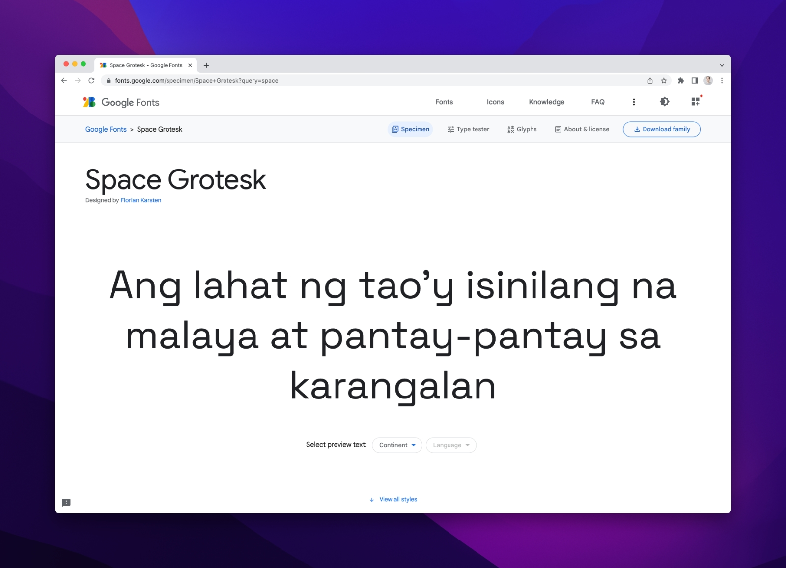
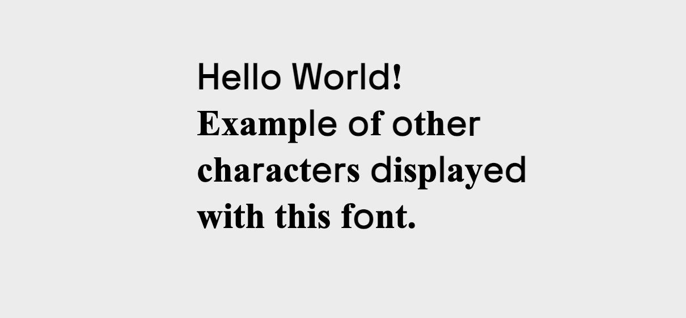
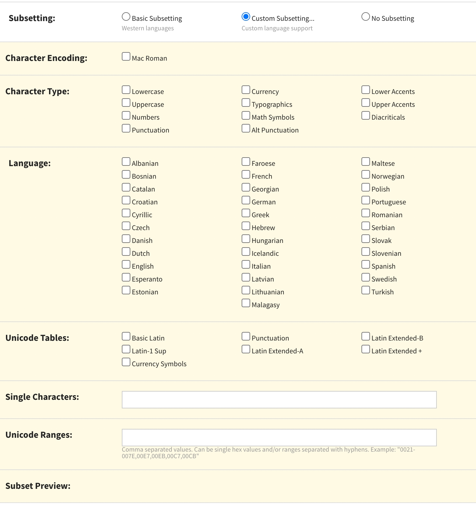
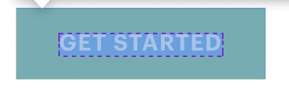
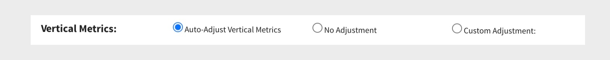
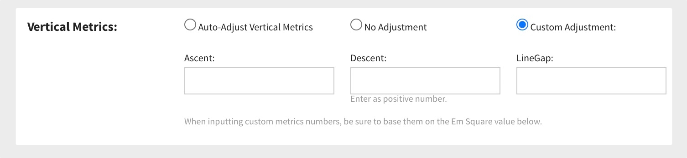
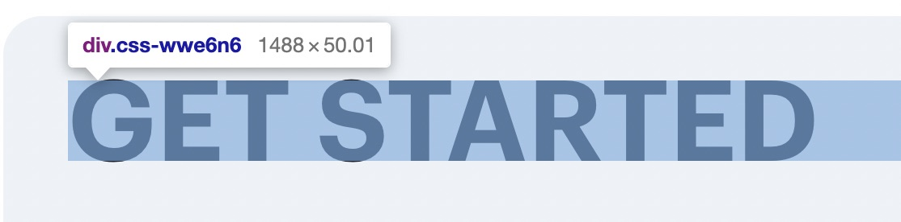

Website developers have been using custom fonts for ages. Since custom fonts are not present in the OS, they need to load with the site and, therefore, need to load quickly and display consistently across platforms. Common examples include Google Web Fonts — a dedicated library of web-optimized fonts in the Web Open Font Format (WOFF2), which provides excellent compression to minimize size.

In practice, however, a Google Web Font is typically 20–30KB. If you multiply that by several different styles and weights, you can quickly get to 100–150KB for your site. Another catch with custom fonts is they cause a visible layout shift during page loading.

This article shares advanced techniques to make your site faster and create a better UX using web fonts.

## Quick basics

Let’s quickly address some basics before we jump to advanced techniques. Here is a checklist of basic best practices you can follow:

- Use <a href="https://fonts.google.com/" target="_blank" rel="external">Google Web Fonts</a> whenever possible.
- If you use a custom font try to pass it through <a href="https://www.fontsquirrel.com/" target="_blank" rel="external">Font squirrel</a> for better compression and vertical baseline fixes.
- Use WOFF2 if you manually embed a font. WOFF2 has a high adoption rate (over 97%) and provides much better compression than other formats.
- Use `<link rel="preload" href="/fonts/usual/usual-semi-bold.woff2" as="font" type="font/woff2" crossorigin="anonymous">` to prioritize the font in the HTTP queue. <a href="https://web.dev/codelab-preload-web-fonts/" target="_blank">Learn more</a>.
- Make sure the font is cached with `cache-control: public, max-age=31536000, immutable`. If you use Vercel, Netlify, or Gatsby Cloud, you likely already have good cache policies.
- Download and serve the font from the same CDN as your website. Again, you get this out of the box with Vercel, Netlify, and Gatsby Cloud.

## Now let’s talk about advanced optimization

Here are a few things that will save some KB, make fonts look better, and improve the UX:

- Fallback font size adjustments
- Custom subsetting
- Vertical baseline fixes

## Fallback font metric adjustments

Using custom fonts that are not part of the OS has a tradeoff. Browsers do not know the parameters of a font until it has been loaded; until then, the browser uses a fallback font (e.g., Arial, Times New Roman) to calculate the size of elements that use text on the page. But once the font is loaded, the size is recalculated.

The difference can be huge, and layout shifts will become visible, especially on a slow connection.

<Video autoPlay playsInline muted loop width="1920" height="1080">
<source type="video/mp4" src="https://pixel-point-website.s3.amazonaws.com/posts/2022-11-28-advanced-web-font-optimization-techniques/without-fontpie-optimized.mp4" />
<source type="video/webm" src="https://pixel-point-website.s3.amazonaws.com/posts/2022-11-28-advanced-web-font-optimization-techniques/without-fontpie.webm" />
</Video>

This example compares two fonts—Times New Roman and a custom font called Usual. Both fonts have a font size of 16px and a line height of 1.2 but notice the difference in length they have for the same text.



Recently some new CSS properties to match fallback and custom font metrics have seen wide adoption.

<p><a href="https://developer.mozilla.org/en-US/docs/Web/CSS/@font-face/ascent-override" target="_blank" rel="external">ascent-override</a></p>

<p><a href="https://developer.mozilla.org/en-US/docs/Web/CSS/@font-face/descent-override" target="_blank" rel="external">descent-override</a></p>

<p><a href="https://developer.mozilla.org/en-US/docs/Web/CSS/@font-face/line-gap-override" target="_blank" rel="external">line-gap-override</a></p>

<p><a href="https://developer.mozilla.org/en-US/docs/Web/CSS/@font-face/size-adjust" target="_blank" rel="external">line-gap-override</a></p>

This sounds great, but do you match them? <a href="https://docs.google.com/document/d/e/2PACX-1vRsazeNirATC7lIj2aErSHpK26hZ6dA9GsQ069GEbq5fyzXEhXbvByoftSfhG82aJXmrQ_sJCPBqcx_/pub" target="_blank" rel="external nofollow">Katie Hempenius and Kara Erickson</a> on the Google Aurora team have created an algorithm for this, but it needs automated solutions to be its best. The Next.js team recently announced its support for this in the updated `@next/font` package in v13. Our team took the same approach and wrapped this algorithm in a CLI that generates CSS to adjust fallback font metrics; we call it Fontpie.

<a href="https://github.com/pixel-point/fontpie" target="_blank">github.com/pixel-point/fontpie</a>

This is very simple to use. Here’s an example command:

```bash
npx fontpie ./roboto-regular.woff2 --name Roboto
```

Entering this command will return the following CSS, which you can embed in your project no matter which framework or language it uses:

```css
@font-face {
  font-family: 'Roboto';
  font-style: normal;
  font-weight: 400;
  font-display: swap;
  src: url('roboto-regular.woff2') format('woff2');
}

@font-face {
  font-family: 'Roboto Fallback';
  font-style: normal;
  font-weight: 400;
  src: local('Times New Roman');
  ascent-override: 84.57%;
  descent-override: 22.25%;
  line-gap-override: 0%;
  size-adjust: 109.71%;
}

html {
  font-family: 'Roboto', 'Roboto Fallback';
}
```

This CSS solution works like this: (1) we declare a new font face—Roboto, (2) then we declare another font face with the name “Roboto Fallback” that uses the local Times New Roman font but with applied metric adjustments. This will completely mitigate any layout shift.



As you can see in the image, Times New Roman with metric adjustments now takes the same amount of space as the Usual font.

<Video autoPlay playsInline muted loop width="1920" height="1080">

<source type="video/mp4" src="https://pixel-point-website.s3.amazonaws.com/posts/2022-11-28-advanced-web-font-optimization-techniques/with-fontpie-optimized.mp4" />
<source type="video/webm" src="https://pixel-point-website.s3.amazonaws.com/posts/2022-11-28-advanced-web-font-optimization-techniques/with-fontpie.webm" />
</Video>

This technique is compatible with all modern browsers except Safari.

### Custom subsetting

This technique reduces the number of characters embedded in a font. Fonts typically have many more characters than you need for your project, so using a subset that only includes what you need can significantly reduce the font size.



Google Web Fonts have a nice API to create a font subset. As an example, we will take the font <a href="https://fonts.google.com/specimen/Space+Grotesk">Space Grotesk</a>. The Regular (400) font size is 15KB in WOFF2 format. An embedded link will look like this

```html
<link href="https://fonts.googleapis.com/css2?family=Space+Grotesk&display=swap" rel="stylesheet" />
```

To define a subset, you just need to add an additional &text parameter to the URL; for example:

```html
<link
  href="https://fonts.googleapis.com/css2?family=Space+Grotesk
&display=swap&text=HelloWorld"
  rel="stylesheet"
/>
```

This is particularly useful when you have a single “stylish” headline in a different font from the rest of the site. In that case, you can define a subset that only includes the characters for that headline. In the example above, custom subsetting reduced the font size to 1KB.

Screenshot below illustrates how characters will look like when the letter does not present in the subset.



Listed below are popular subsets you can copy/paste and insert into Google Web Font or Font Squirrel to get the exact set you want to use.

<details>
<summary>Popular subsets; copy/paste and edit them for your needs</summary>

**Lower case**

```bash
abcdefghijklmnopqrstuvwxyz
```

**Upper case**

```bash
ABCDEFGHIJKLMNOPQRSTUVWXYZ
```

**Number**

```bash
0123456789
```

**Upper Accents**

```bash
ÀÁÂÃÄÅÆÇÈÉÊËÌÍÎÏÐÑÒÓÔÕÖØÙÚÛÜÝÞߌŸ
```

**Lower Accents**

```bash
àáâãäåæçèéêëìíîïðñòóôõöøùúûüýþÿıœƒ
```

**Alt punctuation**

```bash
¡«»¿‚„‹›
```

**Math Symbols**

```bash
ª¬±µº÷Ωπ‰⁄∂∆∏∑√∞∫≈≠≤≥
```

**Typographics**

```bash
§©®°¶·†‡•™◊fifl
```

**Currency**

```bash
$¢£¥ƒ€
```

**Punctuation**

```bash
!"#$%&'()*+,-./:;<=>?@[\]^_`{|}~–—‘’“”…
```

**Diacriticals**

```bash
¨¯´¸ˆˇ˘˙˚˛˜˝
```

</details>

For example, the Space Grotesk subset defined below includes Upper case, Lower case, Numbers, Punctuation, and Currency, and the resulting font custom subset is only 6KB.

```bash
https://fonts.googleapis.com/css2?family=Space+Grotesk&display=swap&text=abcdefghijklmnopqrstuvwxyzABCDEFGHIJKLMNOPQRSTUVWXYZ0123456789!%22#$%&'()*+,-./:;%3C=%3E?@[\]^_%60{|}~%E2%80%93%E2%80%94%E2%80%98%E2%80%99%E2%80%9C%E2%80%9D%E2%80%A6$
```

### Custom fonts subsetting

Things get worse if you use custom fonts, like those available in Adobe Fonts. Many of these fonts are not optimized for web use and contain many unnecessary characters. These fonts can easily reach 30KB. Font squirrel allows you to easily create custom font subsets; just drop your font there in TTF or OTF format, enable Expert mode and custom subsetting.



Creating subsets is easy; simply check the subsets you want to keep or write an exact character in the Single Characters field. For example, the copyright symbol is presented in the “Typographics” subset type, but if you only need ©, add it to the Single Characters field.

## Vertical baseline fixes

### Fixing fonts with Font Squirrel

Another potential issue when using custom fonts, or those not well-optimized, is that the vertical baseline may not be correct. For example:



Using these fonts can result in spacing inconsistencies like above, where the padding at the top is smaller than that at the bottom, while in CSS, the padding is the same.
Sometimes, passing the font over Font Squirrel may automatically fix this problem.



If that doesn’t work, you can address it with Custom Adjustments. Though it takes time to find the right combination of metrics, it can solve the issue.



### Using Capsize

<a href="https://seek-oss.github.io/capsize/" target="_blank" rel="external">Capsize</a> is a library that uses font metadata, so text can be sized according to the height of its capital letters while trimming the space above capital letters and below the baseline. It applies CSS rules with :before and :after pseudo-elements, adjusting the margin-top and margin-bottom so the text can be perfectly sized inside the box, taking the whole space.



Example result:

```css
// For 48px
.css-dpa7xb::before {
  content: '';
  margin-bottom: -0.1432em;
  display: table;
}

.css-dpa7xb::after {
  content: '';
  margin-top: -0.2142em;
  display: table;
}

// For 24px

.css-1m2jnlz::before {
  content: '';
  margin-bottom: -0.322em;
  display: table;
}

.css-1m2jnlz::after {
  content: '';
  margin-top: -0.393em;
  display: table;
}
```

This is an amazingly easy-to-use solution that works 100% of the time. It just requires additional CSS code for each font size used on a page. I would still recommend trying Font Squirrel auto-fixes first and going for Capsize if necessary.

## Summary

Let’s recap what we’ve learned in this article:

- Adjusting fallback font metrics is a simple, quick fix that you can use in every project with the help of [Fontpie](https://github.com/pixel-point/fontpie) or `next/font`.
- Remove font subsets irrelevant to your use case, especially if a custom stylish font is used in the Hero section for design purposes only.
- Keep an eye on the font's vertical baseline and try to fix it if you realize you have to keep padding within a button different from the top and bottom to make the text look centered.

Using those techniques can fix visual issues of your font while saving additional KB. If you enjoyed this article and want more web tips, [follow me on Twitter](https://twitter.com/alex_barashkov).
