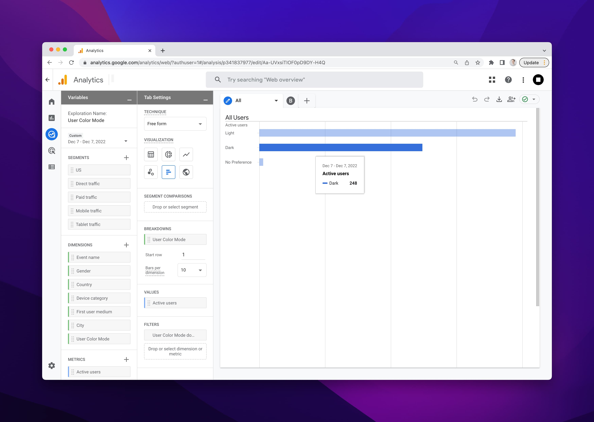

Dark mode has become increasingly popular in recent years, as it can help reduce eyestrain and save battery life on devices. If you have a website or an app, you may want to track whether your users are using dark mode so that you can better understand their preferences and tailor your content accordingly.

To track the user's dark mode setting, we will use Google Analytics 4 (GA4) and Google Tag Manager (GTM). This process will include the configuration of GTM, the creation of a custom dimension in GA, and, finally, setting up a report for gained data.

Here are the steps to create a custom variable in GTM to track the user's dark and light theme setting:

<Video autoPlay playsInline muted loop width="1528" height="1080">
<source type="video/mp4" src="https://pixel-point-website.s3.amazonaws.com/posts/2022-12-12-how-to-track-user-dark-and-light-mode-in-ga4/video-1.mp4" />
<source type="video/webm" src="https://pixel-point-website.s3.amazonaws.com/posts/2022-12-12-how-to-track-user-dark-and-light-mode-in-ga4/video-1.webm" />
</Video>

1. In your GTM account, go to the "Variables" section and click on the "New" button.
2. On the "Create Variable" page, select "Custom JavaScript" as the variable type and name it “User Color Mode”.
3. In the "Custom JavaScript" field, enter a function that returns either "dark" or "light" depending on the user's dark mode setting.
4. Click on the "Save" button to save the custom variable.

```jsx
  function () {
    if (window.matchMedia && window.matchMedia('(prefers-color-scheme: dark)').matches) {
      return 'Dark';
    }
    else if (window.matchMedia && window.matchMedia('(prefers-color-scheme: light)').matches) {
      return 'Light';
    }
    return 'No Preference';
  }
```

Note: `window.matchMedia('(prefers-color-scheme: dark)')` shows user preference through an operating system setting (e.g., light or dark mode) or a user agent setting. If you want to track it based on the user’s selected option in your app, you can extend this approach by adding the GA user data programmatically.(GA docs)

Once you have created the custom variable in GTM to track the user's dark mode setting, you can create a custom tag in GTM that sends the data to GA4 as an event. To create a custom tag in GTM, follow these steps:

<Video autoPlay playsInline muted loop width="1528" height="1080">

<source type="video/mp4" src="https://pixel-point-website.s3.amazonaws.com/posts/2022-12-12-how-to-track-user-dark-and-light-mode-in-ga4/video-2.mp4" />

<source type="video/webm" src="https://pixel-point-website.s3.amazonaws.com/posts/2022-12-12-how-to-track-user-dark-and-light-mode-in-ga4/video-2.webm" />
</Video>

1. In your GTM account, go to the "Tags" section and click on the "New" button.
2. In the "Create Tag" page, select "Google Analytics: GA4 Event" as the tag type.
3. In the "Google Analytics Settings" section, select the correct GA4 property from the "Configuration Tag" dropdown. Make sure that you’ve selected the property that corresponds to your website or app.
4. In the "Event Parameters" section, enter the following values:
   - Event name: "page_view"
   - Event parameters: `{ "color_mode": {{User Color Mode}} }`
5. Add trigger “Initialization - All pages”
6. Press “Save”

Now to see the results in Google Analytics(GA4) we need to add custom dimension. You can create a custom dimension named "User Color Mode" with a user property value of "color_mode." Here are the steps to do this:

<Video autoPlay playsInline muted loop width="1528" height="1080">

<source type="video/mp4" src="https://pixel-point-website.s3.amazonaws.com/posts/2022-12-12-how-to-track-user-dark-and-light-mode-in-ga4/video-3.mp4" />

<source type="video/webm" src="https://pixel-point-website.s3.amazonaws.com/posts/2022-12-12-how-to-track-user-dark-and-light-mode-in-ga4/video-3.webm" />
</Video>

1. Sign in to your Google Analytics account and navigate to the Configure section.
2. Click on Custom Definitions, then click on Custom Dimensions.
3. Click the "New Custom Dimension" button.
4. In the "Name" field, enter "User Color Mode" as the name of the custom dimension.
5. In the "Scope" field, select "User" as the scope for this custom dimension. This will allow the dimension to be associated with individual users of your website.
6. In the "Event Parameter" field, enter "color_mode" as the event parameter that will set the value of this custom dimension.
7. In the "Active" field, make sure you’ve checked the box to enable this custom dimension.
8. Click the "Create" button to save the new custom dimension.

Once you've set up, you can immediately view the statistics on the "Reports" → "Realtime" page. However, on other pages such as "Explore," you'll need to wait 24 hours before you can start using this new user property.



## Summary

Now you know how to set up Google Analytics 4 and GTM in order to track the user’s dark or light theme setting. Analysis of this data can help you define whether it’s important to implement dark mode for the website or app for your audience.

If you enjoyed the article and want to see more web tips, [follow me on Twitter](https://twitter.com/alex_barashkov).
