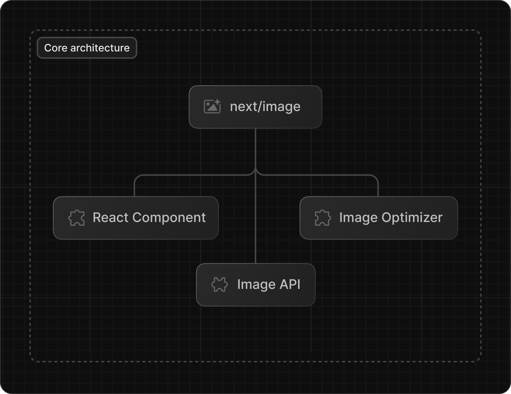
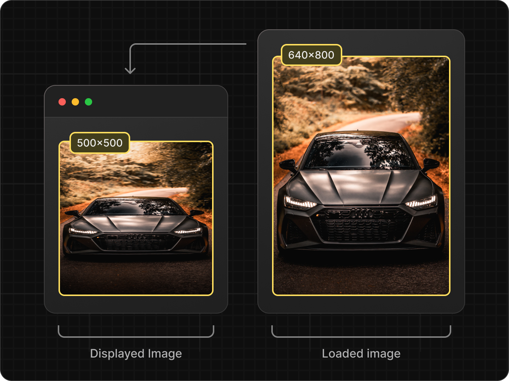
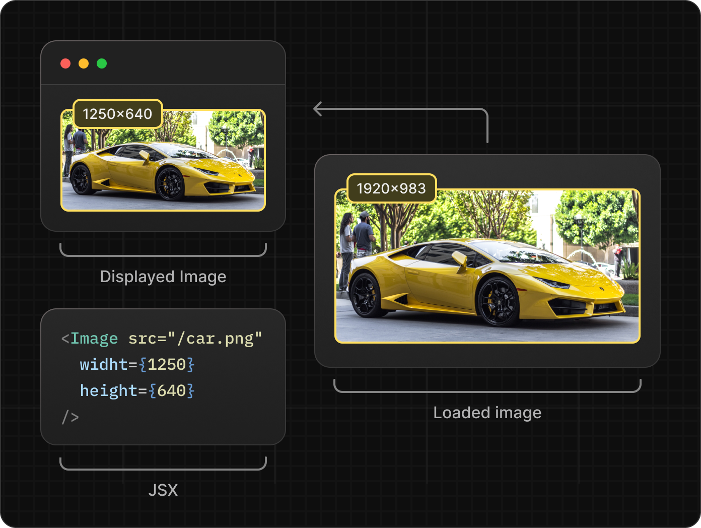
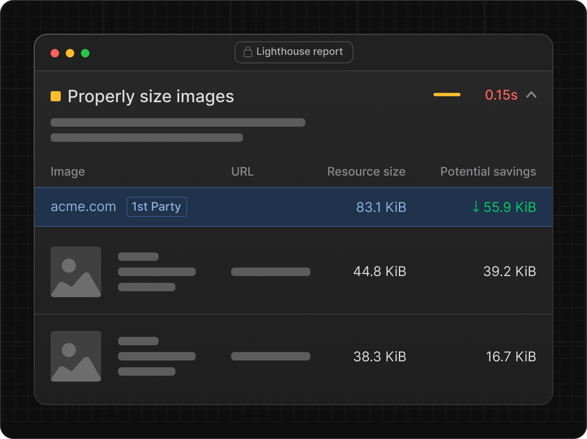

If you've worked with Next.js, it's likely that you've come across Next Image component. This hassle-free image optimization solution not only provides support for modern formats such as webp and avif but also generates multiple versions tailored to different screen sizes.

To leverage this magic, simply add the following code to your page:

{/* prettier-ignore-start  */}

```javascript
import Image from 'next/image';
 
export default function Page() {
  return (
    <Image
      src="/profile.png"
      width={500}
      height={500}
      alt="Picture of the author"
    />
  );
}
```

{/* prettier-ignore-end  */}

However, as is the case with any magic, there's a solid foundation of hard work that enables it to function seamlessly. In this article, we're going to explore how Next Image works and clear up some common misconceptions surrounding it.

## Core Architecture

The underlying architecture of `next/image` is primarily made up of three components:

- React Next Image Component
- Image API
- Image Optimizer



### React Component

The primary function of the component is to generate the correct HTML image output based on the provided properties and to construct multiple URLs to be populated in the `srcset` and `src` attributes. Here is an example output from the Next Image component:

{/* prettier-ignore-start  */}

```html

```

{/* prettier-ignore-end  */}

Let's take a closer look at the generated URL:

```css
/_next/image?url=/images/example.jpg&w=640&q=75
```

This encoded URL accepts two parameters: `w` (width) and `q` (quality), which are more visible in the decoded version. You can spot that there is no `h` (height) attribute, but about that we will talk later in the article.

### Image API

The Next Image API serves as an image proxy, similar to <a href="https://github.com/unjs/ipx" target="_blank">IPX</a>. It performs the following tasks:

- Accepts an **image URL**, **width**, and **quality**
- Validates parameters
- Determines cache control policies
- Processes the image
- Serves the image in a format supported by the user's browser

As things begin to make more sense, let's briefly discuss the final piece of the puzzle before we draw some conclusions from this arrangement.

### Image Optimizer

Next Image utilizes different image optimization libraries - Sharp or Squoosh - depending on certain conditions:

Sharp is a fast and efficient image optimization Node.js module that makes use of the native <a href="https://github.com/libvips/libvips" target="_blank">libvips</a> library.

Squoosh is a fully node-based image optimization solution. It's slower, but it doesn't require any additional libraries to be installed on a machine. For this reason, Sharp is recommended for production use, whereas Squoosh is used by default in local environments.

> I advise using Sharp in local environments as well. While both Sharp and Squoosh optimize images quite similarly, Sharp's compression algorithms can lead to color degradation compared to Squoosh. This can result in visually different behavior between production and local environments, particularly when trying to match the background color of an image with the page background.

## Outcomes

Having understood the primary architecture behind `next/image`, we can debunk common misconceptions and glean more insights on how to utilize it more effectively.

### next/image does not crop

A common misconception among developers is that `next/image` can crop their images. This confusion arises because you can pass width, height, and fill properties to the component, creating an impression that the image has been cropped. In reality, this isn't the case. The Next Image component primarily requires width and height for assigning to the img tag to prevent layout shifts.



As we've already discussed, the Image API does not accept a height parameter, meaning it currently isn't possible to change the original image's aspect ratio. If you don't use the fill property, the image will merely stretch or shrink in the event of width-height mismatches.

However, if you're using TailwindCSS, it behaves differently due to its default global CSS rule:

```css
img,
video {
  max-width: 100%;
  height: auto;
}
```

This makes layout shift issues harder to detect.

### Displayed image width ≠ loaded image width

Another potential point of confusion is that the width property passed to `next/image` doesn't represent the actual width to which the image will be resized. As we noted from the example at the start of the article, passing `width={500}` to a component will result in the image being resized to a width of 640px, as evident in the generated URL:

```bash
/_next/image?url=/images/example.jpg&w=640&q=75
```

If you expect the x2 retina version to utilize an image width of 1000px or 1280px, you're in for a surprise. The actual width used will be 1080px. Naturally, you might wonder where these numbers are coming from.



Next.js resizes images to the closest size from an array of`deviceSizes` and `imageSizes` that you can define in `next.config.js`. By default, these are:

```javascript
module.exports = {
  images: {
    deviceSizes: [640, 750, 828, 1080, 1200, 1920, 2048, 3840],
    imageSizes: [16, 32, 48, 64, 96, 128, 256, 384],
  },
};
```

What's crucial to note here is that using the default configuration can negatively impact performance, leading to a reduced score in Lighthouse's Page Speed Insights. This becomes particularly evident when you attempt to display large images on a page. For instance, if you want to render an image with a width of 1250px, the actual loaded image width will be 1920px. The discrepancy between the required size and the actual loaded size becomes even greater for x2 retina versions, as these will be resized to 3840px. However, you can remedy this by adding more sizes to the `deviceSizes` or `imageSizes` arrays(<a href="https://nextjs.org/docs/app/api-reference/components/image#devicesizes" target="blank">docs</a>).



### Image optimization can be used without the next/image component

With an understanding of the core architecture, it's easy to see that you can use the Image API without necessarily using `next/image`. There are several scenarios in which this can be beneficial.

First, you can render optimized images inside a canvas. Regardless of whether you're loading images onto a canvas from external sources or from local storage, you can pass the correct URL to the API and have it work seamlessly.

Additionally, you can use it to optimize OG images or create your own `<picture>` tag-based component for better <a href="https://web.dev/codelab-art-direction/" target="_blank">art direction</a>.

The Image API is located under the `/_next/image` route and accepts just three additional parameters: URL, width (w), and quality (q).

```jsx
/_next/image?url=https://example.com/test.jpg&w=640&q=75
```

Remember, the width parameter is checked by the API and can only be a number sourced from either the deviceSizes or imageSizes configuration.

### Use import for local images

With `next/image`, there are two methods you can use to load local images:

```jsx
import Image from 'next/image';
import profileImg from './profile.jpg';

export default function Page() {
  return (
    <>
      {/* Using absolute path */}
      <Image src="/profile.png" width={500} height={500} alt="Picture of the author" />
      {/* Using imported image via relative path */}
      <Image src={profileImg} alt="Picture of the author" />
    </>
  );
}
```

Using an absolute path is common when dealing with local images in examples, tutorials, or even open-source projects. It's easy to assume that there's no significant difference aside from the automatic width/height assignment. However, there is a difference. When you access images by an absolute path from a public folder, Next.js adheres to the cache policies of the destination server, which by default results in a 30-day cache policy rather than `public,max-age=31536000,immutable`. Using a 30-day cache policy for image assets can significantly lower your Lighthouse score.

### Understanding Sizes and the 100vw Technique

The `next/image` component accepts a property known as 'sizes', akin to the html img sizes attribute. However, in line with other aspects we've discussed, it performs some unique operations too. The 'sizes' attribute works in concert with 'srcset' and accepts a list of browser conditions and image widths for which they should be activated. If you're unfamiliar with this, I recommend taking a look at <a href="https://www.dofactory.com/html/img/sizes" target="_blank">these docs</a>, and this <a href="https://codesandbox.io/s/hungry-brattain-vw78xf?file=/index.html:1653-1685" target="_blank">codesandbox example</a>. Here's an example of an image using 'sizes':

{/* prettier-ignore-start  */}

```html

```

{/* prettier-ignore-end  */}

Let's dive into the details for better understanding. When you utilize Next Image without specifying the 'sizes' property, your 'srcset' will include two URLs: one for the standard version (x1) and another for the Retina version (x2). With this setup, the browser will invariably opt for the Retina version when used on a Retina device. This preference arises due to the use of 1x and 2x syntax within the 'srcset'.

```html

```

The browser essentially interprets this as: "Load this URL for 2x pixel density, and this other one for 1x pixel density." Thus, if you have a design where the image version on desktop is smaller than on mobile or tablet, the browser will consistently load the larger version with the default Next Image syntax. Unfortunately, this could result in suboptimal performance and a lower Lighthouse score.

There is, however, a method to instruct the browser to load images based on suitable width. Instead of providing 1x, 2x parameters to the 'srcset' URL, you specify the width of the image. For example, check these instructions to the browser:

```html

```

In this case, the browser selects the most appropriate image for the current size used on the page. If a mobile image has a width of 600px (1200px for Retina), it will choose the `1080w` version. Meanwhile, if a desktop image only uses 300px (600px for Retina), the browser opts for `640w`.

The advantage of this approach lies in loading the most fitting images for the current screen size, thereby enhancing performance due to reduced image size. Now that we understand the benefits, we can apply this strategy with Next Image using the `100vw` trick. While you cannot directly instruct Next Image to use the width (`w`) parameters near the URL instead of pixel-density (`1x`\*\*) options, you can apply a workaround arising from how Next Image is coded:

1. If your 'sizes' attribute contains `vw` numbers, it will only keep those sizes larger than the smallest `deviceSize` (640 by default) multiplied by the percentage(`100vw` = 1, `50vw` = 0.5). Specifying `100vw`, you will end up with 8 URLs.
2. If your 'sizes' property has non-`vw` numbers, your 'srcset' will contain ALL SIZES (i.e., all possible combinations of `deviceSizes` and `imageSizes`), yielding a total of 16 URLs.

To illustrate, let's examine the generated code for `100vw`:

```html

```

If you include a `px` value within 'sizes'(eg. `(max-width: 1024px) 800px, 300px`), the list of URLs expands even further, reaching 16 in a default configuration. Ideally, I would prefer to generate 4 URLs for a specific image, similar to other frameworks, rather than bloating the HTML with many unnecessary options, none of which may be perfectly sized for my needs.

This discussion underscores a key point: to populate 'srcset' with more versions for better performance across a variety of resolutions, you can simply set 'sizes' to `100vw`. This trick forces the creation of URLs for 8 sizes, starting from 640px.

However, because this method can easily inflate your HTML size - especially if you've added extra `imageSizes` or `deviceSizes` - it's recommended to apply this approach carefully.

While I can only speculate about the exact reasoning behind this architecture, I assume that for large-scale projects with various image ratios used in many different places, this approach of generating average-sized versions might prove beneficial. These versions could cater to most scenarios and potentially hit the cache more frequently, all the while maintaining ease of use.

## Conclusions

Though Next Image simplifies image management and provides significant advantages, it could benefit from additional features like advanced cropping and precise resizing, similar to third-party solutions. Incorporating a specialized `<picture>` component for fine-tuned art direction would also be advantageous. I'd particularly appreciate an automated method for generating four image versions at 0.25x, 0.5x, 1x, and 2x the supplied width.

Nevertheless, for most use cases, the developer experience and efficiency of Next Image will more than enough.

If you enjoyed the article and want to see more web tips, [follow me on Twitter](https://twitter.com/alex_barashkov).
