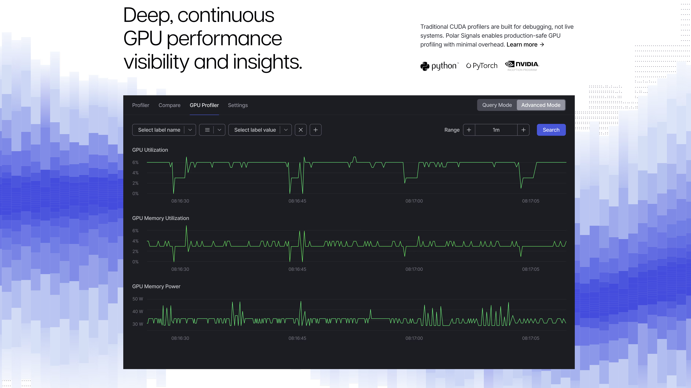
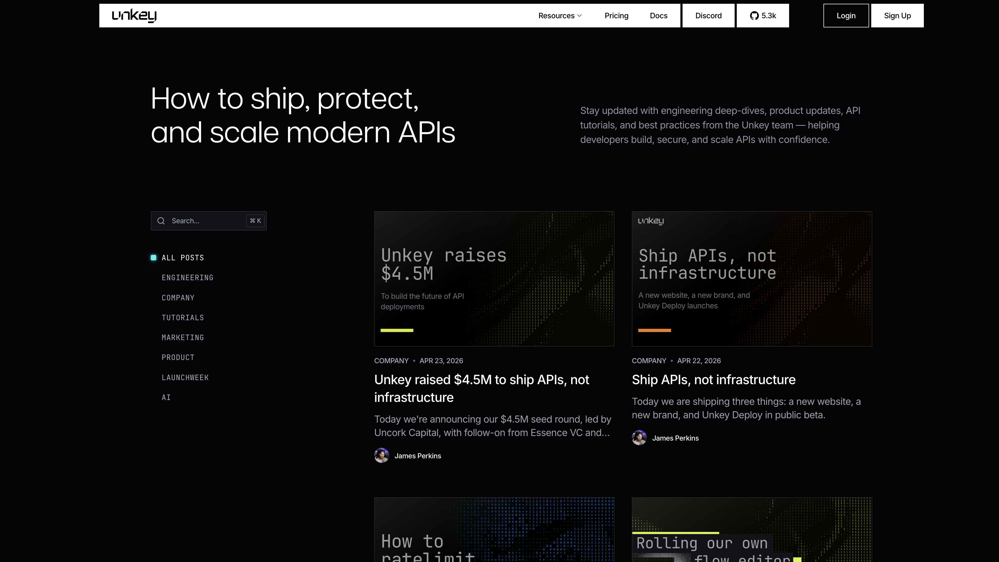
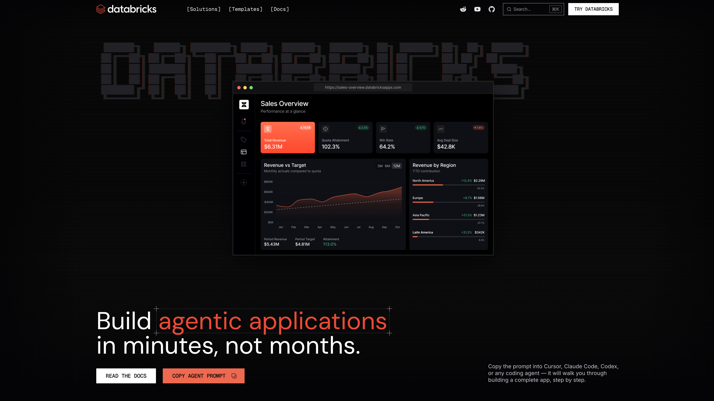

Over the past year, we’ve been obsessed with crafting design tools for our creative workflows. Whether we were working on a new brand identity, a website, or a product design, we constantly felt that the capabilities of existing design software were just not enough for us.

And now, thanks to AI, we can build our own design software. Not for a generalized audience. Not for every possible use case. But for one specific problem we need to solve right now.

The problem is that simply asking AI to build a tool usually does not give you a nice result from the first prompt, even if your prompt is very detailed. The reason is simple: a good creative app is not only about what it generates. It is also about how the canvas behaves, how the controls look, how settings are grouped, how export works, how performance is handled, and many other small UX details that make the app pleasant to use.

You can write a more detailed prompt. You can ask AI to use a UI library. You can even use special libraries for controls, like Tweakpane or Dialkit. But these solve only part of the problem: the control UI. They don’t give you proper canvas behavior, AI skills, testing architecture, export logic, performance checks, and all the other pieces you need when building a creative tool. So even with them, in order to get decent results, you still had to babysit AI a lot.

Until today.

We’re happy to announce **Toolcraft by Pixel Point** — our starter kit and UI library for building creative tools faster, better, and more predictably.

To start, run:

```bash
npx @pixel-point/toolcraft create
```

Then open the created folder in the AI agent of your choice, like Codex, Claude, or Cursor. Write a simple prompt:

```text
Build an app that applies an ASCII effect to an uploaded image.
```

Wait 30–60 minutes and get a nicely working app out of it.

You can try a few examples of apps we built with Toolcraft here:

- [draw-tool](https://draw-tool-one.vercel.app)
- [3d-dotts](https://3d-dotts.vercel.app)
- [bricks-test](https://bricks-test-hazel.vercel.app)
- [glass](https://glass-lemon.vercel.app)

The process is very simple. And with Toolcraft, you spend more time designing the thing you actually want to build, instead of babysitting AI while it fixes bugs in the tool environment.

If that sounds interesting, I also recommend watching the YouTube tutorial once it is available. It shows Toolcraft in more detail and walks through the process of creating a creative app with it.

[Watch video on YouTube](https://youtu.be/DP5SoQRf2Gk?si=aNCKlc6x08qsIXTa)

But before we go deeper into Toolcraft, let’s take a step back. Why would you even need to build your own design tools?

## Why would you build your own design tools?

Usually, you do it for one of three reasons:

- You want to work faster
- You want better UX for yourself or your client
- You simply don’t want to learn a new tool

Let’s start with speed. Here is an example of a graphic we made for Polar Signals. Imagine building something like this straight in Figma. It would not only be hard to draw every rectangle manually, adjust all the gradients, and form a chart-like line out of them. It would also be completely unscalable.



If you need another graphic like that in another place, doing it manually is simply not worth the time. Another problem is experimentation. When you are trying to find the final look, you need to test a lot of small ideas: density, direction, color, spacing, gradients, randomness, shape. The faster you can change these things, the better the final result will be.

Doing all of this manually would be a massive waste of time, so building your own procedural art tool for this kind of effect is a perfect solution. The Polar Signals example also works well for the UX argument. A custom tool does not just improve your speed. It gives you an interface that is simply better for this exact task.

Another good example is branded assets, like blog post covers. Clients do not always know how to use Figma. And even if you create templates or image styles there, asking non-designers to use them can still be complicated. But if you build a dedicated tool for this, like we did for Unkey and Neon, everything becomes much easier. You can select a template, choose accent colors from a predefined list, upload an image for stylization, edit the text, and export the final cover — all in a very simple UI.



The third reason is that sometimes you simply don’t want to learn a new tool. There are so many design and motion tools now: Spline, Rive, Vectary, Photoshop, After Effects, Unicorn Studio, and many more. And it is just hard to know all of them well.

If you have a very specific idea in mind, sometimes it is easier to build your own tool than to learn another interface, or figure out how to combine several tools together. That is what happened when we were working on a new developer portal for Databricks. Our motion designer built a complete animation tool with keyframe adjustments, effect controls, and a state machine. It allowed us to fine-tune and experiment with the styling directly on the real site.



Technically, we could have used another animation tool for that. But for this specific animation, a dedicated app gave us more control and a much better workflow.

## What is Toolcraft?

Toolcraft is a starter kit and UI library that we created at Pixel Point. Its goal is to solve the common problems designers face when building creative apps with AI.

It comes with many different components: sliders, dropdowns, textareas, font pickers, color pickers, curves, toolbars, layers, keyframe controls, and more. But components are only one part of Toolcraft. The bigger part is the system around them.

Toolcraft also comes with AI instructions, verification steps, and testing mechanisms. These make AI work longer on the first prompt, but the result is much more predictable from the beginning. Instead of generating a quick demo that breaks as soon as you touch it, AI has a better environment for building something closer to a real creative tool.

Toolcraft components live directly inside your project, so you can modify anything if you want. But we also added instructions to make sure AI does not randomly change them without your explicit request.

This is important. If you have worked with AI on frontend projects, you probably know this problem. You ask for one small change, and suddenly AI changes styles, breaks layout, or rewrites something that was already working. Toolcraft tries to prevent that.

Performance is another big problem in apps that designers vibe-code. A lot of small creative apps look nice in a screenshot, but the moment you drag a slider, everything starts lagging.

With Toolcraft, we give AI guidance on which libraries and patterns work better for different tasks. This helps the initial architecture of your app to be much healthier. But it is not only about choosing the right libraries. We also make AI test performance and try to optimize it, so you don’t get laggy controls in a simple app.

## What can you build with Toolcraft?

Toolcraft works best for creative apps that need a canvas and controls. For example, you can build:

- Procedural graphics generators
- Gradient tools
- Image stylization tools
- Video effects
- ASCII, pixel, halftone, or glitch effects
- Shader tools
- Three.js experiments
- Animation controllers
- Blog cover generators
- Branded asset tools for clients

The output is limited mostly by your creativity. You can start from a simple idea, a reference image, a video from Pinterest or X, or even a visual effect you saw on another website. Then you describe what you want to build, add a few ideas that would make it unique, and let AI create the first version.

It also works well for reverse-engineering tasks. For example, you can take a visual idea from another website, graphic tool, or animation, and use it as a foundation for your own creative app. The point is not to copy it one-to-one. The point is to quickly build your own version, with your own controls, your own behavior, and your own output.

## How to use Toolcraft

Using Toolcraft is very simple. You start with the command-line tool. Run this command in your terminal:

```bash
npx @pixel-point/toolcraft create
```

Or just give this command to your AI agent and ask it to run it for you. The command-line tool will ask you for a project name. Then it will ask which AI agent you are going to use, so it can install the necessary AI skills for it.

After that, a new folder will appear with the Toolcraft starter inside. The starter is built with React, TanStack Router, Tailwind CSS, Base UI, and TypeScript. It already includes the components, project structure, and important architecture decisions you need for creative apps.

Then you open that folder with your AI agent and write a prompt. The prompt should focus on the graphic or visual behavior you want to build. You don’t need to spend time explaining the environment, canvas behavior, or basic controls. Toolcraft already handles that.

For example, you can find an interesting animation on Pinterest or X, record a video, and give it to the agent. Then you can add a simple explanation:

```text
Build a creative tool inspired by this animation.

I want to upload an image, apply this kind of visual effect, and control the density, speed, colors, distortion, and export size.

Do not copy the reference exactly. Use it as a starting point and make the result feel more unique.
```

That is usually enough to start. AI typically works on the initial prompt for 30–60 minutes. During this time, it builds the app, runs checks, optimizes performance, and tries to create the tool you described.

This can sound like a lot. But I would rather wait that time and do something else in parallel than constantly get interrupted to guide AI through every tiny issue it creates.

Once the task is finished, you can run the app from the project folder:

```bash
npm run dev
```

Toolcraft prefers `http://localhost:3002`, but if that port is already busy, it automatically uses the next free port and prints the actual local URL in the terminal.

After that, you can keep iterating on the app. Ask AI to add more controls, improve the export, add presets, change the visual style, or make the effect more performant. And if you need to share the app with someone, you can deploy it to Cloudflare, Netlify, Vercel, or any other hosting provider.

## Summary

We started building personal design tools because we kept hitting the limits of existing software in real projects. Sometimes we needed more speed. Sometimes we needed a better UX for ourselves or our clients. And sometimes we simply did not want to learn or combine several tools just to solve one specific visual problem.

AI made building these tools possible. But building them from scratch still required too much babysitting. You had to explain the canvas, controls, architecture, performance, export, and many small UX details again and again.

Toolcraft gives AI a better starting point. It combines a starter kit, UI components, app architecture, AI instructions, verification, and performance checks in one solution. So instead of spending your time fixing the environment, you can focus on the actual creative idea.

Start small. Build a gradient tool, an image effect, a shader, a blog cover generator, or a tiny animation controller. Run:

```bash
npx @pixel-point/toolcraft create
```

Open the project in your AI agent. Describe what you want to build. Add a few references. And see what comes out.

We built Toolcraft because we needed it in our own work. Now we’re excited to see what you build with it.
