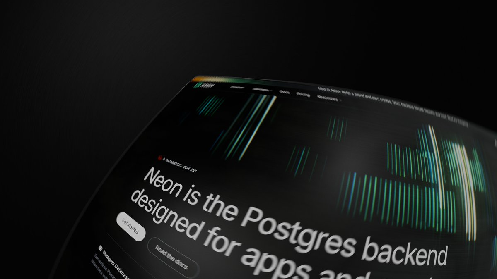

Building a site for a tool-making tool has a nice side effect: you have to keep making tools. While working on the Toolcraft site, we ended up with four of them — and none of them are the kind of demo you click once and forget.

If you're arriving with zero context, the short version lives in [our earlier walkthrough](/blog/how-to-craft-personal-design-tools-with-toolcraft): Toolcraft is how we build small, personal design tools with AI instead of settling for whatever a general-purpose app happens to expose. This post is about what came out of it in practice, and why each of these solves something that off-the-shelf software makes awkward.

## A demo that's actually about math

Start with the one that looks like it doesn't belong on a company blog.

<Video src="/x-video/amplify_video/2078121239156064256/vid/avc1/1920x1080/imQSuWnHjRkQxJZ1.mp4" width="3840" height="2160" controls muted poster="./video-cover-1.jpg"></Video>

It's easy to file this under "another silly AI demo," so it's worth saying what it is. That is not a render from Blender — it's a [three.js app built with Toolcraft](https://x.com/alex_barashkov/status/2078123186240053601), running in a browser tab, and the thing driving it is math.

Every shape, position, and ripple in the scene comes from formulas rather than from a modeling session. You don't drag vertices; you change a number and the whole composition reorganizes itself. That's the part worth caring about. Once geometry is parametric, a visual becomes a *system* you can dial in — increase the density, shift the phase, retime the motion — instead of an asset you have to remake from scratch when the art direction moves.

Concretely: imagine a client asks for a hero background that feels "a bit calmer, a bit denser, and slower." With a handed-over video file, that's a new export from whoever made it. With a parametric scene, it's three sliders and a reload — and the final result ships as code, at any resolution, on any screen size.

## Stickers, shaders, and a 3D model you drag in

The second one started as a detour. Inspired by a post from Fons Mans and mixed with Paper's shaders, we built a small studio for making stylized product shots.

<Video src="/x-video/amplify_video/2077096663953408000/vid/avc1/1920x1080/GXBKPpX8oKt0Kdfk.mp4" width="3840" height="2160" controls muted poster="./video-cover-2.jpg"></Video>

Upload a 3D model, stick your stickers onto it, tweak the shader settings behind it, and pull out a good-looking frame. There's a live demo on the Toolcraft site.

Why build that when design tools already exist? Because this specific job — a recognizable object, a few branded decals, a gradient field behind it that matches the site's palette — sits in the gap between a 2D editor (no real object) and a full 3D suite (an afternoon of setup for one image). A tool that does exactly this, and nothing else, takes minutes to use and produces a dozen variations while you're deciding which one you like.

## Customize in the browser, render in Blender

The third tool is the one I'm most opinionated about, because it steps outside what the browser can honestly do.

<Video src="/x-video/amplify_video/2074492600862568448/vid/avc1/1920x1080/e2Ibg8OGpPy_KL_e.mp4" width="3840" height="2160" controls muted poster="./video-cover-3.jpg"></Video>

No three.js. No fake web-based depth of field, no emulated focal length. Web 3D approximates optics: blur is a post-processing trick, and "85mm" is a number you nudge until it looks close. Fine for interactive scenes, not fine when you want an image that reads as photography.

So we split the job. You customize in the web app — material, layout, camera, colors — and the actual frame is rendered in Blender, where the camera is a real camera and the blur is what a lens genuinely does. The browser gives you fast, friendly controls; the renderer gives you output nobody can tell apart from a studio shot.

While everyone is vibe-coding flat pattern generators, or at most a three.js scene, this is the step ahead: treating the browser as the control surface and a proper renderer as the output stage. For us that means a client can pick their own variation of a product visual, and what lands in the deck is a real render — not a screenshot of a WebGL preview.

## A tool for animating exactly one website section

I typically don't share work in progress, but this one makes the point better than a finished thing would.

<Video src="/x-video/amplify_video/2079925057673994240/vid/avc1/1440x1080/BfwJMdiEu_Y5pdo8.mp4" width="3840" height="2880" controls muted poster="./video-cover-4.jpg"></Video>

It's a creative tool we built specifically to design and animate a single section of a single website. Not a page builder, not an animation suite — one section. Everything in it is under your control, and when a control is missing, you add it, because the tool is yours.

That sounds absurdly narrow until you've spent a day tuning one hero animation by editing numbers in code, reloading, squinting, and editing again. The alternative used to be "good enough," because building a bespoke editor for one section could never pay for itself. It can now. Fifteen minutes of tool-building buys you an afternoon of real iteration, and the result is a section that's been genuinely designed rather than approximated — with the parameters you cared about exposed, and the ones you didn't left out.

## The pattern underneath all four

None of these are products. They're tools we made for one job, kept because they turned out useful, and shown publicly because the underlying shift is easy to miss: the cost of building a purpose-made creative tool has dropped far enough that "I'll just build the tool" is often faster than working around a general one.

The demos are the fun part. The actual takeaway is that math, real renderers, and one-section editors are all now within reach of an afternoon — and that's what makes them more than toys. If you want to try the same approach on your own work, start with the [Toolcraft walkthrough](/blog/how-to-craft-personal-design-tools-with-toolcraft) and build something small for a problem only you have.

