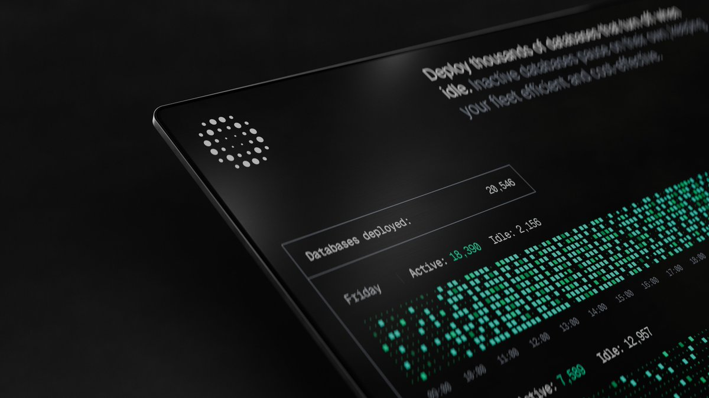
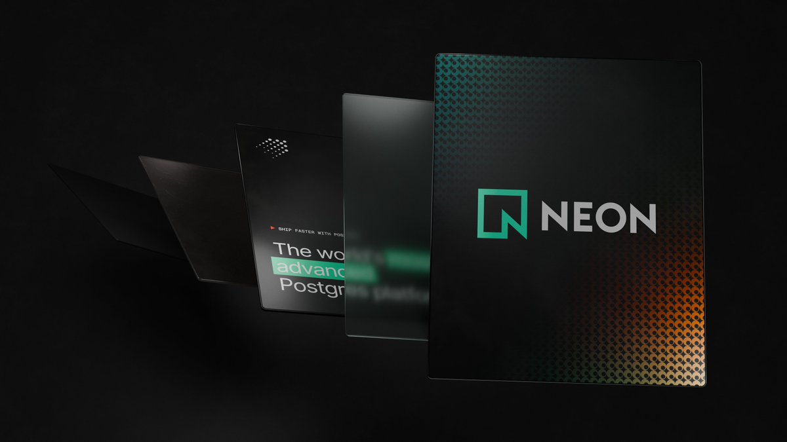

Most of what gets shipped as an "AI demo" right now is a flat pattern generator with a colour picker. It looks impressive for four seconds in a video and it teaches you nothing about what these tools can actually do.

We've spent the last stretch building the opposite: small, sharp creative tools that solve real production problems we keep hitting on client work. They live under Toolcraft, and each one exists because someone on the team wanted a control panel that didn't exist yet. Here's the tour, and more importantly, why each one matters.

## A demo that's actually about math

If you think this is just another silly demo made with AI, stay with me — because this one is about MATH.

<Video src="https://video.twimg.com/amplify_video/2078121239156064256/vid/avc1/3840x2160/hKysjY-IaYAeGe10.mp4" width="3840" height="2160" controls muted poster="./video-cover-1.jpg"></Video>

What you see on screen is not a render from Blender. (Obviously — it's not that good.) It's a Three.js app, meaning it runs live in your browser on your GPU, built with Toolcraft.

That distinction is the whole point. A Blender render is baked: an artist sets up a scene, a machine chews on it for minutes or hours, and you get a video file. Nothing in it can respond to a cursor, a scroll position, or a slider. What's happening here is that every vertex and every colour is being computed from mathematical formulas, sixty times per second, in real time. Change a parameter and the geometry reorganises itself immediately, because there is no pre-rendered asset underneath — just the equations.

The reason this is worth caring about: real-time means interactive. A hero section that reacts to where you move your mouse, a data visualisation that morphs as numbers update, a product page where the visual responds to the configuration a user picked. You can't do any of that with a video file.

## $15 on the Epic Games Store and a few million AI tokens

That's what it cost me to build a web-native grass simulation.

<Video src="https://video.twimg.com/amplify_video/2080310614300164096/vid/avc1/3840x2160/tOnsdTZwG9Z3UB3j.mp4" width="3840" height="2160" controls muted poster="./video-cover-2.jpg"></Video>

Here's the unlock. Epic Games owns Quixel, which produces Megascans — a library of photorealistic assets scanned from the real world, the kind of thing normally used to build environments in Unreal Engine and film VFX pipelines. Most web people never touch that library because they assume it belongs to game engines. It doesn't. You can use those assets in Three.js, and that's exactly what we did.

So instead of hand-modelling a blade of grass and hoping it reads as believable, you start from a real scan and spend your effort on the part that actually sells it: the motion. Wind, bending, the way light passes through a blade. The result is a scene that would have been a serious studio project a few years ago, assembled for the price of a cheap lunch and a pile of AI tokens.

## Customise in the browser, render in Blender

No Three.js. No fake web-based depth-of-field or focal-length emulation.

<Video src="https://video.twimg.com/amplify_video/2074492600862568448/vid/avc1/3840x2160/jAsgCrGo2tZ4Dv29.mp4" width="3840" height="2160" controls muted poster="./video-cover-3.jpg"></Video>

Real-time rendering is a series of clever lies. When a browser gives you "depth of field" — that soft blur behind a sharp subject — it isn't simulating a lens. It's blurring pixels based on how far away they are and hoping you don't look too closely. Same with focal length: it's an approximation of what a 35mm or 85mm lens would do, not the real thing. It's fine for a website. It is not fine when the output needs to hold up as a photograph.

So we built an app where you configure the scene in the browser — materials, camera, lens, composition — and the actual frame is rendered by Blender, a real production renderer that traces light properly. You get the convenience of a web interface with output you could put on a billboard.

A concrete example of why a team would want this: imagine a furniture brand that needs 400 product shots — every chair, in every fabric, in three room settings. The traditional options are a photo studio (expensive, slow, and you reshoot when the fabric range changes) or a 3D artist working manually in Blender for every variation. With this, a marketer picks the options in a browser tab and a render farm produces the finished images. No 3D skills required, no lies in the optics.

While everyone is vibe-coding flat pattern generators, or at most Three.js scenes, we're already a step ahead of that.

## Stickers, shaders, and good-looking shots

While working on Toolcraft's site, we built another little app — this one inspired by a post from [@FonsMans](https://x.com/FonsMans) and mixed with [Paper Shaders](https://x.com/paper).

<Video src="https://video.twimg.com/amplify_video/2077096663953408000/vid/avc1/3840x2160/DQGFY-Ji6WButLah.mp4" width="3840" height="2160" controls muted poster="./video-cover-4.jpg"></Video>

Upload a 3D model, add your stickers, tweak the shader settings, and create some cool-looking shots. Shaders, if the word is new to you, are small programs that run on the graphics card and decide how a surface looks — glossy, iridescent, grainy, dissolving. Normally getting them right means editing code and refreshing. Here they're just settings you drag.

It took an afternoon, it's on the site, and it's a genuinely useful way to generate art direction options for a landing page instead of describing them in a document.

## A tool built to animate exactly one website section

I typically don't share work in progress, but this is a great example of what these tools are really for.

<Video src="https://video.twimg.com/amplify_video/2079925057673994240/vid/avc1/2880x2160/oaOPNgsyXH_ubvxl.mp4" width="3840" height="2880" controls muted poster="./video-cover-5.jpg"></Video>

This is a creative tool we built specifically for designing and animating a single section of a single website. Not a general-purpose animation editor. One section.

That sounds absurd until you've lived the alternative. The usual loop is: a designer describes a motion idea, a developer hardcodes timing and easing values, the designer watches it, asks for it to be "a bit snappier," and the loop runs again. Every adjustment costs a round trip. Meanwhile off-the-shelf tools get you 80% of the way and then refuse to do the one specific thing the concept depends on.

Building a small editor instead flips that. Everything is under your control, and if something is missing, you can simply add it, because you own the tool. The result is a section that's been iterated on dozens of times rather than twice — and that's usually the difference between a page that looks fine and one people remember.

## The real update

The common thread here isn't AI, and it isn't 3D. It's that the cost of building a bespoke tool has collapsed. It used to be irrational to write a custom editor to design one hero section, or a custom configurator to produce one campaign's imagery. Now it's often the fastest path, and the tool sticks around afterwards as an asset.

All of these demos are live on the Toolcraft site — go break them. And if you're looking at a project where the interesting part won't fit inside a template, that's exactly the kind of work we want.

