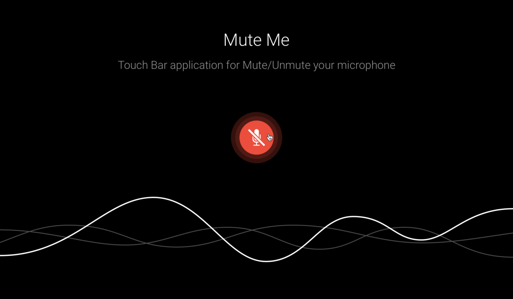
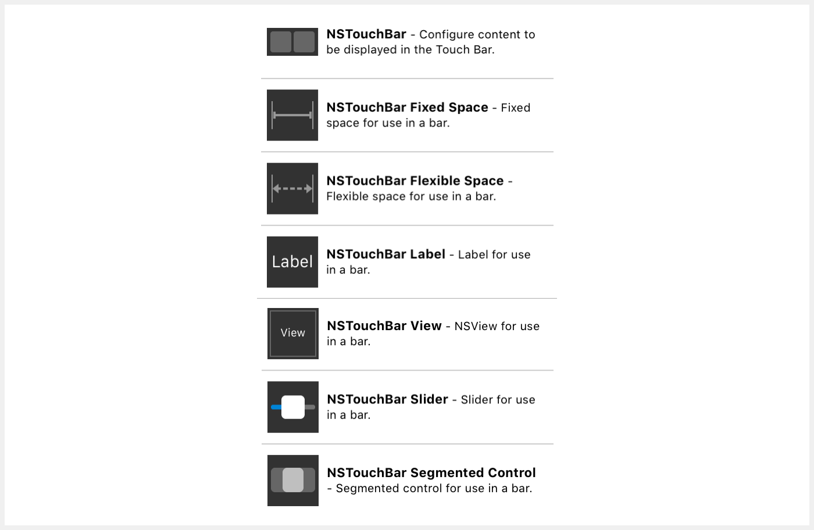
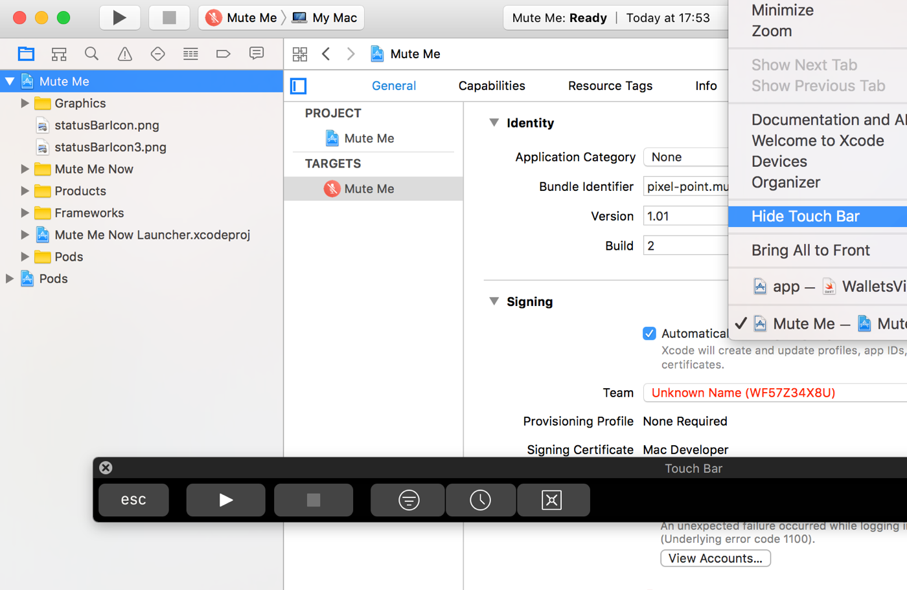
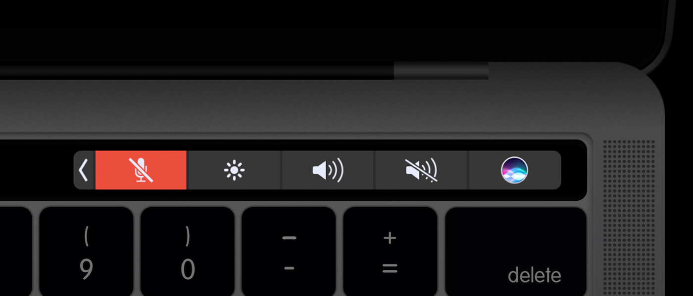

Working with other companies, we always dreamed of devoting some of our time to the realization of our own ideas. But commercial projects were always our top priorities, and there wasn’t much time for passion projects. Now that we have our own business, [Pixel Point](https://pixelpoint.io/), we try to leave enough time for short-term projects that we find especially interesting. It lifts the spirit of our team and allows us to accrue new knowledge so that we can embody our ideals in all of our professional endeavors.

One of these projects is the application we created for MacBook’s Touch Bar: [Mute Me](https://muteme.pixelpoint.io/). In this article, we describe the process of dreaming up and executing this app.
The idea behind this application for Touch Bar

Our idea was simple. When you’re in a meeting using Hangouts, Skype, Slack, or another voice application, it’s good practice to stay on mute until someone speaks to you directly. Often, however, you’ll need to switch between multiple browser tabs, and it can take too long to switch back to the meeting app and unmute your microphone. With Mute Me, you can mute or unmute your mic quickly and easily, right from your Touch Bar.

As you can see, the idea is extremely straightforward. But for us, the application’s simplicity is as important as how effectively it can improve your productivity.



<!-- _You can download the application [here](https://muteme.pixelpoint.io/)_ -->

## Key facts about the development of Touch Bar applications

The development of Touch Bar applications is similar to the process of making other MacOS desktop apps. Adding Touch Bar support to the existing desktop application is easy. You only need to add corresponding controls to Xcode Storyboard.



The structure of MacOS applications and iOS applications is very similar. This means that you can develop applications for Touch Bar without having to own the new MacBook that features Touch Bar. You can test the embedded application in Xcode emulator.



To create your application, it’s helpful to look at short videos on youtube, like [this one](https://www.youtube.com/watch?v=-QX8sPNeE0I). You can also read great Apple guides like these:

- [documentation](https://developer.apple.com/documentation/appkit/nstouchbar)
- [sample shows](https://developer.apple.com/library/content/samplecode/ToolbarSample/Introduction/Intro.html)
- [all controls demos for Touch Bar](https://developer.apple.com/library/content/samplecode/NSTouchBarCatalog/Introduction/Intro.html#//apple_ref/doc/uid/TP40017550-Intro-DontLinkElementID_2)

## Touch bar custom button



Touch Bar has an area with permanent buttons, and Apple doesn’t explain in their documents how to modify it. However, we did find application guides that helped. We solved one problem with a guide on GitHub, and learned that the right-hand Touch Bar area supports four system buttons and one float on where you can put your own button.

If you have several applications for Touch Bar with custom buttons in this area, you can use only one at the same time (find The Control Strip here).

Another issue is that you can’t use the design tool for creating your Touch Bar final view; you’ll want to write your code by hand.

## Touch Bar application window

As with all other desktop MacOS applications, Touch Bar applications have a start window.


Logically, you’ll need to hide them. We had some troubles with this issue, but managed to find a solution:

```diff
- (void)applicationDidFinishLaunching:(NSNotification *)aNotification {
    [[[[NSApplication sharedApplication] windows] lastObject] close];
…
}
```

## Troubles with Touch Bar application autostart

Apple doesn’t provide instruments for testing an application’s autostart. We had to reload the Mac to test it each time, and it wasn’t efficient. If you have troubles with autostart at login, save time by having a look at this article.

## Conclusion

This was brief but interesting journey of taking a new technology from idea to workable product. We are positive that creating small but useful applications well influences command spirit and helps quickly learn new technologies at the same time.

Another big benefit is that you can do public relations for your company with real applications. For example, we posted Mute Me on [Product Hunt](https://www.producthunt.com/posts/mute-me) in the Touch Bar category and got 240+ likes, along with some interesting feedback.

Now our application supports these features:

- show/hide Mute/Unmute button in MacOS menu bar
- custom shortcut for Mute/Unmute
- open at Login option in Preferences
