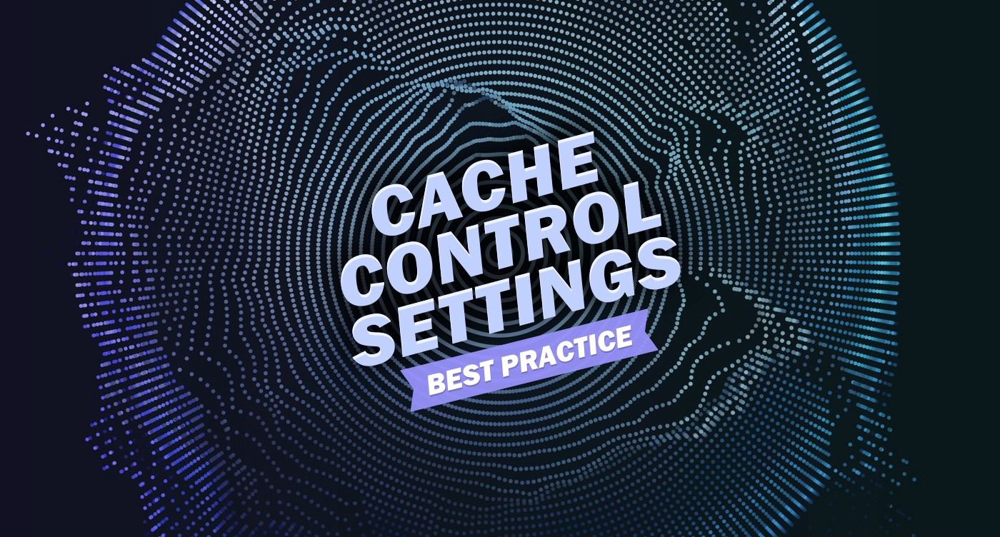
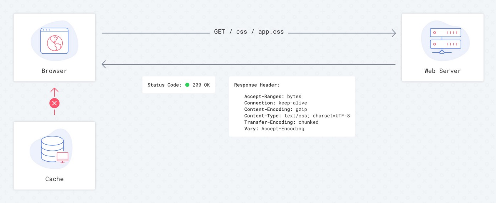
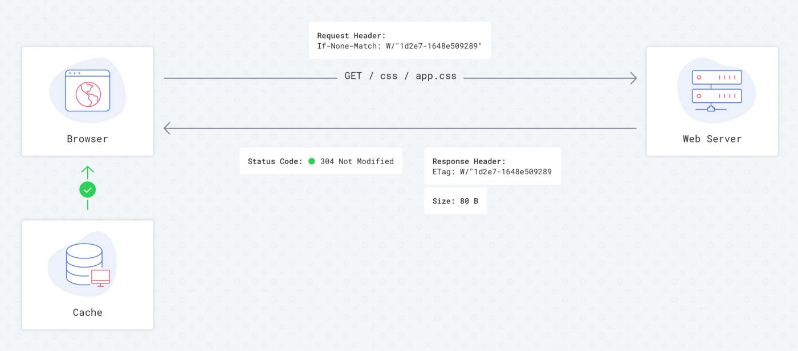
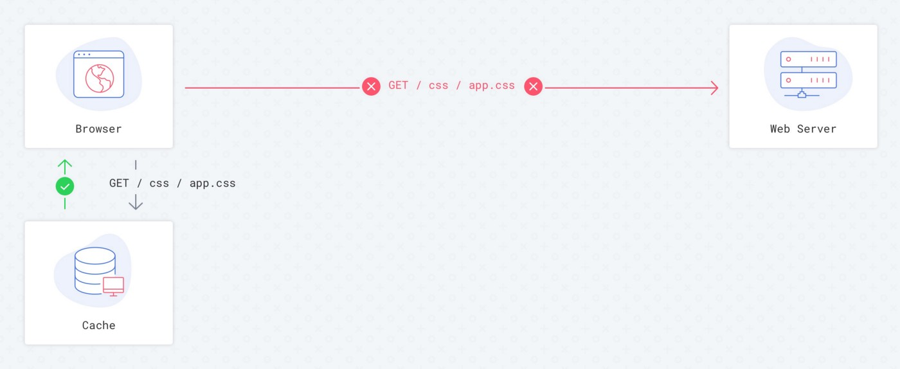

## Best practices for cache control settings for your website

You may have noticed that, sometimes, when accessing a site for a second time, it does not look as expected and some styles are broken, making everything look weird. Usually, the cause of this problem is poorly defined cache control policies that prevent you from receiving the latest changes after the most recent deployment. In this article, I will show you the right cache settings and techniques to help you keep your website up to date for all users after every deployment.

For those of you who just want to get the best practices and start using them, follow the link here to the end of the article.

### How does the cache work behind the scenes?

Your browser, on each request to the website/resource, tries to load as little data as possible by reading cached information from local memory. This is only possible we provide enough instructions for the browser, to explain what resources it needs to keep and for how long.

These instructions function as directives; to tell your browser about them, you must add them to response HTTP header information. The most common directives involved in the cache process are **“Cache-Control”**, **“Expires”**, **“Etag”** and **“Last-Modified”**.

Almost every web server has some cache settings in header responses by default , but it isn’t clear what we get if there are no cache policies.

Without cache control settings, the browser goes to the web server for every request for resources and reads information from it. This increases load times of the affected site, adds extra load to your web server when transferring information, and increase the number of calls to your backend.

_Requests flow with no cache settings_

It’s up to the browser to decide what to do and how to cache information without instructions from the server. Currently, Chrome and Safari download data from the backend every time, without cache instruction. This can change and lead to different behaviours, however, especially on other platforms.

To clearly define what to do with certain files, let’s do a deep dive into learning cache control directives, adding them step-by-step to response headers and watching for the result.

#### Etag (Entity tag)

Etag is one of the cache settings. The main idea behind this HTTP header is to allow your browser to be aware of modifications to relevant resources without downloading full files. The server could calculate something similar with hash sum of each file and then send this hash sum to the client. The next time the client tries to access this resource, instead of downloading the file, the browser will send something like this in the HTTP header: **If-None-Match: W/“1d2e7–1648e509289”**. The server will then check this hash sum against the hash sum of the current file and, if there is the difference, force client to download a new file. Otherwise, the client will be informed that it should use a cached version.

_Requests flow with Etag — 1st load_

_Requests flow with Etag — 2nd load_

With an Etag cache policy turned on, we always go to the server to check the hash sum of a file, and only after that will the browser decide take it from the cache or load it completely. When a resource has not been modified, it takes just 80–100 bytes to verify no matter what you are requesting, whether a 10KB or 10MB file.

#### Last Modified

Another cache control setting is the “Last Modified” HTTP header. The main idea is very similar to Etag, but the browser’s behaviour is a bit different. Servers have a timestamp of the last modified date for each file; after the first file loading, client has the ability to ask the server if the resource has been modified since the specific moment the files was last accessed by the client. To do this, the browser sends **If-Modified-Since: Fri, 13 Jul 2018 10:49:23 GMT** in the HTTP header. If the resource has been modified, the browser has to download a new file, otherwise it uses a cached version.

The reality is that browsers have their internal cache policies and could decide by themselves whether or not take a resource from the cache or download a new copy.

> Last-Modified is a weak caching header, as the browser applies a heuristic to determine whether to fetch the item from the cache or not., and heuristics vary between browsers.
> **Google caching best practices guide**

_Requests flow with Last-Modified — 1st load_

_Requests flow with Last-Modified — 2nd load (Perfect Scenario)_

_Requests flow with Last-Modified — 2nd load (Common case)_

As a result we can’t rely only on Last-Modified, so I prefer to completely remove it from my server settings to reduce traffic, even if it’s just few bytes.

#### Cache-Control max-age

This directive allows us to tell the browser how long it should keep file in the cache since the first load. The time that the browser should keep the file in cache should be defined in seconds, typically presented like this **Cache-Control: max-age=31536000**. With this policy, the browser completely skips the process of making requests to your server and opens files very fast. But how can we be sure that file won’t change for so long? We don’t.

So, to force the browser to download a new version of the needed file, we use a technique implemented by many assets builders tools, like Webpack or Gulp. Each file will be precompiled on the server and hash sums are added to the file names, such as “app-72420c47cc.css”. Even small changes to the the file are reflected in the hash sum, which guarantees that it will be recognized as different. So, after next the deployment, you will get a new version of the file. This can apply to all of our css, js, and images files (max-age=31536000); after we change something, the browser will just request a new file with a new hash sum, which it will then cache.

#### no-cache

The tricky part of the above technique is that you cannot forget about your html files; if you apply that setting to those too, you will never get new links for your css, js, or image files until you force a reload.

I recommend you apply Cache-Control: no-cache to html files. Applying “no-cache” does not mean that there is no cache at all, it simply tells the browser to validate resources on the server before use it from the cache.That’s why we need to use it with Etag, so browsers will send a simple request and load the extra 80 bytes to verify the state of the file.

### Final settings

- Use Gulp, Webpack, or similar to add unique hash digits to your css, js, and image files (like app-67ce7f3483.css);
- For js,css, and image files, set Cache-Control: public, max-age=31536000, no Etag, no Last-Modified settings.
- For html files, use Cache-Control: no-cache, and Etag.

So as we can see, even obvious and common things, like caching static files, may not be obvious if we dive deeper. Good research could prevent you from making mistakes and reduce traffic on your server, reducing site speed load times.
