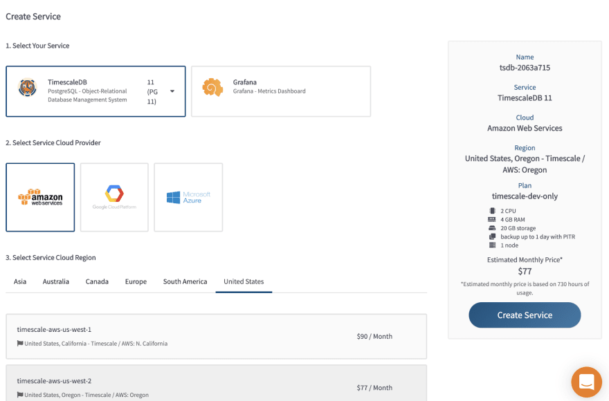

## Top 10 open-source SaaS that could help you build the next big thing

I'm super happy that investors and big companies are finally happy to support Open Source projects. It was hard to imagine 10 years ago that there will be plenty of SaaS built based on open-source model.

Here is the list of my favourites that could help you build amazing modern architecture covering different aspects of product development and architecture.

### [Hasura](https://github.com/hasura/graphql-engine)

Blazing fast, instant realtime GraphQL APIs on your DB with fine grained access control, also trigger webhooks on database events.

Hasura simplifies the development a lot. How do you usually build your apps? Probably you choose some framework, set up ORM, set up DB, write manually migrations, then you build batch of CRUD endpoints either with REST or Graphql, add authorization layer.

With Hasura you can:

- easily create most of your tables for PostgreSQL, TimescaleDB, MySQL, MongoDB, MSSQL using nice UI
- every DB structure modification will be recorded as a migration(so you can easily run it within your CI by using Hasura CLI)
- each table will automatically get relevant graphql/rest endpoints
- protect each endpoint by a powerful set of rules for each user role
- and if you need more business logic you can merge generated endpoints with custom graphql server

### [TimescaleDB](https://github.com/timescale/timescaledb)

An open-source time-series SQL database optimized for fast ingest and complex queries. Packaged as a PostgreSQL extension.

An extension for PostgreSQL that boost the performance of time-series operations. Super simple to use, amazing documentation and nice cloud service. You can always use it as a replacement of PostgreSQL because it does not have any downsides, but in case you start saving some metrics, stats to your database you will be covered. It has 10x-100x faster queries than PostgreSQL for time-series.

### [Supertokens](https://github.com/supertokens/supertokens-core)

Open source alternative to Auth0 / Firebase Auth / AWS Cognito

Every project needs authorization. If you used Auth0, it's pretty much the same but it's Open Source, so you can easily host it within your own infrastructure or either use cloud version. It works based on JWT, so simply integrates with Hasura.

### [n8n](https://github.com/n8n-io/n8n)

Free and open fair-code licensed node based Workflow Automation Tool. Easily automate tasks across different services.

Don't want to bother yourself with programming automation between different services and spending hours on that? Try n8n. Powerful UI to design different integrations and automations that rely on data changes/triggers.

### [Rancher](https://github.com/rancher/rancher)

Complete container management platform

Modern applications deserve modern infrastructure and managing it could be a painful process. Rancher simplifies management of Kubernetes clusters whether you run it in the cloud or on bare-metal servers.

### [Drone CI](https://github.com/harness/drone)

Drone is a Container-Native, Continuous Delivery Platform

Despite Github actions and Gitlab are very popular solutions, Drone CI has fantastic architecture and a very simple set-up. After it's been acquired by Harness, it's got a major 2.0.0 update that brought a lot of cool features such as activity charts, user management, new UI. Drone CI is a very powerful and flexible tool.

### [Grafana](https://github.com/grafana/grafana)

The open and composable observability and data visualization platform. Visualize metrics, logs, and traces from multiple sources like Prometheus, Loki, Elasticsearch, InfluxDB, Postgres and many more.

You can't build the next big thing without having a proper monitoring analytics solution. Grafana was an essential tool in that space for a very long time, and now they also have a cloud version.

### [K6](https://github.com/grafana/k6)

A modern load testing tool, using Go and JavaScript

The best performance testing tool and it's open source. Recently K6 has been acquired by Grafana Labs, so I'm sure it will become even better. If you had experience writing scripts for jMeter, K6 experience will be 100x times better.

### [Sentry](https://github.com/getsentry/sentry)

Sentry is cross-platform application monitoring, with a focus on error reporting.

Error reporting is crucial when you want to handle customer issues before it will have a negative impact on your business. Sentry allows you to simply integrate their SDK in your framework/language and start to receive alerts when errors happen either on the client or server-side.

### [Flagsmith](https://github.com/Flagsmith/flagsmith)

Open Source Feature Flagging and Remote Config Service.

In 2021 you should stop pushing major updates to all users at the same time. Control their expectations and react to issues predictively by using feature flags. Simply integrate it with your framework by using SDK, then manage who should be allowed to have access to certain features.

### Summary

Building projects with open source technologies is amazing, since you don't need to spend a fortune to test things, but as projects grow you always could try paid cloud versions.

What open source SaaS do you use in your project?
